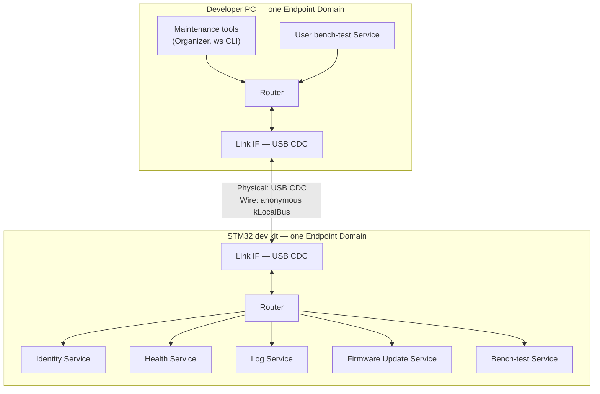
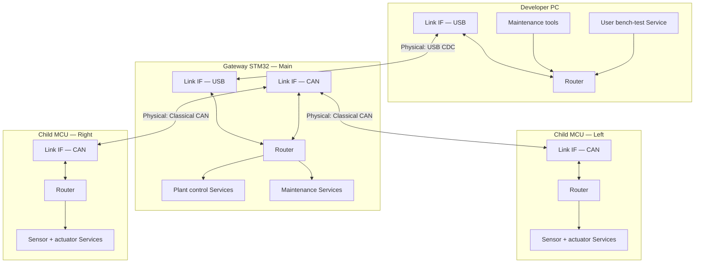
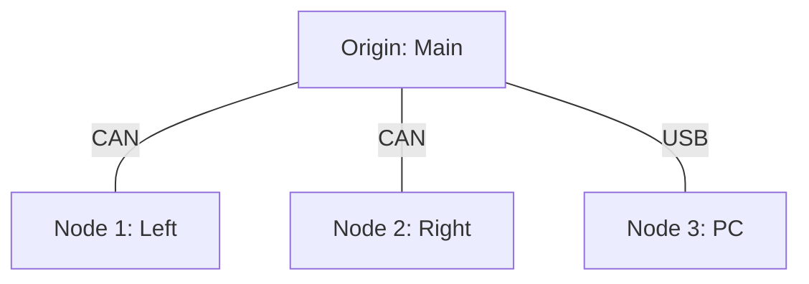
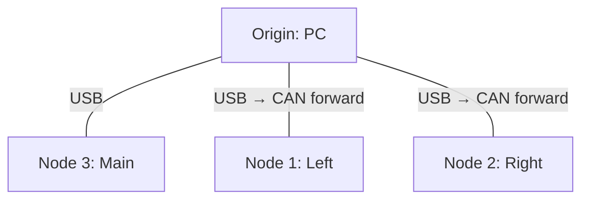

# Sketch 01 — Dev Board (PC ↔ MCU, first gateway)

**Intent:** Exercise the smallest useful WireSpaces system (one cable, one MCU) and the first natural growth step (MCU as Classical CAN gateway to two child nodes). Stress Level 0–1 bring-up, Origin placement, plug-and-play discovery through a gateway, and — in Config B — whether Wires follow **physical links** or **authority relationships** when a gateway joins USB and CAN (`CORE §3`).

**Archetype:** Generic STM32-class dev kit; USB CDC to PC; optional Classical CAN fieldbus to two smaller MCUs.

---

## Configurations

### Config A — Single MCU on USB

**What changed** (baseline for this sketch):

- One STM32 dev kit, one USB CDC link to a developer PC.
- MCU runs Identity, Health, Log, and Firmware Update Services.
- PC runs WireSpaces maintenance tools (`ws devices`, `ws logs`, …) **and** a custom user WS Service (e.g. a bench-test harness that sends commands and reads status).
- No fieldbus, no gateway, no child nodes.

**Maturity level:** **Level 0**, with a short **Level 1** appendix. At Level 0 the link works immediately with anonymous `kLocalBus` and no authored topology (`INTRO §8.1`). Level 1 adds Organizer discovery and stable identity readout without changing the data plane — there is nothing to assign because one Link and one Wire are already unambiguous.

---

### Config B — Gateway MCU + two CAN child nodes

**What changed** vs Config A:

- Gateway adds a second Link Interface: Classical CAN to two child MCUs (each a full WS node with its own Services).
- Real application traffic: children publish sensor/actuator state; Main MCU runs plant control; PC user app and maintenance tools address children over the **same** USB↔CAN topology.
- Two **authority-shaped** Wires span both Physical Links (not one Wire per link); see Config B mapping.
- Plug-and-play experiment: cold-plug USB + CAN, run Organizer auto-Wiring, see whether Level 1 produces a usable ephemeral map without a pre-authored Manifest.

**Maturity level:** **Level 1–2**. Discovery and ephemeral Wiring are the point; exporting to static configuration is the natural maturation path after the bench experiment works (`DEPLOY §1.9`).

---

## Config A — Single MCU

### Native communication model

```text
Developer PC connects to one STM32 dev kit over USB (virtual serial).

The MCU firmware:
  - answers identity queries (serial, firmware version, board type);
  - emits periodic health/heartbeat;
  - streams log lines and discrete events when faults occur;
  - accepts firmware-update segments when the host starts an update.

The PC maintenance tool:
  - shows identity and health as soon as the link is up;
  - tails logs and events;
  - can push a firmware image.

A separate PC user application (custom WS Service):
  - sends bench-test commands to the MCU (e.g. exercise GPIO, run a self-test sequence);
  - receives command results and ad-hoc status from the MCU.
```

There is one physical attachment, one obvious "device under test," and no bus arbitration story beyond USB.

### Obvious conventional implementation

> **Obvious conventional implementation:** A USB CDC byte stream with an ad-hoc framing protocol (COBS/HDLC-style), fixed command opcodes, and separate PC tools each speaking that protocol — or a single Python script that multiplexes "maintenance" and "test harness" over the same serial port with different message types.

> **What additional conceptual objects does WS introduce compared with this?** One Wire, one Origin/Node pair, four standard Services plus one custom Service — all as Endpoints on the same bus. No forwarding table, no WireNumber, no Manifest. The extra structure is mostly **named Services on a shared bus model** rather than a bespoke opcode map per tool.

### WireSpaces mapping

#### Design choice: one Wire, anonymous `kLocalBus`

Config A deliberately follows `INTRO §8.1`: a single Link carrying everything on anonymous `kLocalBus` (WireAlias 0, unnamed canonical WireNumber). Internal Debug Wire + splice (`DEPLOY §3.2`) is **not** used here — see [Alternative considered](#config-a--alternative-internal-debug-wire) below.



**Why not split maintenance vs user traffic into two Wires on one cable?** Physically there is one point-to-point link. Splitting would be WS-imposed structure with no separate arbitration, timing, or failure domain. Recording that outcome is part of the experiment: *forced traffic-plane split on a single serial link adds configuration without matching a real boundary.*

#### Tables

**Devices**

| Device | Endpoint Domains | Link interfaces | Role summary |
|---|---|---|---|
| Developer PC | 1 | USB CDC | Origin on host link; runs tools + user Service |
| STM32 dev kit | 1 | USB CDC | Node; device Services + bench-test responder |

**Wires**

| Wire (name / #) | Origin | Nodes | Physical realization | Notes |
|---|---|---|---|---|
| *(anonymous LocalBus)* | PC | STM32 (Node 1 implicit) | USB CDC | `kLocalBus`; no WireNumber; all traffic shares one bus |

No separate maintenance Wire table — maintenance and user traffic share the same Wire by design.

**Interactions**

| Interaction | Producer | Consumer(s) | Wire | Direction | Notes |
|---|---|---|---|---|---|
| Identity read | STM32 Identity | PC tools | LocalBus | Node→Origin | On connect / on request |
| Health / heartbeat | STM32 Health | PC tools | LocalBus | Node→Origin | ~1 Hz periodic |
| Log / event stream | STM32 Log | PC tools | LocalBus | Node→Origin | Queue Endpoint; tools drain |
| Firmware update | PC tools | STM32 FW Update | LocalBus | Origin→Node | Reliable segment transport |
| Bench-test command | PC user Service | STM32 bench-test | LocalBus | Origin→Node | Request/response datagram |
| Bench-test status | STM32 bench-test | PC user Service | LocalBus | Node→Origin | Reply or async status |

**Services / Endpoints** (topology-relevant only)

| Service | Endpoint (NS/EID) | Wire | Direction | Rx / Tx storage | Binding mode | Notes |
|---|---|---|---|---|---|---|
| Log | NS0 / Log | LocalBus | Node→Origin | Tx Queue | `debug_tx` default | Queue fits streaming |
| Health | NS0 / Health | LocalBus | Node→Origin | Tx Snapshot | `debug_tx` default | Latest sample replaces pending |
| Firmware Update | NS0 / FWU | LocalBus | bidirectional | Rx Queue + Tx | static | Reliable segment for image |
| Bench-test | NS0 / user | LocalBus | bidirectional | Rx Queue + Tx Queue | static | Custom user Service on both ends |

Link Telemetry Service (`DEPLOY §3.3`) is **omitted** in Config A. With one Link and no gateway, a ~1 Hz snapshot of queue pressure adds little beyond what Health already exposes; see [Alternative considered](#config-a--alternative-link-telemetry).

#### Level 1 appendix (same topology)

```text
Plug USB → Organizer discovers one device on one Link
        → reads Identity (128-bit UUID, firmware version)
        → reports "ephemeral / no WireNumber assigned" (expected)
        → no NodeId assignment needed (only one Node on the bus)
        → PC tools and user Service work unchanged
```

This is discovery **without** configuration churn — validating that Level 1 does not regress Level 0 on the simplest topology.

### Config A — Alternative considered: Internal Debug Wire

`DEPLOY §3.2` recommends a device-private Internal Debug Wire spliced to a host-facing Wire so standard Services can bind to `debug_tx` without knowing the external WireNumber.

On this topology:

| Approach | Wires | Splices | Benefit | Cost |
|---|---|---|---|---|
| **A (chosen):** anonymous `kLocalBus` only | 1 | 0 | Matches `INTRO §8.1`; zero config | `debug_tx` binds directly to the only Link |
| **B:** IDebug → splice → host Wire | 2 (private + named) | 1 | Rehearses production debug pattern | Extra Wire + splice for a cable that already carries only debug traffic |

**Verdict for this sketch:** Approach A. Approach B is worth a sentence in Config B where a named maintenance Wire appears anyway.

### Config A — Alternative considered: Link Telemetry

Including Domain Local Link Telemetry (~1 Hz, `DEPLOY §3.3`) on a one-Link dev board:

- **Pro:** Same Service code path as larger gateways; host normalizes one telemetry schema everywhere.
- **Con:** Snapshot of one USB Link queue depth is redundant with Health and drop counters; feels like checklist wiring.

**Recorded as mild model pressure:** telemetry Service shines when **Link count ≥ 2**; on Config A it is optional cargo.

### Friction signals — Config A

| Signal | Rating | Justification |
|---|---|---|
| Artificial Origin | **Mild** | PC-as-Origin is conventional for a host-maintenance link, but nothing in the native model *requires* a bus master — it is WS vocabulary for "host initiates maintenance." |
| Artificial Wire | **None** | One physical serial link ↔ one logical bus. |
| Wire proliferation | **None** | Resisted splitting maintenance vs user traffic; one Wire is correct. |
| Forwarding tax | **None** | No gateway. |
| Identity awkwardness | **None** | Single Node; NodeId barely matters (implicit 1). |
| Interaction awkwardness | **None** | Pub/sub logs, request/response bench-test, and FW update map cleanly to Endpoints. |
| Configuration burden | **None** | Level 0: no Manifest, no WireNumber. |
| Role instability | **None** | Roles fixed for life of session. |
| Failure mismatch | **Mild** | USB disconnect is a link fault, not a "Wire failure"; WS Link state maps fine but does not add much over "serial port closed." |

### Model pressure — Config A

- **Change one concept?** Allow **direction-optional** on point-to-point Links with exactly two participants — Origin/Node still matters for gateways and multicast buses, but on USB CDC the direction field carries little information the Link topology does not already imply.
- **Useful distinction?** **Service Endpoints as the stable contract** across PC tools and user apps: the bench harness and `ws logs` are different clients of the same bus model instead of unrelated opcode parsers.

### Open questions — Config A

- Should the PC host be modeled as one Endpoint Domain (chosen here) or separate Domains for tools vs user app? One Domain matches "one process owns the USB device"; split Domains matter if tools and user app are different processes contending for the port.
- Where does Firmware Update authority live when both Organizer and user Service can send on the same Wire?

---

## Config B — Gateway + two CAN children

### Native communication model

```text
Developer PC connects to a gateway STM32 over USB.

The gateway STM32 ("Main"):
  - runs plant control: commands Left/Right actuators, consumes their telemetry;
  - exposes its own maintenance Services (identity, health, logs, FW update);
  - physically sits between USB and Classical CAN — it must move bytes between them.

Child MCU "Left" (Node on CAN):
  - publishes temperature and limit-switch state ~10 Hz;
  - accepts actuator commands from Main (normal operation);
  - may also respond to PC-initiated bench-test commands when the developer asks.

Child MCU "Right" (Node on CAN):
  - same pattern, different sensor set.

Two independent authority relationships exist over the same four devices:

  Plant interaction:  Main coordinates Left and Right (control loop, sequencing).
  Bench interaction:  PC commands any device for bring-up, test, and firmware work.

PC maintenance tool:
  - discovers all participants;
  - reads health/logs; can push firmware to Main, Left, or Right.

PC user application:
  - sends bench-test commands to Left or Right (or Main);
  - expects responses while remaining the authority for that test session.
```

The CAN bus is a shared medium; USB is point-to-point to Main only. Main is a **physical gateway** (two Link Interfaces). The native model has **two command authorities**, not two separate networks.

### Obvious conventional implementation

Two baselines matter — the sketch topology fixes which one applies.

**This sketch's topology** (`PC -- USB CDC -- Main -- CAN -- children`):

> **Obvious conventional implementation:** A custom USB-side protocol on Main (framing, command opcodes, error codes) **plus** a CAN ID map on the same firmware. PC tools speak the USB protocol; Main translates USB requests into CAN frames (CANopen/UDS/custom) and tunnels responses back. Children are CAN nodes with static IDs. The USB↔CAN bridge is a **nontrivial gateway component** — routing table, buffering, timeout behavior, and often a protocol spec of its own. It is not neutral plumbing.

**Alternative topology** (`PC -- PCAN adapter -- CAN -- Main + children`):

> PC is effectively another CAN participant; the adapter solves only the physical interface. Main may still be bus coordinator, but PC tools talk CAN directly and no USB tunnel protocol is required. **Not this sketch**, but important when comparing "conventional" cost.

> **What additional conceptual objects does WS introduce compared with the USB-gateway topology?** Same gateway firmware still forwards between Link Interfaces, but forwarding operates on **canonical PDUs on named Wires** rather than a bespoke USB↔CAN tunnel namespace. Two overlapping Wires (Main-origin plant bus + PC-origin bench bus), each spanning USB and CAN; per-Wire NodeIds and Direction; gateway forwarding rows per Wire (not cross-Wire translation). The conventional system also needs routing semantics — WS makes them explicit and Wire-scoped instead of embedding them in a tunnel opcode map.

### WireSpaces mapping

#### Design choice: authority-shaped Wires (primary)

`CORE §3` states that a Wire may span several Physical Links through gateways, and that multiple Wires may share the same Physical Link with overlapping membership. Config B uses **two Wires over the same USB + CAN topology**, distinguished by **who is Origin**, not by which cable is involved.

```text
                 USB                    CAN
PC ==================== Main ================== Left
 |                       |                     |
 |                       |                     Right
 |                       |
 |<--------- Wire Plant spans both Links ----->|
 |<--------- Wire Bench spans both Links ----->|

Wire Plant (e.g. #42) — Main-controlled system interaction
  Origin: Main
  Nodes:  Left (1), Right (2), PC (3)

Wire Bench (e.g. #101) — PC-controlled maintenance / test
  Origin: PC
  Nodes:  Left (1), Right (2), Main (3)
```

NodeIds are **per-Wire** (`CORE §3`). Roles invert across Wires without conflict:

| Device | Wire Plant | Wire Bench |
|---|---|---|
| Main | **Origin** | Node 3 |
| PC | Node 3 | **Origin** |
| Left | Node 1 | Node 1 |
| Right | Node 2 | Node 2 |

Left/Right keep the same NodeIds on both Wires here for human readability (`DEPLOY §1.8` convenience); they need not.

Main is a **gateway in the physical sense**: it forwards canonical PDUs between its USB and CAN Link Interfaces. It is **not** translating between a "USB network" and a "CAN network." On each Wire, ingress and egress carry the **same WireNumber, Direction, NodeId, and PDU** — standard gateway forwarding (`CORE §12`).

Main may simultaneously **host Endpoints** on a Wire it forwards (e.g. its own Health Service on Wire Bench as Node 3) (`CORE §12.6`).

#### Topology — physical links (device-centric)



Physical diagram only — **Wire membership is not shown here** because both Wires span both Links.

#### Topology — Wire Plant (Main-origin)



- Left/Right telemetry: `NodeToOrigin` → Main (CAN ingress).
- Main plant commands: `OriginToNode` → Left/Right.
- PC on Wire Plant is an observer/command delegate if needed — not the authority.

#### Topology — Wire Bench (PC-origin)



- PC bench command to Left: `OriginToNode` on Wire Bench, USB → Main Router → CAN, **same Wire Bench PDU throughout**.
- Left reply: `NodeToOrigin` on Wire Bench, CAN → Main Router → USB → PC.
- Main's own maintenance Services are Node 3 on this Wire.

#### Gateway forwarding (same Wire across Links)

Forwarding is **per Wire**, not cross-Wire. Example rows for Main's Router:

| Ingress link | Wire | Egress link(s) | Local delivery? | Notes |
|---|---|---|---|---|
| CAN | Wire Plant | — | Yes | Main consumes child telemetry |
| CAN | Wire Plant | USB | No | Forward child PDU to PC (if PC is plant observer) |
| USB | Wire Plant | CAN | No | Main-origin command to child |
| CAN | Wire Bench | USB | No | Child reply to PC |
| USB | Wire Bench | CAN | No | PC-origin command to child |
| USB | Wire Bench | — | Yes | PC command to Main's own Services (Node 3) |

No splice. Wire representation is unchanged across the forward step.

#### Multi-consumer telemetry — pressure point

If Left publishes the same autonomous temperature snapshot to **both** Main (plant consumer) and PC (bench observer), how does WS avoid duplicating CAN traffic?

| Strategy | Mechanism | CAN load | Notes |
|---|---|---|---|
| **A. Plant Wire only** | Left publishes `NodeToOrigin` on Wire Plant; PC reads via Main aggregation or explicit poll on Wire Bench | 1× TX | PC is not a passive subscriber of raw plant telemetry; bench Wire is request/response |
| **B. Forward, don't re-TX** | Left publishes once on Wire Plant; Main forwards the same PDU to USB for PC (Node 3 on Wire Plant) | 1× TX | One publication, two consumers; gateway forward is not a second CAN transmission |
| **C. Dual transmit bindings** | Left has `tx` bindings on both Wires; emits two PDUs | 2× TX | Works structurally; wastes bus bandwidth for identical data |
| **D. Main re-originates** | Left → Main on Wire Plant; Main publishes derived snapshot on Wire Bench | 1× child TX + Main TX | Main becomes semantic transformer — not pure forwarding (`CORE §12`) |

**Sketch choice:** **B** for autonomous plant telemetry when PC should observe the plant bus; **A** (poll on Wire Bench) when PC only needs on-demand readings during test. **C** is a footgun to avoid, not the normal path. **D** is valid when PC needs a different semantic view (filtered, scaled).

In the chosen mapping, plant telemetry is unremarkable WS: one publication on Wire Plant, Main consumes, Main forwards the same PDU to PC (also Node 3 on Wire Plant). PC simultaneously holds Node on Plant and Origin on Bench — a clean demonstration of overlapping Wires, not a workaround. Awkwardness only appears if you insist the same telemetry also arrive on Wire Bench.

#### Plug-and-play experiment (Level 1)

```mermaid
sequenceDiagram
    participant Org as Organizer (PC)
    participant Main as Main STM32
    participant L as Left MCU
    participant R as Right MCU

    Org->>Main: Discover on USB (Wire Bench)
    Main-->>Org: Identity + Link capabilities (USB + CAN)
    Org->>Main: Enumerate CAN Link
    Main-->>Org: CAN profile, observed participants
    Org->>Main: Proxy Identity read (Wire Bench or Plant)
    Main->>L: Identity PDU (CAN)
    L-->>Main: Identity response
    Main->>R: Identity PDU (CAN)
    R-->>Main: Identity response
    Main-->>Org: Left + Right identities
    Org->>Org: Auto-Wire: Wire Plant + Wire Bench,<br/>NodeIds per Wire, forwarding tables
    Org->>Main: Install ephemeral config (+ children if needed)
    Main-->>Org: Ack / config fingerprint
    Note over Org,R: Both Wires span USB+CAN;<br/>no USB↔CAN tunnel protocol
```

**Does plug-and-play work?** **Mostly yes**, with caveats:

| Step | Expected outcome | Friction |
|---|---|---|
| USB discover Main | Works immediately | Same as Config A on Wire Bench |
| Enumerate CAN Link | Main reports capabilities (`DEPLOY §1.10`) | Requires firmware support |
| Discover unconfigured children | **Blocked** without commissioning | `LINK §2.13`; deferred TODO |
| Discover pre-committed children | Works | Factory NodeIds on both Wires |
| Auto-Wire two overlapping Wires | Works | Symmetric topology; Organizer can generate both Wires |
| PC bench command to child | Works | Forward Wire Bench PDU USB→CAN; same Wire throughout |

**Happy-path assumption:** Children ship with factory-committed NodeIds. Fully unconfigured cold-plug remains out of scope.

#### Tables

**Devices**

| Device | Endpoint Domains | Link interfaces | Role summary |
|---|---|---|---|
| Developer PC | 1 | USB CDC | Origin on Wire Bench; Node 3 on Wire Plant |
| Main STM32 | 1 | USB CDC, CAN | Origin on Wire Plant; Node 3 on Wire Bench; forwards both Wires |
| Child Left | 1 | CAN | Node 1 on both Wires |
| Child Right | 1 | CAN | Node 2 on both Wires |

**Wires** (both span USB + CAN — no separate "maintenance vs application" link split)

| Wire (name / #) | Origin | Nodes | Physical Links used | Notes |
|---|---|---|---|---|
| Wire Plant (42) | Main | Left (1), Right (2), PC (3) | USB + CAN | Plant control + telemetry |
| Wire Bench (101) | PC | Left (1), Right (2), Main (3) | USB + CAN | Maintenance, bench test, FW update |

**Interactions**

| Interaction | Producer | Consumer(s) | Wire | Direction | Notes |
|---|---|---|---|---|---|
| Child temperature (plant) | Left / Right | Main | Wire Plant | Node→Origin | Autonomous Snapshot ~10 Hz |
| Plant actuator command | Main | Left / Right | Wire Plant | Origin→Node | Normal control loop |
| PC observe plant telemetry | Left / Right | PC | Wire Plant | Node→Origin | Main **forwards** same PDU to USB (strategy B) |
| Bench-test command | PC user app | Left / Right / Main | Wire Bench | Origin→Node | USB→CAN forward, same Wire |
| Bench-test reply | Target Node | PC user app | Wire Bench | Node→Origin | CAN→USB forward |
| Identity / health / logs | Any Node | PC tools | Wire Bench | Node→Origin | Maintenance namespace |
| FW update to child | PC tools | Left / Right | Wire Bench | Origin→Node | Reliable segment; multi-hop forward |
| Link Telemetry | Main | PC tools | Wire Bench | Node→Origin | 2 Links; Compact schema candidate |

**Services / Endpoints** (topology-relevant)

| Service | Endpoint (NS/EID) | Wire(s) | Direction | Rx / Tx storage | Binding mode | Notes |
|---|---|---|---|---|---|---|
| Temperature | NS0 / temp | Plant | Node→Origin | Tx Snapshot | `plant_tx` | One autonomous binding; forward for PC observe |
| Bench-test | NS0 / user | Bench | bidirectional | Rx Queue + Tx | static | PC-origin only |
| Health | NS0 / Health | Bench | Node→Origin | Tx Snapshot | `debug_tx` | Main Node 3; children Node 1/2 |

#### Alternative decomposition: physical-link-shaped Wires (rejected as primary)

An earlier draft of this sketch — and a tempting first mapping — assigned **one Wire per Physical Link**:

| Wire | Physical link | Origin | Problem |
|---|---|---|---|
| HostMaint | USB only | PC | Children not on this link |
| PlantCAN | CAN only | Main | PC not on this link |

PC↔child traffic then **crosses Wires** at Main (HostMaint → PlantCAN), which is semantically a USB↔CAN tunnel between named network segments. That is suspiciously close to renaming network segments "Wires" rather than using WS gateway forwarding on a **single canonical Wire** across Links (`CORE §3`).

```text
  Physical-link decomposition (alternative — not primary):

  PC ==== HostMaint (USB) ==== Main ==== PlantCAN (CAN) ==== Left/Right
                \________________cross-Wire translate________________/
```

Compared:

| Aspect | Physical-link Wires | Authority-shaped Wires |
|---|---|---|
| What varies | Cable type | Who is Origin |
| Gateway role | Protocol translator between Wires | Forwarder of same Wire across Links |
| Matches `CORE §3` span | Partially — each Wire is one link | Yes — Wires span links; links share Wires |
| Conventional analog | USB tunnel + CAN bus | Closer to "logical buses with shared participants" |
| Second Wire exists because… | Second physical link | Second authority relationship |

**Keep this decomposition in the sketch** as the contrast case. It is a useful warning: **if every Physical Link gets its own Wire, you may be modeling cables, not communication domains.**

**Alternative considered — IDebug splice on Main:** Still orthogonal — device-private debug Services spliced to Wire Bench. Not needed for this four-device topology.

### What if this changes?

| Change | Effect on WS mapping |
|---|---|
| **Children unconfigured at power-on** | Discovery blocked until commissioning (`LINK §2.13`) |
| **PCAN adapter instead of USB** | PC gains CAN Link IF; may join Wire Plant/Bench directly on CAN; Main still forwards for USB-less PCs |
| **Only Wire Plant (no bench Wire)** | PC accesses children only via Main's aggregation; loses direct PC→child bench authority |
| **Only Wire Bench** | Main is forwarder only; no plant control loop on WS — possible but odd for this archetype |
| **Child bus is UART RS-485** | Same two-Wire authority model; polling cadence on Wire Plant (`CORE §1.7`) |
| **WiFi replaces USB** | Same Wire semantics; intermittent link affects Wire Bench Queue pressure — foreshadows sketch 04 |

### Friction signals — Config B

Ratings follow the sketch rubric: **actual clunkiness observed**, not merely "a design choice existed."

| Signal | Rating | Justification |
|---|---|---|
| Artificial Origin | **None** | Both Origins map to real authority (plant control vs bench/maintenance); neither exists only to satisfy WS formalism. |
| Artificial Wire | **None** | Both Wires map to real authority relationships; physical-link-shaped alternative was the artificial case. |
| Wire proliferation | **Mild** | Two Wires over one topology is justified by two Origins; a third Wire would need a third authority, not a third cable. |
| Forwarding tax | **Mild** | Main must forward between Links — same as any USB↔CAN gateway; WS does not add a second tunnel protocol on top. |
| Identity awkwardness | **None** | Per-Wire NodeIds handle role inversion cleanly; Left is Node 1 on both Wires by convention. |
| Interaction awkwardness | **Mild** | Normal plant pub/sub and bench request/response need no special cases; developers must know which Wire each interaction uses. |
| Configuration burden | **Mild** | Two symmetric Wires over four devices is small explicit state; conventional gateway firmware holds equivalent implicit routing. Organizer auto-Wiring and export absorb most of it (`DEPLOY §1.4`, `§1.9`). |
| Role instability | **None** | Per-Wire roles are fixed; Main is always Plant Origin and Bench Node 3. |
| Failure mismatch | **Mild** | USB down → PC loses Wire Bench though Wire Plant may still run on CAN; per-Link, not end-to-end. |

### Model pressure — Config B

- **Change one concept?** Document **multi-Wire overlap policy** for edge cases — when one sensor might feed multiple Origins, is forward-on-one-Wire the default, or should tooling reject dual `tx` bindings to overlapping Wires? The happy path (strategy B) does not need this resolved to work.
- **Useful distinction?** **The second Wire exists because of a second Origin, not a second cable** — overlapping Wires over the same gateway are a feature, not a modeling error. Also: gateway forwarding same-Wire across Links vs cross-Wire translation is a sharp line the physical-link decomposition blurs.
- **Tooling opportunity?** With stable NodeIds (`DEPLOY §1.8`), creating Wire Plant from Wire Bench could be a near-trivial "clone with different Origin" operation after Organizer discovers the PC-origin Wire — richer structure without meaningful authoring friction.

### Open questions — Config B

- Should Organizer auto-Wire **both** Wires on first connect, or only Wire Bench until the user defines plant authority?
- Can Organizer offer **"clone Wire with different Origin"** once stable NodeIds are known — making Wire Plant a one-step derivative of discovered Wire Bench?
- FW update multi-hop on Wire Bench: transparent forward of reliable segment, or Main termination?
- If PC is Node 3 on Wire Plant only for observation, does that invite accidental PC commands on the plant bus — authority separation in tooling?
- Gateway Link Telemetry: report per-Wire pressure or per-Link only?

---

## Cross-config synthesis

| Topic | Config A | Config B |
|---|---|---|
| Wires | 1 (anonymous) | 2 (authority-shaped; both span USB+CAN) |
| Splices | 0 | 0 |
| Gateway forwarding | — | Same-Wire across Links (not cross-Wire translate) |
| Link Telemetry | Omitted (low value) | Included on Wire Bench |
| Plug-and-play | Trivial | Works with pre-committed children; commissioning gap remains |
| Key lesson | Level 0 is complete architecture | Wires follow authority, not cables |

**Overall:** Dev board is a **strong expected fit**. Config A validates minimum scale (`INTRO §8.1`). Config B shows that Wires follow **authority**, not cables: the authority-shaped decomposition (Main-origin plant + PC-origin bench, both spanning USB and CAN) matches `CORE §3` and compares fairly to conventional USB-gateway designs — which also implement routing, but as implicit tunnel logic rather than explicit per-Wire forwarding. Friction is **Mild at worst** on the happy path; the model is structurally richer than raw CAN IDs, but that richness is small, symmetric, and amenable to Organizer generation. Reserve **Significant** friction for larger or more asymmetric topologies where WS structure outpaces the underlying system even with good tooling.

---

## Spec findings

| ID | Config | Topic |
|---|---|---|
| [SF-001](synthesis.md#spec-findings-log) | B | Observation on broadcast Links (PC observe plant traffic) |
| [SF-004](synthesis.md#spec-findings-log) | B | Forward vs compose (same-Wire gateway forward) |
| [SF-013](synthesis.md#spec-findings-log) | B | Authority Wire lists downstream Nodes across Links |
| [SF-015](synthesis.md#spec-findings-log) | B | Cross-Wire relay mislabeled as forward (rejected mapping) |
| [SF-007](synthesis.md#spec-findings-log) | B | CAN NodeId 31 / provisioning drift (deferred commissioning) |
| [SF-009](synthesis.md#spec-findings-log) | B | Stable device identity definition (deferred commissioning) |

---

## References

| Doc | Sections used |
|---|---|
| `INTRO` | §6 maturity ladder, §8.1 dev board, §9 roadmap context |
| `CORE` | §3 Wires spanning Links / overlapping membership, §5 `kLocalBus`, §6 splices, §12 gateway forwarding |
| `DEPLOY` | §1 Organizer/discovery, §1.3 recursive discovery, §1.9 ephemeral Wiring, §3.2 IDebug, §3.3 Link Telemetry |
| `LINK` | §2 Classical CAN, §2.13 commissioning gap |
