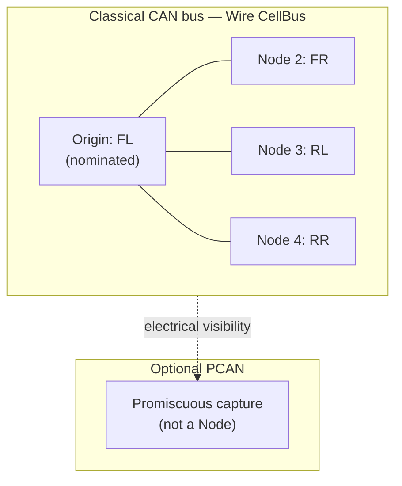

# Sketch 02 — Peer CAN ECUs (no coordinator)

**Intent:** Stress Origin placement and peer equality on a shared Classical CAN bus where every MCU publishes state and any MCU may command any other — with **no natural coordinator** in the native model. Separate **peer telemetry** (observation on one Wire) from **peer-addressed control** (where the model fractures). Exercise whether passive observation stands in for symmetric publication, and what breaks for arbitrary A→B commands (`CORE §3.1`, `§12.6`).

**Archetype:** Four STM32-class ECUs on one committed 11-bit Classical CAN segment (`LINK §2`). Optional PCAN adapter for bench observation only.

---

## Configurations

### Config A — Four peer ECUs on one CAN bus

**What changed** (standalone sketch):

- Four ECUs on one CAN bus; symmetric roles in the application (no designated master in firmware intent).
- Each ECU publishes actuator/sensor state ~10 Hz and may issue commands to any other (enable, setpoint, fault reset).
- One committed WS Wire on the bus; nominal Origin assigned at commissioning (lowest NodeId convention).
- Optional: developer PC on CAN via PCAN for promiscuous capture / maintenance (`DEPLOY §3.1`) — not a plant coordinator.

**Maturity level:** **Level 1–2**. NodeIds and WireNumber are commissioned; no PC required for normal operation. Organizer may discover the bus and export static Wiring.

---

## Config A — Four peer ECUs

### Native communication model

```text
Four ECUs (FL, FR, RL, RR) share one Classical CAN bus — e.g. four corners of a small mobile platform.

Each ECU:
  - publishes its own wheel speed, driver state, and fault flags periodically;
  - listens to the other three ECUs' periodic state (every frame is visible on the bus);
  - may command any other ECU directly (torque enable, speed setpoint, clear fault) without asking a master;
  - reacts to observed faults on other corners (e.g. cut torque if any neighbor reports slip).

There is no firmware-designated coordinator. Arbitration is CAN's; addressing is per-frame CAN IDs chosen by each ECU's stack.

A developer may attach a PC with a PCAN adapter to log traffic during bring-up. The PC is not part of normal runtime control.
```

Peers are **equal** in authority. The bus is physically broadcast; application logic treats received frames as "whoever sent this, I can act on it if it's for me."

### Obvious conventional implementation

> **Obvious conventional implementation:** Fixed CAN identifier plan — each ECU owns TX IDs for its status frames; peer commands use addressed CAN IDs (or a small matrix of command IDs per source/destination pair). Every ECU implements the full RX filter table. No bus master; symmetry is in the ID map and handler tables.

> **What additional conceptual objects does WS introduce compared with this?** At minimum: one Wire, one **nominated** Origin (not a peer in the native sense), per-ECU NodeIds, Direction on every PDU, and explicit **observer configuration** if peers consume each other's `NodeToOrigin` traffic. Peer-to-peer command may move from CAN-ID addressing to application-layer addressing over observed bus traffic, or to multiple overlapping Wires — see mapping below.

### WireSpaces mapping

#### Design choice: one Wire, nominated Origin, observation for peer visibility

WireSpaces has **no Node-to-Node unicast primitive** (`CORE §3.1`). On a single Wire the structural directions are only `OriginToNode` and `NodeToOrigin`. Peer equality therefore requires a design pattern, not a built-in role.

**Primary mapping — `CellBus` (one Wire, four devices on one CAN Link):**

```text
Wire CellBus (e.g. #50)
  Origin:  FL  (nominated at commissioning — lowest NodeId convention)
  Nodes:   FR (2), RL (3), RR (4)

Physical: one Classical CAN bus; all four ECUs + optional PCAN
```



#### Telemetry — who publishes how?

| ECU | Role on CellBus | Autonomous state publish | Mechanism |
|---|---|---|---|
| FL | **Origin** | Wheel status, faults | `OriginToNode`, **NodeId 0** (broadcast to all Nodes) (`CORE §3.1`) |
| FR, RL, RR | Node | Wheel status, faults | `NodeToOrigin` to FL (nominal sink) |

FL cannot use `NodeToOrigin` on CellBus — Origin and Node are mutually exclusive on one Wire (`CORE §3.3`). The Origin's own telemetry **must** use `OriginToNode` broadcast, not the same pattern as the other three ECUs. That is already a mild asymmetry in an allegedly symmetric peer system.

#### Peer visibility — passive observation, not NodeToOrigin "broadcast"

A common mental model: *"each ECU broadcasts to everyone by sending `NodeToOrigin`."* **`NodeId == 0` is invalid in `NodeToOrigin`** (`CORE §3.1`) — there is no WS-layer "broadcast to all Nodes via NodeToOrigin."

What actually exists on CAN:

```text
FR sends NodeToOrigin  →  nominal sink is FL (Origin)
                         electrical fan-out: RL, RR, PCAN also see the frame
```

Other ECUs may **consume** FR's publication only if configuration explicitly permits observing `NodeToOrigin` traffic not addressed to them (`CORE §3.1`, `§12.6`):

> Electrical visibility ≠ membership. Seeing a frame grants no delivery right unless configured.

**Sketch choice for peer state:** FR, RL, RR each publish `NodeToOrigin`; FL, FR, RL, RR each configure **passive observation** of the other three Nodes' status Endpoints on CellBus. One CAN transmission per update; no duplicate TX.

| Approach | WS mechanism | One CAN TX per update? | Verdict |
|---|---|---|---|
| **Observation (chosen)** | Nodes publish `NodeToOrigin`; peers observe configured Endpoints | Yes | Matches bus physics; requires explicit observer wiring |
| **Origin relay** | All Nodes send to FL; FL re-originates as `OriginToNode` broadcast | No — 2× for relayed nodes | Adds latency; FL becomes semantic hub |
| **Dual binding / re-TX** | Each ECU transmits separately for each consumer | No — N× | Rejected |
| **`NodeToOrigin` NodeId 0** | "Broadcast to everyone" | — | **Invalid** per `CORE §3.1` |

**Is observation a good mechanism for telemetry?** **Yes — legitimate and fairly clean** when passive observation is a first-class WS concept on broadcast Links.

- **Pros:** One Wire, one TX per publisher, faithful to CAN fan-out, no invented coordinator behavior in the data plane. Symmetric publication maps reasonably well.
- **Residual asymmetry:** The nominated Origin's telemetry uses `OriginToNode` broadcast while Nodes use `NodeToOrigin` — real model pressure, captured under **Artificial Origin**, not interaction awkwardness.
- **Config caveat:** Observer relationships must be declared; with symmetric-observation tooling (see friction table) this is not onerous. `learned-from-ingress` is **disabled** on unauthenticated CAN (`CORE §10.6`).

#### Peer commands — where the model fractures

Native model: ECU-FR commands ECU-RL directly. This is **peer-addressed control** — the fracture point for this sketch. Telemetry maps well; arbitrary A→B commands do not.

| Strategy | Mapping | Friction |
|---|---|---|
| **A. App-addressed over observed `NodeToOrigin`** | FR sends `NodeToOrigin` with command payload; RL's command Endpoint accepts **observed** ingress from FR's NodeId only | One Wire; native "FR→RL" becomes "FR→Origin, RL observes and parses dest" — **Wire layer no longer expresses the addressing relation** |
| **B. `OriginToNode` from nominated Origin** | FR sends request `NodeToOrigin` to FL; FL application relays `OriginToNode` to RL | FL becomes **application coordinator** — contradicts "no master" intent |
| **C. Per-commander Wire** | Wire `FR-Cmd`: FR Origin, RL/RR/FL Nodes; repeat per ECU | **Directionally clean, topologically expensive** — see alternative below |
| **D. Separate command Wire per pair** | Up to 12 Wires for 4 peers | Wire explosion; rejected except as stress bound |

**Sketch choice:** **A** for infrequent peer commands (fault reset, enable); **OriginToNode broadcast** from FL only for global estop-style actions all ECUs must accept. Strategy C recovers native unicast Direction semantics at the cost of four logical authority domains on one peer bus — a stress bound, not a recommendation unless each commander represents a distinct real authority.

```mermaid
sequenceDiagram
    participant FR as FR (Node 2)
    participant FL as FL (Origin)
    participant RL as RL (Node 3)

    Note over FR,RL: State (observation path)
    FR->>FL: NodeToOrigin — status Snapshot
    Note over RL: Observes FR status<br/>(configured permit)
    FR->>FL: NodeToOrigin — command for RL (app-addressed)
    Note over RL: Observes command;<br/>accepts if source=FR, dest=RL

    Note over FR,RL: Global estop (Origin broadcast)
    FL->>FR: OriginToNode NodeId 0 — estop
    FL->>RL: OriginToNode NodeId 0 — estop
```

#### Optional PCAN observation

Bench PC with PCAN adapter:

- **Not** a Node on CellBus for normal operation (no plant authority).
- Uses **promiscuous / bring-up mode** (`DEPLOY §3.1`) to log PDUs; does not create Wiring or consume as a configured recipient.
- If PC must actively command ECUs during bench: add a **second Wire** with PC as Origin (authority-shaped, same bus — cf. `01_dev_board` Wire Bench pattern). Omitted from primary mapping to keep focus on peer stress.

#### Tables

**Devices**

| Device | Endpoint Domains | Link interfaces | Role summary |
|---|---|---|---|
| ECU FL | 1 | CAN | **Origin** on CellBus; observes FR, RL, RR |
| ECU FR | 1 | CAN | Node 2; observes FL, RL, RR |
| ECU RL | 1 | CAN | Node 3; observes FL, FR, RR |
| ECU RR | 1 | CAN | Node 4; observes FL, FR, RL |
| PC (optional) | 1 | CAN (PCAN) | Promiscuous capture only |

**Wires**

| Wire (name / #) | Origin | Nodes | Physical realization | Notes |
|---|---|---|---|---|
| CellBus (50) | FL (1) | FR (2), RL (3), RR (4) | Classical CAN | One Wire; nominated Origin |

**Interactions**

| Interaction | Producer | Consumer(s) | Wire | Direction | Notes |
|---|---|---|---|---|---|
| Wheel status (FL) | FL | FR, RL, RR | CellBus | Origin→Node (NodeId 0) | Origin uses broadcast, not NodeToOrigin |
| Wheel status (others) | FR / RL / RR | FL + observed peers | CellBus | Node→Origin | Peers consume via **observation** |
| Peer command (e.g. FR→RL) | FR | RL | CellBus | Node→Origin | App-addressed; RL observes FR ingress |
| Global estop | FL | all Nodes | CellBus | Origin→Node (NodeId 0) | Legitimate Origin broadcast |
| Fault reaction | any observer | local actuator | — | local | Application logic on observed state |

**Services / Endpoints** (topology-relevant)

| Service | Endpoint (NS/EID) | Wire | Direction | Rx / Tx storage | Notes |
|---|---|---|---|---|---|
| WheelStatus | NS0 / status | CellBus | mixed | Tx Snapshot per role | FL: Origin broadcast; others: NodeToOrigin |
| PeerCommand | NS0 / cmd | CellBus | Node→Origin | Rx Queue (observe) + Tx | Destination in payload; source from WS identity |
| Health | NS0 / Health | CellBus | Node→Origin | Tx Snapshot | FL via Origin broadcast if needed |

No gateway forwarding table — single Link, single Wire.

#### Alternative decomposition: one Wire per commander (authority-shaped proliferation)

If each ECU must be **Origin** for its own command authority (symmetric WS roles without nominating FL):

```text
Wire FL-Cmd: Origin FL, Nodes FR, RL, RR
Wire FR-Cmd: Origin FR, Nodes FL, RL, RR
Wire RL-Cmd: Origin RL, Nodes FL, FR, RR
Wire RR-Cmd: Origin RR, Nodes FL, FR, RL
```

All four Wires share the **same CAN Physical Link** (`CORE §3` — multiple Wires per Link). Each commander uses `OriginToNode` to addressed peers — **directionally clean** (native unicast Direction), **topologically expensive** (four authority domains on one peer bus to recover addressing WS lacks at the Wire layer).

| Aspect | One Wire + observation | Four commander Wires |
|---|---|---|
| Wire count | 1 | 4 |
| Origin | One nominated (artificial) | Each ECU is Origin somewhere (symmetric roles, artificial topology) |
| Peer state | Observe `NodeToOrigin` — **clean** | Observe or per-Wire NodeToOrigin to each Origin |
| Peer command | App-layer on observed traffic | Native `OriginToNode` unicast — **directionally clean** |
| CAN bandwidth | 1× per status TX | Risk of 4× if status duplicated per Wire |
| Config complexity | Symmetric observation declaration (tool-generated) | 4× Wire membership + aliases |

**Verdict:** One-Wire + observation is **topologically minimal** — best for telemetry, leaks peer addressing into Services for commands. Four-Wire model is **directionally clean for commands** but turns one natural peer bus into four logical authority domains; useful as a **stress bound**, not a more "honest" answer unless each Wire names a real distinct authority. Keep both; neither is free.

#### Alternative considered: virtual / off-bus Origin

Commission FL as Origin only because tooling requires an Origin slot, with FL's application treating peer traffic as symmetric. Same as primary mapping — highlights that **Origin is a WS formalism**, not a product role. A maintenance PC as permanent Origin (without PCAN promiscuous-only) changes the native "no coordinator" story and is deferred.

### What if this changes?

| Change | Effect |
|---|---|
| **Five ECUs** | Same patterns; generated observer tables grow O(n²); user-facing burden unchanged if symmetric-observation tooling exists |
| **Add gateway / PC as bench Origin Wire** | Second authority-shaped Wire on same CAN (`01` pattern); peers unchanged on CellBus |
| **Require reliable peer command ACK** | Observation + app ACK is Service-layer; per-pair `NodeToOrigin` reply on same Wire (`CORE §10.1`) — correlation in Service, not Direction |
| **Elected runtime master** | Nominated Origin becomes semantically justified; FL asymmetry acceptable |
| **CAN FD one-frame PDUs** | Same Wire semantics; less PDUA friction |

### Friction signals — Config A

Ratings: **actual clunkiness on the chosen happy path**, not edge-case documentation gaps or internal table cardinality.

| Signal | Rating | Justification |
|---|---|---|
| Artificial Origin | **Significant** | FL is Origin only because WS requires exactly one per Wire; no plant master exists. FL's telemetry path differs from peers (`OriginToNode` broadcast vs `NodeToOrigin`). |
| Artificial Wire | **None** | One CAN bus ↔ one logical cell bus is natural. |
| Wire proliferation | **Mild** (primary) / **Significant** (4-Wire alt) | Primary stays at one Wire; four-commander alternative is the proliferation stress case. |
| Forwarding tax | **None** | No gateway. |
| Identity awkwardness | **Mild** | NodeIds are useful source identities on a shared bus — not awkward. The **Origin/Node role distinction** (not NodeId) imposes hierarchy the native model lacks. |
| Interaction awkwardness | **Significant** | **Peer-addressed control only.** Telemetry via observation is clean. Commands require "FR→Origin, RL observes and accepts by app-layer dest" — the Wire layer no longer expresses the natural addressing relation. |
| Configuration burden | **Mild** with symmetric-observation tooling; **Significant** if per-peer/per-Endpoint observer bindings are hand-maintained | One Wire and four NodeIds are small. User declares e.g. "all members observe `WheelStatus` from all others"; tool may generate O(n²) tables without O(n²) authoring burden. |
| Role instability | **None** | Fixed at commissioning. |
| Failure mismatch | **Mild** | CAN fault is link-level; "Wire down" is the whole cell — matches physics. |

### Model pressure — Config A

- **Change one concept?** Narrow options, not a vague "peer-equal Wire profile":
  - **Observer groups** — first-class symmetric observation declarations on broadcast Links (tooling generates bindings); addresses telemetry well.
  - **Native peer-addressed interaction** — distinct from Wire Direction; only if multiple sketches demand it.
  - **Accept as non-goal** — arbitrary peer command meshes may simply be outside the sweet spot (`CORE §3.1` already steers substantial Node-to-Node interaction toward another Wire with one participant as Origin).
- **Useful distinction?** **Peer telemetry vs peer-addressed control** — the problem is not symmetric publication; it is arbitrary A→B commands without a native Node→Node relation. Electrical fan-out vs semantic broadcast (`§12.6`) matters for telemetry; observation is the bridge.
- **Question the mechanism:** App-addressed commands over observation are a **documented compromise**, not the natural WS expression of peer unicast. Reserve per-commander Wires for cases where each commander is a real authority domain.

### Open questions — Config A

- Should Organizer support **symmetric observation groups** ("all members of Wire X observe Endpoint Y from all other members") as a first-class declaration?
- For peer commands, is app-addressed observation a **documented compromise** or an anti-pattern to discourage?
- May an Origin ECU's status use the same Snapshot schema as Nodes if the transmit API path differs (`OriginToNode` broadcast vs `NodeToOrigin`)?
- Phase 2: will independent agents converge on one Wire + observation vs four commander Wires from the same neutral description?

---

## Synthesis

| Topic | Finding |
|---|---|
| Expected fit (`README` catalog) | **Origin stress** — representable but **outside WS's strongest topology regime** |
| Peer telemetry | Maps **reasonably well** via passive observation — one TX, CAN fan-out, explicit permits |
| Peer-addressed control | **The fracture** — no native Node→Node; app-layer addressing over observation or Wire proliferation |
| Broadcast on peer bus | `OriginToNode` NodeId 0 from Origin; **`NodeToOrigin` "broadcast" does not exist** |
| Nominated Origin | Required on single-Wire model; **Significant** artificial Origin |
| Four-Wire alternative | Directionally clean for commands; topologically expensive — stress bound only |

Peer CAN is where **equal participants** meet **exactly-one-Origin-per-Wire**. The architecture remains usable, but the **native CAN ID matrix is simpler for true peer symmetry** — a useful negative result, not something to explain away. WS does real work when authority relationships exist (`01_dev_board`); on a truly peer-equal bus, structure becomes ceremony or leaks into application-level addressing. Arbitrary peer command meshes may be a deliberate **non-goal** unless future sketches prove otherwise.

---

## References

| Doc | Sections used |
|---|---|
| `CORE` | §3.1 Direction / observation / no Node-to-Node, §3.3 invariants, §10.1 reply on one Wire, §10.6 learned-from-ingress on CAN, §12.6 visibility ≠ membership |
| `LINK` | §2 Classical CAN committed profile, §2.13 commissioning (deferred) |
| `DEPLOY` | §3.1 promiscuous mode |
| `sketches/README` | Origin stress catalog entry; guidance from sketch reviews |
