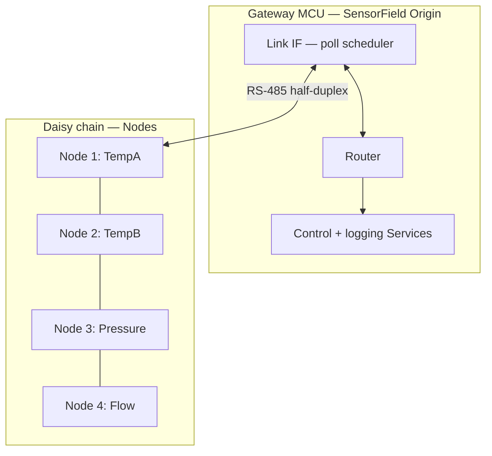
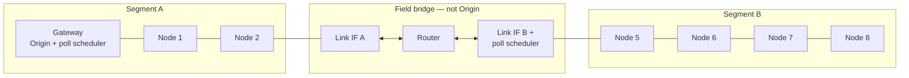
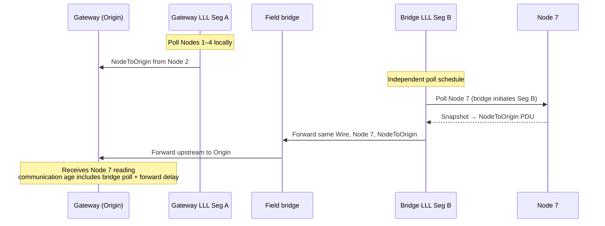

# Sketch 03 — RS-485 industrial sensor chain

**Intent:** Exercise **master-initiated / polled** Links (`CORE §1.7`) where Origin/Node maps to a **real** bus master and passive sensor Nodes — the catalog's **strong expected fit**. Config A establishes Snapshot transmit + poll. Config B tests whether **one semantic Wire** can span **multiple locally-polled RS-485 Links** when a field bridge sits between electrically separate segments — distinguishing **Wire Origin** (semantic authority) from **Link poll initiator** (local scheduling).

**Archetype:** Gateway PLC/MCU as RS-485 master; byte-stream profile with half-duplex turnaround (`LINK §3`); 4–8 remote sensor Nodes on a daisy chain.

---

## Configurations

### Config A — Single RS-485 segment

**What changed** (baseline for this sketch):

- One gateway MCU acts as RS-485 bus master (half-duplex turnaround).
- Four remote sensor Nodes on one daisy-chained segment (temperature ×2, pressure, flow).
- Gateway LLL polls each Node on a fixed schedule; Nodes do not initiate bus traffic.
- Gateway sends configuration and calibration commands on demand.
- One Wire (`SensorField`); static Wiring at Level 2.

**Maturity level:** **Level 2**. NodeIds, WireNumber, poll cadence, and per-Node bindings are authored or generated and exported — appropriate for a deployed sensor chain.

---

### Config B — Active field bridge, two polled segments

**What changed** vs Config A:

- Eight sensor Nodes: four on **Segment A** (gateway head), four on **Segment B** (electrically separate, beyond an **active** field bridge).
- **Gateway remains the sole semantic Origin** on `SensorField`; the bridge is **not** a second Origin.
- Gateway LLL polls Nodes 1–4 on Segment A. **Bridge Segment-B LLL independently polls Nodes 5–8** — the gateway cannot physically master half-duplex transactions on Segment B.
- Bridge forwards canonical `NodeToOrigin` PDUs upstream and `OriginToNode` PDUs downstream on the **same Wire** (`CORE §12`).
- Tests whether poll projections per Link compose without turning each local bus master into a semantic Origin.

**Maturity level:** **Level 2**. Same as A, plus bridge poll projection, forwarding table, and per-segment Link capabilities.

**Not Config B:** A **passive** RS-485 repeater (bit-transparent, electrically one bus) collapses to Config A with longer cable — one Link, gateway polls all eight Nodes. Config B requires an active bridge with two Link Interfaces.

---

## Config A — Single segment

### Native communication model

```text
A gateway MCU (PLC role) sits at the head of an RS-485 daisy chain.

Four remote devices:
  - two temperature transmitters,
  - one pressure transmitter,
  - one flow meter.

Each sensor:
  - samples its process variable locally;
  - holds the latest reading in RAM;
  - responds only when the master addresses it (Modbus-style request/response or equivalent);
  - does not seize the bus outside the master-initiated profile.

The gateway:
  - polls each sensor on a 100 ms round-robin (25 ms effective per device);
  - logs readings and drives local control outputs;
  - occasionally sends configuration (unit scale, filter constant, device address).

Half-duplex RS-485 with a single master-initiated poll profile.
```

The master/slave relationship is **physical and operational**, not a WS formality.

### Obvious conventional implementation

> **Obvious conventional implementation:** Modbus RTU (or similar) on RS-485 — master maintains a poll table of slave addresses, function codes for read holding registers / write single register, CRC16 on each frame, turnaround timing between TX and RX. Each sensor implements the same slave profile; the gateway implements the master state machine.

> **What additional conceptual objects does WS introduce compared with this?** One Wire with explicit Origin, four NodeIds, canonical PDUs instead of Modbus function codes (or a Modbus carrier inside WS — out of scope), Snapshot transmit semantics on sensors, Link-level poll cadence in capabilities, and freshness metadata on acceptance. The **master/slave structure already exists** in both models; WS names it Origin/Node and separates Link scheduling from Service publication.

### WireSpaces mapping

#### Design choice: one Wire, natural Origin, Snapshot + poll

```text
Wire SensorField (e.g. #60)
  Origin:  Gateway MCU          ← semantic authority
  Nodes:   TempA (1), TempB (2), Pressure (3), Flow (4)

Physical: one RS-485 segment (half-duplex, master-initiated profile)
Profile:  byte-stream / UART LLL with turnaround (`LINK §3`)

Gateway Link IF:
  poll scheduler initiates local RS-485 transactions
  (Link controller — not a second meaning of "Origin")
```



#### Master-initiated mechanics — why this fits WS

On a polled Link (`CORE §1.7`):

- A Node **cannot** push `NodeToOrigin` when the sample is taken — only when the local Link scheduler polls.
- The LLL **initiates** the bus transaction; the sensor Service **authors** the payload (`Snapshot transmit`, `CORE §10.4`).
- An empty poll response is **normal**, not a fault (`CORE §18.1`).
- Effective **communication** rate is bounded by poll cadence — must appear in Link capabilities and static capacity checks (`DEPLOY §2.2`).
- QoS is effectively **Minimal** — Critical cannot beat the next poll (`CORE §14.1`).

Three concerns stay separate:

```text
Service:  "This is my current value."           (Snapshot transmit)
Link:     "I have bus ownership; I'll read it." (poll scheduler)
Wire:     "This belongs to Node N → Origin."   (canonical PDU)
```

#### Freshness — communication age vs measurement age

Do not conflate **when the Gateway received a value** with **when the sensor sampled it**.

| Concept | Bound | Mechanism |
|---|---|---|
| **Communication age** | ≈ one poll interval (when polls succeed) | Arrival timestamp at Gateway acceptance (`CORE §9.3`, `§21.4`) |
| **Measurement age** | Sensor sample period + filter delay | Service payload: sample time, generation counter, or explicit freshness metadata |

Example: sensor samples every 1 s; master polls every 100 ms. A freshly received Snapshot may still contain a measurement up to ~1 s old. The poll cadence bounds **delivery latency**, not **process-variable staleness**.

```mermaid
sequenceDiagram
    participant LLL as Gateway LLL (poll scheduler)
    participant SVC as TempA Service
    participant BUS as RS-485 bus

    Note over SVC: Sample temperature;<br/>write Snapshot transmit EP
    LLL->>BUS: Poll Node 1 (Link initiates)
    BUS->>SVC: Turnaround; collect Snapshot
    SVC-->>LLL: NodeToOrigin PDU — value + Service freshness
    LLL->>LLL: Deliver to Gateway consumer EP<br/>(arrival time recorded)
```

**Sketch choice:** Each sensor uses **Snapshot transmit** for process variables; gateway uses **Snapshot receive**. Configuration commands use **OriginToNode** unicast to the target Node.

#### Tables — Config A

**Devices**

| Device | Endpoint Domains | Link interfaces | Role summary |
|---|---|---|---|
| Gateway MCU | 1 | RS-485 | **Origin** on SensorField; Segment poll scheduler |
| TempA, TempB, Pressure, Flow | 1 each | RS-485 | Nodes 1–4; Snapshot transmit |

**Wires**

| Wire (name / #) | Origin | Nodes | Physical realization | Notes |
|---|---|---|---|---|
| SensorField (60) | Gateway | TempA (1), TempB (2), Pressure (3), Flow (4) | RS-485 segment | QoS-Minimal; poll-bound |

**Interactions**

| Interaction | Producer | Consumer(s) | Wire | Direction | Notes |
|---|---|---|---|---|---|
| Process variable read | each sensor | Gateway | SensorField | Node→Origin | Polled Snapshot; **communication** age ≈ poll interval |
| Alarm / event (if any) | sensor | Gateway | SensorField | Node→Origin | Queue EP; poll must drain fast enough |
| Config / calibration | Gateway | target sensor | SensorField | Origin→Node | On demand |
| Health / identity | sensors | Gateway | SensorField | Node→Origin | In poll round or separate Endpoint |

**Services / Endpoints** (topology-relevant)

| Service | Endpoint (NS/EID) | Device | Wire | Tx storage | Notes |
|---|---|---|---|---|---|
| ProcessValue | NS0 / pv | sensor | SensorField | **Snapshot transmit** | LLL samples on poll |
| ProcessValue | NS0 / pv | gateway | SensorField | Snapshot receive | Arrival time + Service sample metadata |
| DeviceConfig | NS0 / cfg | both | SensorField | Queue / Snapshot | Request/response on command |

No gateway forwarding — single Link.

#### Alternative considered: autonomous Node publish

If sensors called `send()` expecting immediate bus TX on sample:

- Violates the **selected master-initiated WireSpaces Link profile** (`CORE §1.7`), not the RS-485 PHY.
- Half-duplex RS-485 does not inherently require single-master operation — token passing, TDMA, and multi-master schemes exist on the wire.
- WS intentionally separates **Physical Link** from **LLL behavior**; this sketch selects master-initiated polling. A different profile would be a different mapping exercise.
- **Rejected for this sketch** — wrong profile choice, not physical impossibility.

#### Alternative considered: one Wire per sensor

Four point-to-point "Wires" over one cable — ignores shared bus reality. **Rejected** as anti-pattern.

### Friction signals — Config A

Ratings: **actual clunkiness on the happy path**.

| Signal | Rating | Justification |
|---|---|---|
| Artificial Origin | **None** | Gateway is the operational bus master; Origin matches semantic authority. |
| Artificial Wire | **None** | One field bus ↔ one SensorField Wire. |
| Wire proliferation | **None** | Single Wire sufficient. |
| Forwarding tax | **None** | No bridge. |
| Identity awkwardness | **None** | NodeIds map to device addresses; master/slave is the native model. |
| Interaction awkwardness | **None** | Poll/response and Origin command map directly; Snapshot + poll is `CORE §10.4`. |
| Configuration burden | **None** | Wire + NodeIds + poll schedule + bindings ≡ Modbus address/poll table; Organizer generates equivalent state — "configuration exists" is not friction under the rubric. |
| Role instability | **None** | Fixed roles. |
| Failure mismatch | **Mild** | Sensor offline → poll timeout; same as Modbus. |

---

## Config B — Active field bridge, two polled segments

### Native communication model

```text
Gateway --[Segment A, RS-485]-- Field bridge --[Segment B, RS-485]-- four more sensors

Segment A: Nodes 1–2 (TempA, TempB) — gateway is bus master here.
Segment B: Nodes 5–8 (TempC, TempD, Pressure2, Flow2) — electrically separate bus.

The field bridge:
  - has two RS-485 transceivers (two independent half-duplex buses);
  - is NOT a bit-transparent physical repeater;
  - must act as bus master on Segment B to poll those sensors;
  - passes sensor readings toward the gateway and gateway commands toward Segment B;
  - adds latency; Node 7 data reaches the gateway asynchronously after bridge poll + forward.

From the gateway application's view: one sensor field, eight Node addresses, one coordinator role.
From the physics view: two separately mastered RS-485 segments.
```

### Obvious conventional implementation

> **Obvious conventional implementation:** Two Modbus RTU buses — gateway masters Segment A; bridge MCU masters Segment B with its own poll table, reading slaves and **mapping** results into the gateway's address space (or reporting upstream via a separate protocol). Alternatively, gateway extends its logical poll table but **cannot** execute Segment B polls itself — something on the far side must. A passive repeater would be one electrical bus (Config A); this sketch is the **active two-master** plant layout.

> **What additional conceptual objects does WS introduce?** **Semantic Origin** (gateway only) vs **per-Link poll schedulers** (gateway on A, bridge on B); bridge **poll projection** for downstream Nodes; same-Wire PDU forwarding; separate **Link-local address** ↔ NodeId mapping at the bridge; multi-stage freshness; richer failure attribution.

### WireSpaces mapping

#### Design choice: one semantic Wire, two Link poll schedulers

```text
Wire SensorField (60)
  Origin:  Gateway MCU only
  Nodes:   1–4 on Segment A, 5–8 on Segment B

Gateway:
  semantic Origin on SensorField
  Segment A LLL polls Nodes 1–4

Field bridge:
  NOT Origin on SensorField
  Segment B LLL polls Nodes 5–8 per poll projection
  forwards canonical PDUs between Link IFs (same Wire)

Invariant:
  Wire Origin     = semantic authority / addressing role
  Link scheduler = local transfer initiation (avoid calling this "Origin" in APIs)
```

**Poll projection** (bridge, conceptual):

```text
SensorField on Segment B:
  Nodes 5..8
  poll Snapshot TX Endpoints at configured cadences
  emit NodeToOrigin PDUs toward Gateway (forward upstream)
```

A Node 5 response is still semantically:

```text
Wire SensorField | Node 5 | NodeToOrigin
```

even though the **bridge's** UART hardware initiated the Segment B transaction. The bridge **caused a transfer** but did not invent a semantic Wire operation (`CORE §1.7`: initiating transfer ≠ authoring message).





#### Gateway forwarding + bridge poll (combined behavior)

| Path | Trigger | Bridge action | PDU preserved |
|---|---|---|---|
| Node 5–8 telemetry | Bridge LLL poll schedule | Collect Snapshot; forward `NodeToOrigin` upstream | Wire, NodeId, Direction, payload |
| Gateway → Node 7 command | Gateway sends `OriginToNode` on Seg A | Forward downstream; Segment B LLL delivers on next turnaround | Same |
| Node 1–4 telemetry | Gateway LLL poll | No bridge involvement | — |

Bridge is **not** a purely reactive PDU forwarder — it holds **scheduling state** for Segment B (which Nodes exist, which Endpoints to poll, cadence). That state is Link configuration, not a second Origin.

#### Questions Config B is meant to surface

| Question | Sketch hypothesis |
|---|---|
| Is poll schedule part of **Link configuration** distributed to each scheduler? | Yes — each Link IF gets a **poll projection** for its downstream Nodes on this Wire |
| Can different parts of one Wire have different poll cadences? | Yes — Segment A and B schedulers are independent; static checks must validate each segment and end-to-end freshness |
| Does bridge poll autonomously or only when upstream asks? | **Autonomously** on Segment B — gateway cannot trigger Seg B half-duplex transactions |
| Missing Node 7 sample — who failed? | **Ambiguous without Link telemetry** — Node 7, Segment B, bridge scheduler, or upstream link (`DEPLOY §3.3`) |
| Link-local address vs NodeId? | Bridge maps RS-485 address 3 ↔ Wire Node 7 — must not conflate |
| Events on downstream Nodes? | **Harder than Snapshots** — Queue must be drained per poll; overflow is real capacity pressure |

#### Poll projection size — is it clean?

Target shape (small):

```text
SensorField @ Segment B:
  Nodes 5–8
  Endpoint NS0/pv: poll every 25 ms
  Endpoint NS0/health: poll every 1000 ms
```

Not hundreds of routing entries — **Nodes + Endpoints + cadences** on this Link for this Wire. If implementation requires per-pair special cases, that is **model pressure**.

#### Passive repeater variant (not primary Config B)

| Deployment | WS view |
|---|---|
| Passive RS-485 repeater | One electrical bus, one Link — **Config A** with eight Nodes |
| Active bridge, two transceivers | Two Links, bridge poll + forward — **Config B** |

#### Alternative considered — one Wire per segment

`SensorFieldA` + `SensorFieldB` with gateway Origin on A only — physical-link-shaped; gateway must merge two logical buses. **Rejected** for primary mapping (`README` guidance).

#### Alternative considered — bridge as second Origin

Bridge masters Segment B therefore bridge is Origin — **conflates Link controller with semantic Origin**. Rejected: gateway remains plant authority; bridge is poll scheduler + forwarder.

### Friction signals — Config B

| Signal | Rating | Justification |
|---|---|---|
| Artificial Origin | **None** | Gateway remains sole semantic Origin — correct |
| Artificial Wire | **None** | One logical sensor field |
| Wire proliferation | **None** | Still one Wire |
| Forwarding tax | **Mild** | Bridge forwards telemetry and commands — necessary |
| Identity awkwardness | **Mild** | NodeIds global on Wire; Link-local RS-485 addresses at bridge need explicit map |
| Interaction awkwardness | **Mild** | Snapshot path composes cleanly with per-Link poll projections; multi-stage freshness and failure attribution need discipline; Queue/events downstream are harder |
| Configuration burden | **Mild** | Gateway poll table + bridge poll projection + forward rules — still generatable if tooling expresses "Nodes 5–8 on Link B, poll these Endpoints" |
| Role instability | **None** | |
| Failure mismatch | **Significant** | "Node 7 silent" conflates Node, segment, bridge scheduler, and upstream link without per-Link telemetry |

If poll projection reduces to a compact per-Link declaration, interaction stays **Mild**; if it requires upstream poll-proxy or tightly coupled LLL coordination, would rise to **Significant** — current sketch assumes the compact form works.

### What if this changes?

| Change | Effect |
|---|---|
| **Passive repeater** | Collapse to Config A — one Link, one poll scheduler |
| **Different poll cadence per segment** | Supported; end-to-end freshness = sum of stages |
| **I2C/SPI downstream of bridge** | Same pattern: gateway = Origin; bridge I2C controller polls Nodes 5–8 (`CORE §1.7`) |
| **Sensor autonomously pushes** | Different Link profile — not this sketch |
| **Event-heavy downstream Node** | Queue drain cadence + overflow risk on bridge poll schedule |

---

## Cross-config synthesis

| Topic | Config A | Config B |
|---|---|---|
| Expected fit | **Strong** — cleanest so far | **Strong** if poll projection stays small |
| Semantic Origin | Gateway = natural | Gateway only; bridge is not Origin |
| Link schedulers | One (gateway) | Two (gateway Seg A + bridge Seg B) |
| Key finding | Snapshot + poll = intended WS composition | **One Wire across locally-mastered Links without per-segment Origins** |
| Wires | 1 | 1 (spans 2 Links) |

**Overall:** Config A is probably the **cleanest WireSpaces fit so far** — Origin/Node is the real master/slave model, Snapshot transmit + poll scheduler is exactly `CORE §10.4` / `§1.7`. Config B's main result is architectural, not a friction score: **Wire Origin (semantic authority) and Link poll initiator (local scheduling) are independent.** A single `SensorField` Wire can span I2C, SPI, polled RS-485, and similar Links where each segment's controller initiates transfers without becoming a semantic Origin — if poll projections stay compact. Contrast `02_peer_can`: WS shines when authority is real; Config B extends that to **composed polled plants**.

---

## Model pressure — both configs

- **Terminology:** Avoid calling I2C/SPI/RS-485 "master" **Origin** in APIs — use Link scheduler / poll controller vs Wire Origin.
- **Foundational capability?** A Wire may cross Links whose **local initiation authority differs from the Wire's semantic authority** — not an RS-485 special case.
- **Freshness:** Always separate **communication age** (poll-bound delivery) from **measurement age** (Service metadata).
- **Events vs Snapshots:** Snapshots compose across polled gateways; Queue Endpoints need drain guarantees per poll cycle.
- **Tooling:** Organizer should emit per-Link poll projections; validate end-to-end freshness across bridge hops (`DEPLOY §2.2`).

## Open questions

- Formal name and schema for **poll projection** in Link/Wiring configuration?
- Must bridge poll projections be **static** only, or may gateway adjust downstream cadence via `OriginToNode` config PDUs?
- Minimum bridge firmware: forward + poll only, or full Endpoint Domain with Link Telemetry (recommended for Config B failure attribution)?
- Does this pattern generalize to **multicore gateway** sketch 05 (shared-memory + fieldbus)?

---

## Spec findings

| ID | Config | Topic |
|---|---|---|
| [SF-002](synthesis.md#spec-findings-log) | B | Poll projection (per-Link schedule on one Wire) |
| [SF-003](synthesis.md#spec-findings-log) | A, B | Wire Origin vs Link poll initiator |
| [SF-011](synthesis.md#spec-findings-log) | A | Communication age vs measurement age |
| [SF-017](synthesis.md#spec-findings-log) | A | Master-initiated profile ≠ PHY law |

---

## References

| Doc | Sections used |
|---|---|
| `CORE` | §1.7 master-initiated/polled, §3 Wire/bus model, §9.3 arrival time, §10.4 Snapshot transmit, §12 forwarding, §14.1 QoS-Minimal, §21.4 freshness |
| `LINK` | §3 byte-stream / RS-485 turnaround |
| `DEPLOY` | §2.2 capacity / poll cadence, §3.3 Link Telemetry |
| `sketches/README` | Strong-fit catalog; sketch review guidance |
| `01_dev_board`, `02_peer_can` | Contrast: composed vs peer-equal authority |
