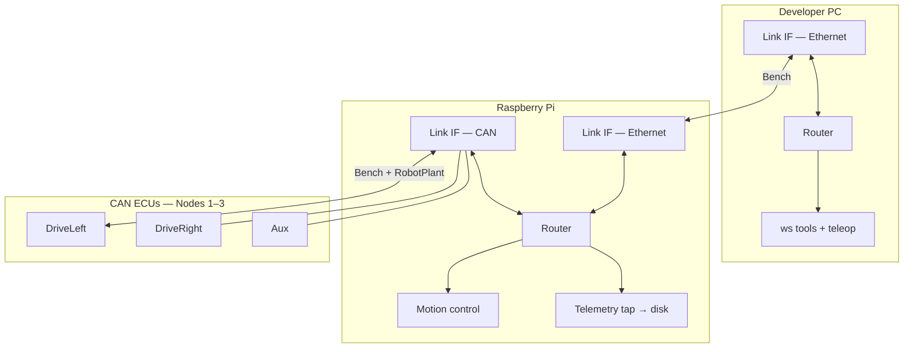
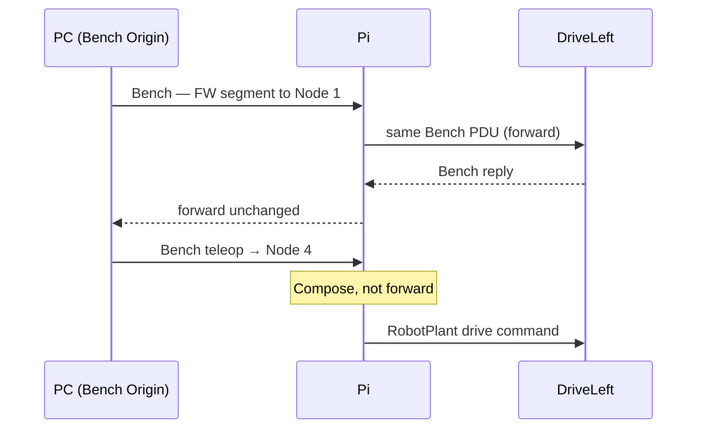
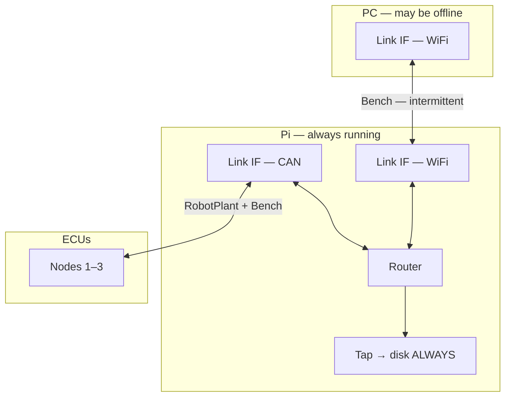
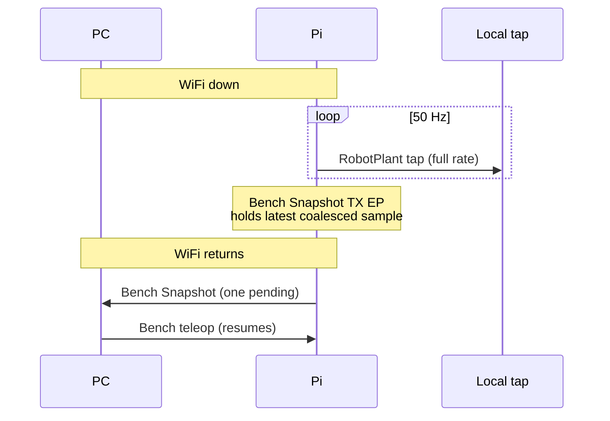
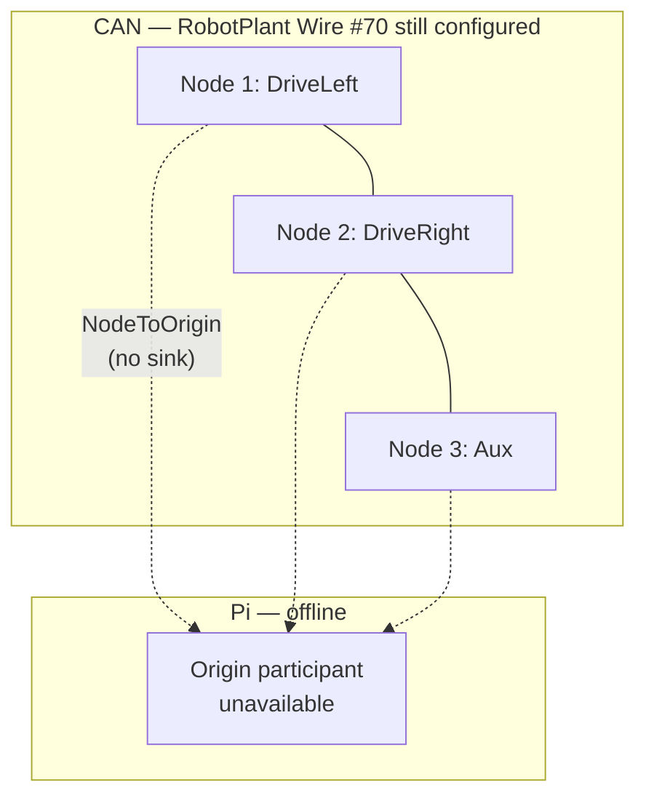

# Sketch 04 — Raspberry Pi robot (Linux gateway)

**Intent:** Exercise a **Linux host** as gateway (`IMPL §2`) between a developer PC and field ECUs. Config A (bench) establishes **authority-shaped Wires** with **Bench spanning Physical Links**. Config B stresses **intermittent WiFi**. Config C stresses **Pi offline** — configured Wires persist without role reassignment.

**Archetype:** Small differential-drive robot; Raspberry Pi runs control; two drive ECUs + one aux ECU on Classical CAN.

---

## Configurations

### Config A — Bench (PC ↔ Pi direct)

**What changed** (baseline):

- Pi with one Linux Endpoint Domain; three CAN ECUs.
- Pi runs motion control; **always logs telemetry** via RobotPlant observation tap.
- PC on **bench Ethernet** (stable).
- **RobotPlant** (Pi Origin, CAN) + **Bench** (PC Origin, Ethernet + CAN through Pi).

**Maturity level:** **Level 1–2**.

---

### Config B — Field (WiFi telemetry)

**What changed** vs Config A:

- PC connects over **intermittent WiFi** instead of bench Ethernet — same `Bench` Wire semantics, different Physical Link profile (UDP/IP or WS-over-Ethernet).
- **RobotPlant unchanged** — Pi continues autonomous control and **local logging when WiFi is down**.
- Bench telemetry to PC uses **Snapshot transmit** with at-most-one-pending (`DEPLOY §3.3`, `CORE §10.4`) — coalesces under link loss.
- Maintenance/teleop when link returns; no change to forward-vs-compose rules from Config A.

**Maturity level:** **Level 1–2**. Ephemeral link quality; static Wiring unchanged.

---

### Config C — ECUs standalone (Pi absent)

**What changed** vs Config A/B:

- Pi **powered off or removed** (failure, repair, shipping without compute).
- Three ECUs remain on CAN; motors in safe/disabled state.
- **No PC path to ECUs** (product rule: PC → Pi → ECU — Pi is gone).
- Tests **degraded operation** when the configured Origin device is offline — without role reassignment or Wire collapse.

**Maturity level:** **Level 2** configuration; **degraded runtime** with Origin unreachable.

---

## Config A — Bench

### Native communication model

```text
A small differential-drive robot:

  Raspberry Pi — motion planner, state estimator, data logger
  DriveLeft / DriveRight ECUs — motor drivers, encoders
  Aux ECU — bumpers, IMU

The Pi is the only CAN coordinator. Normal operation: ~50 Hz control loop;
Pi logs all telemetry locally continuously.

On the bench:
  - PC on wired Ethernet to the Pi
  - PC: maintenance tools + teleop
  - PC reaches ECUs only through the Pi (never direct CAN)
```

### Obvious conventional implementation

> **Obvious conventional implementation:** Pi runs ROS 2 or a control daemon; ECUs on CAN; PC uses SSH/Web UI/UDP teleop over Ethernet; maintenance tunnels through Pi.

> **What additional conceptual objects does WS introduce?** Two authority-shaped Wires; Pi **same-Wire `Bench` forward** for maintenance; **application composition** to `RobotPlant` for teleop — **no cross-Wire forwarding**.

### WireSpaces mapping

#### Design choice: authority-shaped Wires — Bench spans both Links

```text
Wire RobotPlant (#70)
  Origin:  Pi
  Nodes:   DriveL (1), DriveR (2), Aux (3)
  Links:   CAN

Wire Bench (#101)
  Origin:  PC
  Nodes:   DriveL (1), DriveR (2), Aux (3), Pi (4)
  Links:   Ethernet + CAN (Pi forwards Bench unchanged)
```

**Invariant:** Forwarding preserves Wire identity (`CORE §3.3`, `§12`). `Bench` → `RobotPlant` is application composition, not forwarding.



#### Two PC → ECU paths

**Maintenance — transparent `Bench` forward:**

```text
PC → Bench OriginToNode(DriveLeft) → Ethernet → Pi forward → CAN → DriveLeft
```

**Teleop — application composition:**

```text
PC → Bench OriginToNode(Pi) → Pi Service → RobotPlant OriginToNode(DriveLeft) → ECU
```



#### Local logging — observation tap

```text
RobotPlant ingress (CAN)
      ├── delivery → control Endpoint (Snapshot)
      └── local tap → logger Queue → disk
```

Not another Wire; not a second reader on the control Queue (`CORE §12.6`).

#### Tables — Config A

**Devices**

| Device | Endpoint Domains | Link interfaces | Role summary |
|---|---|---|---|
| Developer PC | 1 | Ethernet | Origin on Bench |
| Raspberry Pi | 1 | Ethernet, CAN | Origin RobotPlant; Node 4 Bench; forwards Bench |
| Drive ECUs, Aux | 1 each | CAN | Nodes 1–3 on both Wires |

**Wires**

| Wire | Origin | Nodes | Physical | Notes |
|---|---|---|---|---|
| RobotPlant (70) | Pi | 1–3 | CAN | Plant loop |
| Bench (101) | PC | 1–4 | Eth + CAN via Pi | PC authority |

**Gateway forwarding (Pi — Bench only)**

| Ingress | Wire | Egress | Local? | Notes |
|---|---|---|---|---|
| Ethernet | Bench | CAN | No | Maintenance pass-through |
| CAN | Bench | Ethernet | No | Reply pass-through |
| Ethernet | Bench | — | Yes | Teleop to Pi Node 4 |
| CAN | RobotPlant | — | Yes | Control + logger tap |

### Friction signals — Config A

| Signal | Rating | Justification |
|---|---|---|
| Artificial Origin | **None** | Real plant + bench authorities |
| Artificial Wire | **None** | Two authorities → two Wires |
| Wire proliferation | **None** | Minimal count |
| Forwarding tax | **None** | Same-Wire Bench forward is simpler than ad-hoc protocol translation; bridging is physics, not WS ceremony |
| Identity awkwardness | **None** | Stable ECU NodeIds |
| Interaction awkwardness | **None** | Forward vs compose is clean |
| Configuration burden | **Mild** | Organizer-mechanical |
| Role instability | **None** | |
| Failure mismatch | **Mild** | Bench down; local log continues |

---

## Config B — Field (WiFi)

### Native communication model

```text
Same robot as Config A, but the developer PC is no longer on the bench.

In the field:
  - Robot runs autonomously; Pi controls ECUs on CAN as before
  - Pi logs all telemetry locally at full rate (WiFi may be absent for minutes)
  - When WiFi is up, PC receives aggregated robot status and can teleop
  - When WiFi drops mid-session, teleop stops; robot continues local control + logging
  - When WiFi returns, PC reconnects; maintenance (logs, FW update) resumes

WiFi is intermittent — not a hard fault, normal operating condition.
PC still never reaches ECUs except through the Pi (over WiFi now).
```

### Obvious conventional implementation

> **Obvious conventional implementation:** Pi buffers logs to disk; telemetry to PC over MQTT/ROS bridge/WebSocket when connected; teleop channel shares the same flaky link; reconnect logic in the PC app; no cloud assumed.

> **What additional conceptual objects does WS introduce?** Same two Wires as Config A; **Link** changes (WiFi/UDP vs bench Ethernet) but **Bench authority unchanged**. Explicit Snapshot coalescing rules for Bench telemetry; Link state visible in telemetry; no new Wire for "offline mode."

### WireSpaces mapping

#### What changes vs Config A

| Aspect | Config A | Config B |
|---|---|---|
| Bench Physical Link | Bench Ethernet | **WiFi** (UDP/IP or L2) |
| RobotPlant | Unchanged | Unchanged |
| Bench Wire membership | Unchanged | Unchanged |
| Pi local tap | Full rate | **Full rate always** |
| PC telemetry | Aggregated Snapshot | Aggregated Snapshot, **coalesces when link slow** |
| FW update / maintenance | Over Bench | Over Bench when link up |

**Bench still spans WiFi + CAN through Pi.** Only the upstream Physical Link profile changes — not the authority model.



#### WiFi down — behavior

| Component | WiFi down | WiFi up |
|---|---|---|
| RobotPlant control | **Runs** | Runs |
| Logger tap | **Runs** | Runs |
| Bench Snapshot to PC | **Not transmitted**; latest coalesced in Pi Tx Snapshot EP | Transmitted; pending slot updates (`DEPLOY §3.3`) |
| Bench Queue (teleop) | RX stalls; commands don't arrive | Resumes |
| ECU FW update via Bench | **No forward progress** while disconnected; reliable transport / FW Update Service determines resume, timeout, or restart | Transparent forward resumes when link up |

Pi does **not** buffer unbounded Bench traffic while offline — Snapshot transmit holds **at most one pending** summary per destination; intermediate coalesced. Full-rate history stays on the **local tap only**.



#### Sketch choices

- **Do not** create a third Wire for "offline" or "cached telemetry" — local tap is not a Wire; PC was never entitled to full-rate stream.
- **Do not** forward RobotPlant PDUs onto Bench when WiFi returns — PC gets **aggregated Bench Snapshot** (same as Config A).
- Link Telemetry on Pi reports WiFi Link state to local consumers; optional Bench-facing health Snapshot includes link state for PC.

#### Tables — Config B (delta from A)

**Interactions** (additions/changes)

| Interaction | Producer | Consumer | Wire | Notes |
|---|---|---|---|---|
| Aggregated status | Pi | PC | Bench | Snapshot TX; coalesces; drops pending TX attempts when link down |
| Full-rate log | ECUs | Pi tap | RobotPlant | **Independent of WiFi** |
| Teleop | PC | Pi | Bench | Fails soft when WiFi down — no RobotPlant compose |

**Friction signals — Config B**

| Signal | Rating | Justification |
|---|---|---|
| Artificial Origin | **None** | Same as A |
| Artificial Wire | **None** | Same two Wires |
| Wire proliferation | **None** | |
| Forwarding tax | **None** | Same as A |
| Identity awkwardness | **None** | |
| Interaction awkwardness | **Mild** | Operator sees coalesced remote status vs full local log — product UX, not WS mapping |
| Configuration burden | **Mild** | Same Wiring; Link profile differs |
| Role instability | **None** | |
| Failure mismatch | **Mild** | **Intentional:** WiFi down ≠ plant fault; PC silence ≠ robot stop. Richer than A but matches product intent |

### What if this changes?

| Change | Effect |
|---|---|
| **Always-on cellular** | Same Bench model; Link reliability improves; friction → Config A |
| **PC expects full-rate remote log** | Wrong product assumption; needs pull/sync Service on Bench, not forward |
| **Pi stops control when WiFi down** | Policy choice outside WS; RobotPlant still valid |

---

## Config C — ECUs standalone (Pi absent)

### Native communication model

```text
Pi removed or powered off (failure, repair, shipment).

Three ECUs still on CAN, terminated and powered:
  - motors disabled / safe state
  - may broadcast last-known fault or heartbeat if firmware supports it
  - no motion control loop
  - no logging gateway
  - no path from PC (no Pi bridge)

A technician might bench-test one ECU alone later, but the deployed
robot-as-a-system no longer has a coordinator.
```

### Obvious conventional implementation

> **Obvious conventional implementation:** ECUs idle on CAN with watchdog safe outputs; no master polling unless a service tool is connected; restoring the Pi restores the bus master.

> **What additional conceptual objects does WS introduce?** The **configured Wire survives** Origin offline: RobotPlant remains Pi-Origin with Nodes 1–3; Bench remains PC-Origin but the Pi bridge is unreachable. No artificial replacement Origin. Node-originated `NodeToOrigin` traffic may continue on CAN; Origin-dependent operation cannot.

### WireSpaces mapping

#### Design choice: configured but degraded — no replacement Origin

Config C is **not** peer CAN (`02`) with a nominated ECU Origin:

- Removing the coordinator is **degraded operation**, not peer equality.
- Promoting DriveLeft to Origin would be **artificial** — WS does not require electing a replacement when the real authority is offline.

```text
RobotPlant #70  (configured — unchanged)
  Origin:  Pi          [offline / unreachable]
  Nodes:   DriveL (1), DriveR (2), Aux (3)

Bench #101  (configured — forwarding path broken)
  Origin:  PC
  Nodes:   1–4 including Pi
  Pi bridge absent → PC cannot reach CAN participants
```

The Origin **role** remains well-defined; its participant is simply unavailable. The Wire does not collapse or get renumbered.

**What continues on CAN (Classical CAN, autonomous Node publish):**

```text
DriveLeft -- NodeToOrigin --> absent Pi
DriveRight -- NodeToOrigin --> absent Pi
Aux       -- NodeToOrigin --> absent Pi
```

Valid WireSpaces PDUs — health, fault, last-known status. No consumer at the Origin; configured observers on the bus may still see them (`CORE §3.1`, `§12.6`). Not malformed traffic.

**What stops:**

| Capability | Why |
|---|---|
| `OriginToNode` RobotPlant control | No Origin participant |
| Pi local logging tap | No Pi |
| Bench Ethernet/WiFi ↔ CAN forward | No Pi bridge |
| Teleop / compose | No Pi Service |
| PC → ECU maintenance | No Bench path through Pi |



| State | RobotPlant | Bench | Notes |
|---|---|---|---|
| Pi online (A/B) | Operating | Operating when PC connected | Full system |
| Pi absent (C) | **Configured; Origin unreachable** | **Configured; bridge down** | Node TX may continue; Origin TX cannot |

#### Alternative considered: nominate DriveLeft as emergency Origin

```text
Wire RobotPlant: Origin DriveLeft, Nodes DriveR, Aux
```

**Rejected for this sketch** — confuses degraded absence with peer architecture (`02`). Emergency limp-mode might be a **different product** with different Wiring installed at commission time, not the same manifest with Pi removed.

#### Alternative considered: PC on CAN with PCAN

Violates **PC → Pi → ECU** product rule. Out of scope (service bay might use it conventionally; not this WireSpaces deployment).

#### Alternative considered: Bench without Pi

PC cannot span to CAN Nodes without the Pi bridge. Config C: Bench **configured but unreachable** through the broken forward path.

### Friction signals — Config C

| Signal | Rating | Justification |
|---|---|---|
| Artificial Origin | **None** | No replacement Origin elected — correct behavior |
| Artificial Wire | **None** | Same configured Wires; degradation is runtime state |
| Wire proliferation | **None** | |
| Interaction awkwardness | **None** | Native system is unhealthy; WS not pretending otherwise is not clunkiness |
| Configuration burden | **None** | Wiring unchanged from A/B; tooling may flag Origin offline |
| Role instability | **None** | Roles fixed; Origin participant absent — not reassigned |
| Failure mismatch | **None** | WS models coordinator loss without invalidating Wiring |

**Positive finding:** Coordinator loss does **not** invalidate Wiring or trigger role reassignment. RobotPlant remains configured with semantic Origin unavailable; Node-originated traffic may continue; Origin-dependent operation cannot.

### What if this changes?

| Change | Effect |
|---|---|
| **Pi returns** | Restore Config A/B Wiring; rediscover |
| **Permanent peer mode firmware** | Different product → `02_peer_can` territory |
| **ECU-local autonomy Wire** | Third Wire per ECU — proliferation; out of scope |

---

## Cross-config synthesis

| Topic | A (bench) | B (WiFi) | C (Pi absent) |
|---|---|---|---|
| RobotPlant | Pi Origin, operating | Same | **Configured; Origin unreachable** |
| Bench | PC Origin, Eth+CAN | PC Origin, WiFi+CAN | **Configured; bridge down** |
| Local log | Tap, full rate | Tap, full rate | Stopped (no Pi) |
| Node `NodeToOrigin` | Normal | Normal | **May continue** — no Origin sink |
| Key lesson | Forward vs compose | Link ≠ Wire identity | **No role reassignment on failure** |
| Fit | **Strong** | **Strong** | **Strong** (degraded runtime is honest) |

**Overall:** Configs A–C are a **strong positive result** for the Wire model. A/B establish authority-shaped Bench spanning Links with forward-vs-compose. B shows Link intermittency does not change Wire identity, authority, or local logging. C shows **coordinator loss does not collapse Wiring** — the model refuses to elect a replacement Origin, which is a feature.

**Canonical gateway example (A/B):**

```text
Maintenance:  PC ──Bench──> ECU     same-Wire forwarding
Teleop:       PC ──Bench──> Pi ──RobotPlant──> ECU   composition
```

**Config B invariant:**

```text
WiFi link availability changes
Bench Wire identity does not
RobotPlant does not
Service authority does not
local logging does not
```

---

## Model pressure

- **Forward vs compose** — central vocabulary for any gateway sketch.
- **Intermittent Link** — Snapshot coalescing + local tap separation (B).
- **Coordinator absence** — configured Wires persist; Origin participant offline without role reassignment (C).
- **Open:** Pull-based log sync over Bench when WiFi returns — new Service, not RobotPlant forward.

## Open questions

- Safety interlock: Pi validate all Bench teleop before RobotPlant TX?
- Config C: should tooling flag "Origin device offline" on Manifest mismatch?
- Config B: explicit Link-up trigger for one-shot Bench Snapshot publish?

---

## Spec findings

| ID | Config | Topic |
|---|---|---|
| [SF-001](synthesis.md#spec-findings-log) | A, B | Observation on broadcast Links (RobotPlant tap) |
| [SF-004](synthesis.md#spec-findings-log) | A, B | Forward vs compose (Bench maintenance vs teleop) |
| [SF-012](synthesis.md#spec-findings-log) | C | Wiring persists when Origin offline |
| [SF-013](synthesis.md#spec-findings-log) | A | Authority Wire lists downstream Nodes (Bench spans Eth+CAN) |
| [SF-015](synthesis.md#spec-findings-log) | A | Cross-Wire relay mislabeled as forward (rejected) |
| [SF-016](synthesis.md#spec-findings-log) | A, B | Local observation tap on gateway ingress |

---

## References

| Doc | Sections used |
|---|---|
| `CORE` | §3.3, §9, §10.4 Snapshot TX, §12, §12.6 |
| `DEPLOY` | §1.8, §3.2 IDebug, §3.3 telemetry Snapshot |
| `IMPL` | §2 Linux host |
| `01_dev_board`, `02_peer_can`, `03_rs485` | Gateway, peer, polled contrasts |
| `sketches/README` | Sketch 04 fixed choices |
