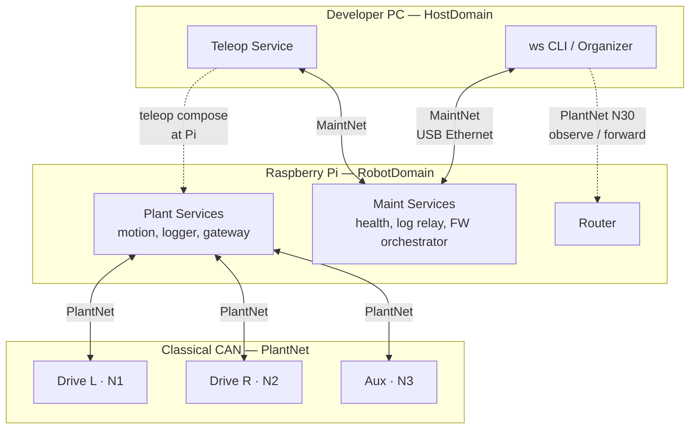

# Sketch 04 — Raspberry Pi Robot (Linux Gateway)

**Intent:** Exercise a **Linux host** as WireSpaces gateway between a developer/operator PC and field ECUs on Classical CAN. Stress **authority-shaped Wires** across heterogeneous Links (USB/Ethernet bench, WiFi field, CAN plant), **intermittent maintenance reachability**, **local telemetry logging that survives WiFi loss**, and **configured topology when the gateway Origin goes offline** — without role reassignment or ad-hoc peer routing.

**Archetype:** Small differential-drive robot; Raspberry Pi 4 onboard; two wheel-drive ECUs and one auxiliary ECU (power, bumpers, estop) on a single CAN segment; developer PC for bench work and occasional field monitoring.

---

## Executive summary

```text
**Mapping:** Two authority-shaped Wires — PlantNet (Pi Origin, ECUs Nodes, spans CAN + host
    Link via gateway forward) and MaintNet (PC Origin, Pi Node, host Link only). Teleop and
    remote commands are **composition** at Pi, not cross-Wire forwarding.
**Worst friction:** Interaction awkwardness — Mild (teleop/FW paths must be classified
    forward vs compose at Pi).
**Main lesson:** WiFi intermittency is a Link concern; PlantNet identity and Pi local logging
    persist across Config B; Config C shows Wiring survives Pi offline with no NodeId
    reassignment on ECUs.
**Configs:** A (bench), B (field WiFi), C (Pi absent).
```

---

## Configurations

### Config A — Bench (PC direct to Pi)

**What changed** (baseline for this sketch):

- Robot on the bench; developer PC attached to Pi via **USB Ethernet gadget** (or bench Ethernet cable).
- Classical CAN to three ECUs remains connected.
- PC runs maintenance tools (`ws devices`, `ws logs`, …) and a teleop / test application.
- Pi runs plant control, CAN gateway, and **always-on local telemetry logger** (even on bench — habit for field parity).

**Maturity level:** **Level 1–2.** Named Wires and NodeIds are commissioned once; Organizer can discover and export static Wiring. No Manifest required for first bench session, but the robot is not a Level 0 anonymous bus.

---

### Config B — Field (intermittent WiFi)

**What changed** vs Config A:

- Robot deployed; PC **not** cabled to Pi.
- **WiFi** is the host Link between PC and Pi when in range; link is **intermittent** (range, interference, sleep).
- Pi **continues logging** all PlantNet telemetry to local storage regardless of WiFi state (`README` fixed choice).
- PC receives telemetry **when WiFi is up**; gaps are expected and do not stop Pi logging.

**Maturity level:** **Level 1–2.** Same Wiring as Config A; only the active Physical Link for MaintNet / PlantNet host leg changes (USB → WiFi). WiFi loss is a **Link** fault, not a Wire topology change.

---

### Config C — ECUs standalone (Pi absent)

**What changed** vs Config B:

- Pi is **powered off** or its CAN transceiver is disconnected — not participating on the bus.
- Drive and Aux ECUs remain powered and connected on CAN.
- ECUs enter a **local safe state** (drives disabled, status frozen or minimal heartbeat only).
- No PC path to ECUs — still **no direct PC↔ECU Link** (`README` fixed choice).

**Maturity level:** **Level 1–2** (configured ECUs). The interesting case is **runtime absence**, not unconfigured bring-up.

---

## Shared physical layout

```text
                    ┌─────────────────────────────────────┐
                    │  Raspberry Pi 4 (one Linux Domain)  │
                    │  RobotDomain                        │
                    │    CAN IF ────────┐                 │
                    │    USB Eth IF ────┼── (Config A)    │
                    │    WiFi IF ───────┼── (Config B)    │
                    └───────────────────┼─────────────────┘
                                        │ Classical CAN
                          ┌─────────────┼─────────────┐
                          │             │             │
                     Drive L        Drive R         Aux
                     (Node 1)       (Node 2)      (Node 3)

  Config A:  PC ═══ USB/Ethernet ═══ Pi
  Config B:  PC ~~~~ WiFi ~~~~ Pi     (intermittent)
  Config C:  PC (no path)             Pi offline
```

| Device | Endpoint Domains | Link interfaces | Role summary |
|---|---|---|---|
| Developer PC | HostDomain | USB/Ethernet (A) or WiFi (B) | Maintenance Origin; teleop operator; diagnostic Node on PlantNet |
| Raspberry Pi 4 | **RobotDomain** (one Linux Domain) | CAN, USB/Eth or WiFi | PlantNet Origin; MaintNet Node; gateway; local logger |
| Drive L MCU | DriveL | CAN ×1 | Left wheel controller |
| Drive R MCU | DriveR | CAN ×1 | Right wheel controller |
| Aux MCU | Aux | CAN ×1 | Power, bumpers, estop chain |

---

## Config A — Bench

### Native communication model

```text
Three ECUs on CAN publish drive status, fault flags, and aux sensor state at fixed rates.
The Pi runs motion control: it consumes ECU telemetry, computes wheel commands, and sends
setpoints to both drive ECUs.

The developer PC:
  - tails logs and health from Pi and (via Pi) from ECUs;
  - may push firmware images to ECUs through Pi orchestration;
  - runs a teleop application that sends velocity commands to Pi, which translates them
    into drive setpoints on CAN.

All PC↔ECU traffic goes PC → Pi → CAN. The PC never speaks CAN directly.

On the bench the PC↔Pi link is a reliable, always-on USB Ethernet connection.
```

### Obvious conventional implementation

> **Obvious conventional implementation:** Pi runs a Python ROS/node stack or custom bridge: SocketCAN for ECUs, TCP/UDP or ROS topics for PC; separate ports or topic namespaces for "diagnostics" vs "teleop"; PC tools each know Pi's IP and API.

> **What additional conceptual objects does WS introduce compared with this?** Two named Wires (plant vs maintenance authority), gateway forwarding table on Pi, NodeIds on PlantNet, explicit compose boundary for teleop, Pi Internal Debug Wire splice (optional), and Organizer-exportable Wiring — versus one implicit "robot API" on the Pi.

### WireSpaces mapping

#### Application vs maintenance view

Two authority-shaped Wires span the Links they need. **Neither Wire is "the USB Wire" or "the CAN Wire."**

```text
PlantNet (Wire 50) — plant / motion / ECU telemetry
    Origin:  Pi (RobotDomain)
    Nodes:   Drive L (1), Drive R (2), Aux (3), PC (30, diagnostic observer)

MaintNet (Wire 51) — host maintenance / orchestration
    Origin:  PC (HostDomain)
    Node:    Pi (1)
```

PC is **Origin on MaintNet** and **Node 30 on PlantNet** (conventional diagnostic equipment, `DEPLOY §1.6`). Pi is **Origin on PlantNet** and **Node on MaintNet**. Roles are stable across configs; only the Physical Link carrying the host legs changes in B.

#### Device-centric topology (Config A)



Solid lines: primary traffic paths. Dotted: logical relationship (compose or configured observation/forward).

#### Wires — application

| Wire (name / #) | Origin | Nodes | Physical realization | Notes |
|---|---|---|---|---|
| **PlantNet** / 50 | Pi | Drive L (1), Drive R (2), Aux (3), PC (30) | CAN + USB Ethernet (forwarded) | Application plant bus; PC observes telemetry |
| **MaintNet** / 51 | PC | Pi (1) | USB Ethernet only | Host tools, FW orchestration to Pi |

#### Wires — maintenance / debug

| Wire (name / #) | Origin | Nodes | Physical realization | Notes |
|---|---|---|---|---|
| **MaintNet** / 51 | PC | Pi (1) | USB Ethernet | Same as application table — not a separate cable |
| *(device-private)* **InternalDebug** / 920 | Pi | *(local)* | `kLocalDomain` / splice | Pi runtime logs; splice → MaintNet for `ws logs` |

Internal Debug Wire follows `DEPLOY §3.2`: Pi Services publish locally; splice exposes selected traffic on MaintNet without colliding with external WireNumbers.

#### Interactions

| Interaction | Producer | Consumer(s) | Wire | Direction | Notes |
|---|---|---|---|---|---|
| Drive status publish | Drive L/R | Pi logger (observe) | PlantNet | NodeToOrigin | Snapshot; ~50 Hz |
| Aux status publish | Aux | Pi logger (observe) | PlantNet | NodeToOrigin | Snapshot |
| Motion setpoints | Pi motion | Drive L/R | PlantNet | OriginToNode | Pi control loop |
| PC teleop command | PC teleop | Pi teleop handler | MaintNet | OriginToNode | Unreliable datagram |
| Teleop → wheel cmd | Pi teleop | Drive L/R | PlantNet | OriginToNode | **Compose** at Pi (`SF-004`) |
| ECU telemetry to PC | ECUs | PC tools (observe) | PlantNet | NodeToOrigin | Pi **forwards** same Wire to USB; no re-origination |
| FW update segment | PC orchestrator | Pi → ECU | MaintNet then PlantNet | OriginToNode | Compose at Pi; reliable segment |
| Pi health/logs | Pi maint | PC tools | MaintNet / splice | NodeToOrigin | |

#### Gateway forwarding (Pi RobotDomain)

| Ingress link | Wire | Egress link(s) | Local delivery? | Splice? | Notes |
|---|---|---|---|---|---|
| CAN | PlantNet | USB Ethernet | yes | no | ECU → Pi services + forward to PC |
| USB Ethernet | PlantNet | CAN | yes | no | PC-originated plant traffic only if authorized on PlantNet |
| USB Ethernet | MaintNet | — | yes | IDebug→Maint | Maint is local to host link; IDebug splice on egress |

MaintNet does **not** forward to CAN. PC access to ECUs is always compose at Pi.

#### Services / Endpoints (topology-relevant)

| Service | Endpoint (NS/EID) | Wire | Direction | Rx / Tx storage | Binding mode | Notes |
|---|---|---|---|---|---|---|
| DriveStatus | user | PlantNet | NodeToOrigin | Snapshot | autonomous TX | ECUs |
| MotionCmd | user | PlantNet | OriginToNode | Queue | autonomous TX | Pi motion |
| TeleopVel | user | MaintNet | OriginToNode | Queue | autonomous TX | PC |
| TeleopHandler | user | MaintNet / PlantNet | RX / compose TX | Queue | fixed binding | Pi; consumes Maint, produces Plant |
| PlantLogger | user | PlantNet | observe | Snapshot | configured observe | Pi; always on |
| FirmwareUpdate | NS0 | MaintNet + PlantNet | compose | Queue | request-scoped | PC→Pi→ECU |

**Learned-from-ingress** not used on shared CAN (`CORE §10.6`).

### Friction signals (Config A)

| Signal | Rating | Justification |
|---|---|---|
| **Artificial Origin** | **None** | Pi as plant coordinator and PC as maintenance host match natural authority. |
| **Artificial Wire** | **None** | PlantNet and MaintNet match plant vs host-tool relationships, not cables. |
| **Wire proliferation** | **Mild** | Two Wires for a bench robot is small; both are authority-shaped, not per-link. |
| **Forwarding tax** | **Mild** | Pi forwards PlantNet telemetry to PC — same work a conventional bridge does. |
| **Identity awkwardness** | **None** | NodeIds map to physical ECUs; PC as Node 30 is conventional. |
| **Interaction awkwardness** | **Mild** | Teleop and FW update must be documented as **compose**, not forward. |
| **Configuration burden** | **Mild** | Two Wires, forwarding table, splice, NodeIds — more than raw sockets, comparable to a documented bridge design. |
| **Role instability** | **None** | Pi is always PlantNet Origin; PC is always MaintNet Origin. |
| **Failure mismatch** | **None** | Not stressed in happy-path bench config. |

### Alternative considered — physical-link Wires (rejected)

| Aspect | Physical-link decomposition (rejected) | Authority-shaped (chosen) |
|---|---|---|
| Wires | `USBWire` + `CANWire` + translate at gateway | `PlantNet` spans CAN + host Link |
| PC access to ECU telemetry | Re-publish or tunnel between Wires | Forward PlantNet on Pi |
| Teleop | Ambiguous which Wire carries motion | Compose MaintNet → PlantNet at Pi |
| Lesson | Recreates USB↔CAN tunnel protocol with WS names (`README` guidance) | Gateway carries **same Wire** across Links |

---

## Config B — Field (intermittent WiFi)

### Native communication model

```text
Same robot and CAN plant as Config A, but the PC connects over WiFi when the robot is
in range. WiFi drops frequently.

The Pi always records PlantNet telemetry to local storage (SD/USB SSD) at full plant rate,
whether or not anyone is listening.

When WiFi is up, the PC receives a **stream of telemetry snapshots** and can send teleop /
maintenance commands. When WiFi drops, the PC sees a link fault; the Pi keeps logging;
ECUs keep talking to Pi over CAN.

When WiFi returns, the PC resynchronizes from Pi health/logs and live PlantNet forward —
it does not receive backfilled high-rate history unless Pi exposes a separate log-retrieval
Service (out of scope for minimal sketch).
```

### What changed in WS mapping

| Item | Config A | Config B |
|---|---|---|
| Host Physical Link | USB Ethernet | **WiFi** |
| MaintNet realization | USB | **WiFi** |
| PlantNet host leg | USB forward | **WiFi forward** |
| Wire identities | unchanged | **unchanged** |
| NodeIds | unchanged | **unchanged** |
| Pi local logger | on | **on** (critical path) |
| PC PlantNet role | Node 30 observe | Node 30 observe (when link up) |

**WiFi intermittency does not change Wire topology** — only Link state and admission on the WiFi egress queue (`CORE §14.4`, `DEPLOY §3.3` telemetry over healthy link).

#### Gateway forwarding (delta)

| Ingress link | Wire | Egress link(s) | Local delivery? | Notes |
|---|---|---|---|---|
| CAN | PlantNet | **WiFi** | yes | replaces USB egress |
| **WiFi** | PlantNet | CAN | yes | when link up |
| **WiFi** | MaintNet | — | yes | intermittent |

#### Interactions (delta)

| Interaction | Producer | Consumer(s) | Wire | Direction | Notes |
|---|---|---|---|---|---|
| Local telemetry log | ECUs | Pi PlantLogger | PlantNet | NodeToOrigin | **Always**; independent of WiFi |
| Telemetry uplink | ECUs (via Pi forward) | PC | PlantNet | NodeToOrigin | Only when WiFi up; Snapshot coalesce on WiFi TX (`DEPLOY §3.3`) |
| Teleop | PC | Pi → ECUs | MaintNet → compose | — | Fails with `kLinkUnavailable` when WiFi down |

#### Link Telemetry

Pi **Domain Local Link Telemetry Service** (`DEPLOY §3.3`) reports WiFi pressure, drops, and state on InternalDebugWire → splice → MaintNet when host link is up — or buffers locally for later retrieval.

### Friction signals (Config B)

| Signal | Rating | Justification |
|---|---|---|
| **Artificial Origin** | **None** | Same as A |
| **Artificial Wire** | **None** | Same as A |
| **Wire proliferation** | **Mild** | Same as A |
| **Forwarding tax** | **Mild** | Same as A; WiFi may drop forwarded telemetry — expected |
| **Identity awkwardness** | **None** | Same Wiring when link returns |
| **Interaction awkwardness** | **Mild** | Operator must know teleop is unavailable when WiFi down — Link, not Wire |
| **Configuration burden** | **Mild** | **No re-Wiring** for field deploy if static config exported from bench |
| **Role instability** | **None** | Roles fixed |
| **Failure mismatch** | **Mild** | "WiFi down" ≠ "plant down"; must not conflate in UI — WS makes this separable |

---

## Config C — ECUs standalone (Pi absent)

### Native communication model

```text
Pi is offline. CAN still connects the three ECUs, but nothing originates PlantNet motion
commands. Drive ECUs stop applying torque after a watchdog timeout. Aux ECU asserts safe
outputs. ECUs may continue publishing status frames on CAN that nobody consumes.

There is no PC connectivity. The PC never had a direct ECU path in any configuration.

If Pi returns, it resumes as PlantNet Origin without ECUs needing NodeId changes.
```

### What changed in WS mapping

| Item | Config B | Config C |
|---|---|---|
| Pi on CAN | active Origin | **absent** |
| PlantNet Origin traffic | Pi motion + compose | **none** |
| ECU autonomous TX | status Snapshots | **may continue** (watchdog-limited) |
| MaintNet | WiFi intermittent | **inactive** (Pi offline) |
| ECU NodeIds | 1, 2, 3 | **unchanged** |
| Wiring tables on ECUs | configured | **unchanged** |

No **role reassignment**: Drive L does not become Origin. No ad-hoc peer commanding. Safe state is local ECU policy, not a WS routing change.

#### Operational statements

```text
Configured:   PlantNet Origin = Pi, Nodes = {1, 2, 3, 30}
Observed:     Pi not participating on CAN
Reportable:   "PlantNet Origin (Pi) unavailable"
              "Drives in local safe state"
Not claimed:  "Wire 50 deleted" or "Node 1 promoted to Origin"
```

### Friction signals (Config C)

| Signal | Rating | Justification |
|---|---|---|
| **Artificial Origin** | **None** | N/A — failure case |
| **Artificial Wire** | **None** | PlantNet still describes the plant bus relationship |
| **Wire proliferation** | **Mild** | Unchanged |
| **Forwarding tax** | **None** | No gateway active |
| **Identity awkwardness** | **None** | NodeIds stable when Pi returns |
| **Interaction awkwardness** | **None** | No cross-peer workaround attempted |
| **Configuration burden** | **Mild** | Unchanged |
| **Role instability** | **None** | **No reassignment** — key positive result |
| **Failure mismatch** | **None** | Degraded state is crisp: Origin offline, not topology confusion |

---

## Cross-config friction summary

| Signal | A | B | C |
|---|---|---|---|
| Artificial Origin | None | None | None |
| Artificial Wire | None | None | None |
| Wire proliferation | Mild | Mild | Mild |
| Forwarding tax | Mild | Mild | None |
| Identity awkwardness | None | None | None |
| Interaction awkwardness | Mild | Mild | None |
| Configuration burden | Mild | Mild | Mild |
| Role instability | None | None | None |
| Failure mismatch | None | Mild | None |

**Worst across happy paths (A/B):** Interaction awkwardness — **Mild** (compose vs forward at Pi).

---

## Model pressure

**If you could change one WireSpaces concept** to make this system simpler?

A first-class **"gateway compose"** annotation in tooling (MaintNet ingress Service → PlantNet egress Service) that generates the Pi binding graph — teleop and FW paths are structurally obvious but repetitive to document.

**Did WS expose a useful distinction** the conventional model tends to obscure?

Yes: **Link intermittency vs Wire identity**. WiFi up/down is transport state; PlantNet membership and Pi logging obligation stay constant. Separating MaintNet (host authority) from PlantNet (plant authority) also clarifies why PC teleop is not "just another CAN master."

---

## Open questions

1. Should PC teleop use MaintNet only, or may authorized operators send MotionCmd directly on PlantNet as Node 30? (Affects audit trail and compose boundary.)
2. When WiFi returns, does PC catch up via log-retrieval Service on MaintNet, or only live forward? (Product choice, not Wire topology.)
3. Is Internal Debug Wire + splice worth the configuration on Pi, or does MaintNet alone suffice for a single-Domain Linux gateway?
4. Config C: should ECUs suppress CAN TX when Origin is absent for bus quietness, or keep publishing for sniffer/debug? (ECU policy, not WS.)
5. Multiple Linux Endpoint Domains on Pi (control vs diagnostics process split) — deferred `README` TODO — would duplicate Routers; when does it pay off?

---

## Spec findings (candidates)

| ID | Finding | Action |
|---|---|---|
| *(candidate)* | Teleop path is the canonical **compose** example for Linux gateways; sketches should show it explicitly to avoid SF-004 violations. | Note in sketch guidance |
| *(candidate)* | Intermittent WiFi is a stress test for **Snapshot transmit** on telemetry uplink (`DEPLOY §3.3` one pending summary). | Confirm in conformance vectors |

*Not added to `synthesis.md` in this pass — report only.*
