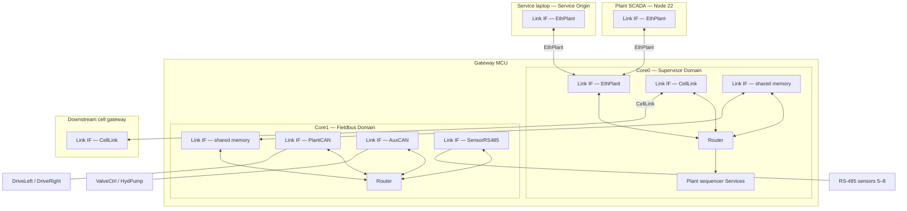

# Sketch 05 — Multicore AMP industrial gateway

```text
**Mapping:** Two Endpoint Domains on one AMP MCU; **PlantNet** (supervisor Origin) spans shared-memory + three Core1 fieldbuses + CellLink + SCADA observation on EthPlant; **Service** (service-laptop Origin) spans EthPlant and all fieldbuses for maintenance. Routing is **per Domain** — shared memory is a real hop.
**Worst friction:** Identity awkwardness — Mild (two Domain-local Link Telemetry instances need distinct Service-Wire NodeIds 9/10 until a service-instance mechanism is specified).
**Main lesson:** Cross-domain routing composes through the same Link model — no MCU-wide forwarding plane; semantic Origin on Core0, Link schedulers on Core1.
**Configs:** Single configuration (baseline).
```

**Intent:** Exercise **complexity stress** — a production-style AMP gateway MCU with **multiple Endpoint Domains**, **shared-memory inter-core Links**, and **four heterogeneous named fieldbuses** on one device. Reuses lessons from `01` (authority-shaped Wires), `03` (poll projection / Origin ≠ Link initiator), and `04` (forward vs compose, observation tap). Notes **ASIL-A-ish** timing/freshness without a formal safety case.

**Archetype:** Dual-core automotive/industrial gateway SoC (e.g. Cortex-M7 supervisor + Cortex-M4 fieldbus engine). One PCB; **plant SCADA** (read-only PlantNet observer) and a **service laptop** (maintenance Origin) on separate EthPlant sessions; local CAN drives, auxiliary CAN devices, polled RS-485 sensors, and an Ethernet-attached downstream **cell** controller.

---

## Configurations

### Baseline — Dual-core gateway, four fieldbuses

**What changed** (first sketch at this scale):

- **Two Endpoint Domains** on one MCU: Core0 (supervisor), Core1 (fieldbus engine) — `CORE §13.2`.
- **One shared-memory Physical Link** between cores (`CORE §13.1`) — not a bespoke IPC API.
- **Four named fieldbuses** (heterogeneous Link types):
  1. **PlantCAN** — Classical CAN to two motor-inverter Nodes (high-rate torque/telemetry).
  2. **AuxCAN** — Classical CAN to a valve controller and a hydraulic pump controller.
  3. **SensorRS485** — half-duplex RS-485 polled segment with four sensor Nodes (`03` pattern).
  4. **CellLink** — Ethernet WS link to a downstream cell gateway (remote Nodes 20–21 on the same Wire).
- **PlantNet** Wire (#10): Core0 is **semantic Origin**; spans all four fieldbuses plus inter-core shared memory.
- **Service** Wire (#101): **service laptop** is **Origin** for maintenance; spans EthPlant and all fieldbuses through the gateway (`01-B` / `04` Bench pattern). Wiring is static; the Origin participant may be offline (`SF-012`).
- **SCADA** participates on **PlantNet** only — as **Node 22**, a configured observer on EthPlant (not a second Wire, not Service Origin).
- Supervisor runs plant sequencing and cross-fieldbus composition; fieldbus core runs CAN LLLs and RS-485 poll projection.

**Maturity level:** **Level 2–3**. Static Wiring, NodeIds, WireNumbers, forwarding tables, poll projections, and per-Link capacity checks are authored or Organizer-generated and exported. No commissioning narrative (TODO).

**Not in scope:** Redundant partner gateway (`06`), formal WireContracts, lockstep cores, or safety-case evidence.

---

## Native communication model

```text
One gateway MCU on a machine cell:

  Core0 (supervisor):
    - 100 Hz plant sequencer: reads sensors, commands drives and aux devices,
      exchanges setpoints with the downstream cell controller.
    - Ethernet to plant switch: SCADA (read-only) and service laptop (maintenance) as **separate hosts/sessions**.

  Core1 (fieldbus engine):
    - Owns PlantCAN, AuxCAN, SensorRS485 Link drivers.
    - Polls RS-485 sensors on a fixed schedule; Nodes do not initiate bus traffic.
    - Forwards canonical plant traffic between shared memory and the three local fieldbuses only.
    - Does NOT own CellLink — that Link Interface is on Core0.

  Downstream cell gateway (separate device):
    - Two Nodes on CellLink Ethernet — material handling handshake.

  Field devices:
    - DriveLeft / DriveRight (PlantCAN): ~500 Hz torque command / encoder feedback.
    - ValveCtrl / HydPump (AuxCAN): ~50 Hz commands, eventful status.
    - Temp ×2, pressure, flow (SensorRS485): Snapshots updated locally; bus master polls ~10 Hz.

  Plant SCADA (HMI / historian):
    - Configured observer on PlantNet (Node 22); receives canonical NodeToOrigin traffic
      the gateway forwards to EthPlant — read-only; no maintenance authority.

  Service laptop (bench / field service):
    - Configured Origin on Service Wire (Wiring static; participant may be offline — `SF-012`).
    - Reads health/logs; firmware update to any Node when online.

  Timing expectations (ASIL-A-ish notes, not a safety case):
    - Drive torque command freshness budget: ≤ 5 ms plant loop including Core0→Core1 hop.
    - RS-485 sensor delivery latency bounded by poll cadence (~100 ms), not plant loop.
    - Cross-core shared-memory hop: bounded queue + one context switch — budget ~0.1–0.5 ms.
    - Distinguish communication age (arrival) from measurement age (sample timestamp on sensors).
```

The natural model has **one plant authority** (supervisor core), **one maintenance authority** (service laptop on Service Wire — configured even when offline), **one SCADA observer** (read-only PlantNet participant), and **one fieldbus execution engine** (Core1) that is a transport role — not a second plant coordinator.

---

## Obvious conventional implementation

> **Obvious conventional implementation:** Core0 runs the plant application and uses **vendor-specific IPC** (shared-memory rings, `rpmsg`, or a custom mailbox API) to command Core1's CAN/RS-485 stacks. Core1 exposes a fixed struct-per-bus API ("write DriveLeft torque", "read sensor block"). Ethernet to SCADA uses another protocol stack (Modbus/TCP, OPC UA, or a proprietary plant protocol). Maintenance tools use a separate TCP port or UDS-on-Ethernet. Downstream cell is another socket or gateway-specific tunnel. Routing, Node addressing, and protocol translation live in **implicit gateway firmware tables** — one per bus, plus IPC framing.

> **What additional conceptual objects does WS introduce?** Named Wires with explicit Origin/Node roles spanning heterogeneous Links; **canonical PDUs** forwarded identically across shared memory, CAN, RS-485, and Ethernet; **poll projection** as Link configuration rather than a second Origin; per-Wire maintenance vs plant authority (`Service` vs `PlantNet`). The conventional design also needs routing — WS makes it **Wire-scoped and table-driven** instead of embedding it in per-bus APIs and IPC structs. Inter-core traffic is not a special case: it is one more Link Interface pair on the same PlantNet Wire.

---

## WireSpaces mapping

### Design choice: PlantNet spans cores and fieldbuses; Origin on supervisor

`CORE §13` states that inter-core communication reuses the Link model and that device-private Wires may cross shared memory. This sketch uses a **network-visible** Wire on the inter-core Link — PlantNet is not internal-only.

```text
Wire PlantNet (#10)
  Origin:  Gateway MCU — Core0 supervisor Domain
  Nodes:   1–2   DriveLeft, DriveRight        (PlantCAN)
           3–4   ValveCtrl, HydPump           (AuxCAN)
           5–8   Temp×2, pressure, flow       (SensorRS485)
          20–21  CellFeeder, CellConveyor     (CellLink — Core0 Link IF)
          22     Plant SCADA (configured observer on EthPlant)

Wire Service (#101)
  Origin:  Service laptop
  Nodes:   1–8, 20–21   field devices (same NodeIds as PlantNet)
           9            Gateway Core0 Domain (maintenance + Link Telemetry network face)
          10            Gateway Core1 Domain (Link Telemetry network face only)
```

Core1 is **not** Origin on PlantNet. It **initiates** RS-485 polls and CAN frame transmission as Link scheduler / LLL — same distinction as `03` (`SF-003`).

Each Endpoint Domain has its own Router (`CORE §13.2`). **There is no MCU-wide forwarding plane** — traffic to Core1 fieldbus Nodes crosses Core0's `SmCore1` Link Interface, the shared-memory Physical Link, and Core1's `SmCore0` Link Interface as explicit hops.

### Design choice: one PlantNet across four fieldbuses

Four physical buses do **not** imply four Wires. There is one semantic plant authority (Core0):

```text
                    Core0 Origin
                         |
        +----------------+----------------+
        |                |                |
     Drives            Aux            Sensors          Cell
   (PlantCAN)        (AuxCAN)      (SensorRS485)   (CellLink)
```

NodeIds 1–8 and 20–21 are globally unique within PlantNet. Shared memory is just another segment on paths to Nodes behind Core1. Cross-fieldbus sequencing on Core0 is ordinary application composition — not evidence for `DriveWire` + `AuxWire` + `SensorWire` + `CellWire`.

### Topology — device-centric



### Devices

| Device | Endpoint Domains | Link interfaces | Role summary |
|---|---|---|---|
| Gateway MCU | Core0 supervisor; Core1 fieldbus | Core0: EthPlant, CellLink, SmCore1; Core1: SmCore0, PlantCAN, AuxCAN, SensorRS485 | PlantNet Origin on Core0; per-Domain Router projections; RS-485 poll on Core1 |
| DriveLeft / DriveRight | 1 each | PlantCAN | Motion Nodes 1–2 |
| ValveCtrl / HydPump | 1 each | AuxCAN | Aux Nodes 3–4 |
| RS-485 sensors ×4 | 1 each | SensorRS485 | Polled Nodes 5–8 |
| Cell gateway | 1 | CellLink | Nodes 20–21 |
| Plant SCADA | 1 | EthPlant | PlantNet Node 22 — configured observer |
| Service laptop | 1 | EthPlant | Service Wire Origin (Wiring static; participant may be offline) |

### Wires — application

| Wire | Origin | Nodes | Physical realization | Notes |
|---|---|---|---|---|
| PlantNet #10 | Core0 supervisor | 1–8, 20–22 | SmCore1↔SmCore0, PlantCAN, AuxCAN, SensorRS485, CellLink, EthPlant (SCADA observe) | One semantic plant bus; CellLink on Core0 only |
| Service #101 | Service laptop | 1–8, 9–10, 20–21 | EthPlant + Sm + fieldbuses via per-Domain forward | Maintenance authority; Nodes 9/10 = gateway Domains |

### Interactions (primary)

| Interaction | Producer | Consumer(s) | Wire | Direction | Notes |
|---|---|---|---|---|---|
| Drive torque command | Core0 plant sequencer | DriveLeft/Right | PlantNet | OriginToNode | Core0 app → `SmCore1` → shared memory → Core1 `SmCore0` → PlantCAN; ≤5 ms budget |
| Drive encoder feedback | DriveLeft/Right | Core0 sequencer | PlantNet | NodeToOrigin | PlantCAN → `SmCore0` → shared memory → `SmCore1` → Core0 |
| Aux valve command | Core0 | ValveCtrl | PlantNet | OriginToNode | Same Sm hop as drives; AuxCAN egress on Core1 |
| Sensor reading | Sensor Nodes 5–8 | Core0 | PlantNet | NodeToOrigin | Core1 **poll projection**; upstream via `SmCore0` (`SF-011`) |
| Cell handshake | Core0 | CellFeeder | PlantNet | OriginToNode | Direct on Core0 `CellLink` — no Sm hop |
| SCADA telemetry view | Field Nodes 1–8, 20–21 | Plant SCADA (Node 22) | PlantNet | NodeToOrigin (observe) | Core0 forwards observe set to EthPlant (`SF-001`) |
| Parameter read (service) | Service laptop | ValveCtrl | Service | OriginToNode | Core0 `EthPlant` → `SmCore1` → Core1 → AuxCAN (`SF-013`) |
| FW update segment | Service laptop | DriveLeft | Service | OriginToNode | Reliable segment; forward across Sm + CAN |
| Link Telemetry (Core0) | Core0 Domain | Service laptop | Service | NodeToOrigin | Node 9 — EthPlant, CellLink, SmCore1 faces |
| Link Telemetry (Core1) | Core1 Domain | Service laptop | Service | NodeToOrigin | Node 10 — PlantCAN, AuxCAN, SensorRS485, SmCore0 faces |
| Plant event log tap | Core0 | Core0 logger Queue | PlantNet | observe tap | Local tap on ingress — `SF-016`; not second Wire |

### Gateway forwarding — per Endpoint Domain

Each Domain has its own Router. Forwarding tables are **projections per Domain**, not one MCU-wide table. Cross-Domain reachability always includes the shared-memory Link as an explicit hop.

> **Cross-domain routing composes through the same Link model** — there is no invisible backplane bypassing `SmCore1` ↔ `SmCore0`.

#### Core0 Router

**PlantNet**

| Ingress | Egress / delivery | Notes |
|---|---|---|
| Core0 plant Services (local) | `CellLink` for Nodes 20–21 | Direct — CellLink IF on Core0 |
| Core0 plant Services (local) | `SmCore1` for Nodes 1–8 | Toward Core1 fieldbuses |
| `SmCore1` | local delivery to Core0 plant Services | Telemetry/commands returning from Core1 |
| `CellLink` | local delivery | Cell segment |
| `CellLink` / `SmCore1` | `EthPlant` | Forward observe set toward SCADA Node 22 |

**Service**

| Ingress | Egress / delivery | Notes |
|---|---|---|
| `EthPlant` | local delivery (Node 9 maintenance Endpoints) | Service laptop → Core0 |
| `EthPlant` | `SmCore1` for Nodes 1–8 | Toward Core1 fieldbuses |
| `EthPlant` | `CellLink` for Nodes 20–21 | Toward cell gateway |
| `SmCore1` / `CellLink` | `EthPlant` | Responses toward Service laptop |

#### Core1 Router

**PlantNet**

| Ingress | Egress / delivery | Notes |
|---|---|---|
| `SmCore0` | `PlantCAN` / `AuxCAN` / `SensorRS485` per NodeId | Fieldbus fan-out only — **no CellLink** |
| `PlantCAN` / `AuxCAN` / `SensorRS485` | `SmCore0` | Upstream toward Core0 |

**Service**

| Ingress | Egress / delivery | Notes |
|---|---|---|
| `SmCore0` | appropriate fieldbus per NodeId | Maintenance toward Nodes 1–8 |
| fieldbus | `SmCore0` | Responses toward Core0 |

Core1 does not terminate `EthPlant` or `CellLink` — those Link Interfaces belong to Core0's Domain.

Forwarding preserves WireNumber, NodeId, and Direction on every hop (`CORE §12`). **No cross-Wire forward** (Service maintenance stays on Service; plant commands stay on PlantNet — `SF-004`, `SF-015`).

### Poll projection — SensorRS485 on Core1

```text
PlantNet on SensorRS485 (Core1 LLL):
  Nodes 5..8
  poll Snapshot TX Endpoints at 10 Hz (example)
  emit NodeToOrigin toward Core0 via SmCore0
```

Semantic PDU remains `PlantNet | Node 7 | NodeToOrigin` even though Core1's UART initiated the transaction (`CORE §1.7`, `03`).

### Shared-memory Link — not device-private for plant traffic

PlantNet uses the inter-core Link as an ordinary segment of a network-visible Wire. **Device-private Wires** (`CORE §4.2`) remain available for Core0↔Core1 **diagnostics-only** traffic (e.g. `InternalDebugWire` on Core1) with an optional **splice** to Service for maintenance (`DEPLOY §3.2`) — not used for drive commands in the baseline mapping.

```text
Alternative considered — device-private Wire 900 across cores for all plant PDUs:
  Rejected for PlantNet: would require splice before EthPlant/CellLink egress,
  adding rewrite steps without semantic benefit. Network-visible PlantNet on
  shared memory matches CORE §13.1 diagram intent.
```

### ASIL-A-ish timing notes (informal)

| Path | Dominant freshness bound | Measurement vs communication |
|---|---|---|
| Core0 → `SmCore1` → Core1 `SmCore0` → PlantCAN → Drive | Plant loop + Sm queue depth + CAN queue | Command **communication age** |
| RS-485 sensor → Core0 | Poll interval + Sm hop | **Measurement age** from sample metadata; arrival age poll-bound (`SF-011`) |
| CellLink round-trip | Ethernet latency + Core0 compose time | Separate from drive loop if composed async |
| Service FW update | Reliable segment ACK chain | Throughput-bound; not hard real-time |

Static capacity checking (`DEPLOY §2.2`) should validate worst-case Sm queue depth against 500 Hz drive traffic **and** RS-485 poll blocking on Core1's single executor per LLL (`CORE §13.3`).

### Per-domain Link Telemetry — Service Wire addressing

Each Endpoint Domain exposes **one** Domain Local Link Telemetry Service (`DEPLOY §3.3`). The **network face** of each is projected on Service Wire as a distinct gateway Node:

| Domain | Service Wire NodeId | Network face reports | Maintenance Endpoints |
|---|---|---|---|
| Core0 supervisor | **9** | EthPlant, CellLink, SmCore1 | Identity, health, logs, FW update |
| Core1 fieldbus | **10** | PlantCAN, AuxCAN, SensorRS485, SmCore0 | Link Telemetry only in this sketch |

The service laptop reaches Node 9 vs Node 10 by **Wire NodeId** — same standard Service schema, different Domain scope. This is the happy-path addressing model; whether a future **service-instance** sub-address is needed instead is an open spec question (`SF-019`).

**Rejected for this sketch:** "tooling aggregates two telemetry instances behind Node 9" without an unambiguous wire-addressable identity.

### Alternatives considered

| Alternative | Outcome |
|---|---|
| One Wire per fieldbus (PlantCANWire, RS485Wire, …) | **Rejected** — physical-link decomposition; duplicates Node authority; cross-fieldbus sequencing needs cross-Wire compose everywhere (`README` guidance) |
| Core1 as co-Origin on PlantNet | **Rejected** — fieldbus core is Link executor, not plant authority (`SF-003`) |
| Core1 runs plant sequencer | **Rejected** — splits Ethernet/cell composition from fieldbus; still needs Sm IPC with same tables; hides supervisor role |
| All inter-core traffic on device-private Wire 900 + splice | **Rejected** for plant path — extra splice hop on every egress; keep private wire for debug only |
| SCADA and Service on one Wire | **Rejected** — distinct authorities; SCADA is PlantNet Node 22 observer, not Service Origin |
| SCADA via Core0 aggregated read-only Service instead of PlantNet observe | **Rejected for happy path** — valid alternative, but hides canonical PlantNet PDUs; this sketch uses explicit observe Node 22 |

---

## Friction signals

| Signal | Rating | Justification |
|---|---|---|
| **Artificial Origin** | None | Core0 is natural plant coordinator; service laptop is natural maintenance authority |
| **Artificial Wire** | None | PlantNet and Service match real authority boundaries |
| **Wire proliferation** | None | Two Wires for plant vs maintenance — same pattern as `01-B` / `04` |
| **Forwarding tax** | Mild / None | Per-Domain tables mirror conventional per-core routing; explicit but not extra work vs AMP gateway firmware |
| **Identity awkwardness** | Mild | Two Domain-local Link Telemetry instances need NodeIds 9 and 10 on Service Wire until `SF-019` is resolved in spec |
| **Interaction awkwardness** | None | Cross-fieldbus sequencing is application composition in any architecture — WS has not made it harder |
| **Configuration burden** | Mild | Per-Domain forwarding + poll projections; Organizer generation expected at Level 2–3 |
| **Role instability** | None | Core0/Core1 roles fixed at build time |
| **Failure mismatch** | None | Core1 hang stalling fieldbuses is hardware partitioning — WS represents it faithfully via per-Domain Link Telemetry |

---

## Model pressure

- **Per-Domain Router projections** — cross-core traffic is never modeled as an MCU-wide backplane; shared memory is a real Link hop on every path.
- **Origin placement vs Link execution split** — generalizes RS-485 poll projection (`03`) to **AMP partition**: semantic Origin on Core0, schedulers on Core1.
- **Heterogeneous Link mix on one Wire** — CAN + polled RS-485 + Ethernet cell + inter-core Sm is the intended gateway sweet spot; **Wire follows authority, not physical bus.**
- **Multi-Domain Service addressing** — one physical PCB, N Domains → N wire-addressable telemetry Nodes (9, 10) or a future instance mechanism (`SF-019`).
- **Open:** Whether high-rate PlantCAN traffic warrants a **dedicated Sm queue** or priority lane vs aux/sensor traffic on the same inter-core Link — QoS policy, not Wire count.

---

## Open questions

- Should Organizer emit **per-Domain forwarding templates** (Core0 vs Core1 projections) from a dual-core gateway profile?
- **SF-019:** Is per-Domain **Wire NodeId** (9 vs 10) the right long-term model for multiple instances of the same Domain-local Service on one PCB, or is a service-instance sub-address needed?
- Priority / separate queues on inter-core Link for PlantCAN vs SensorRS485 — Link QoS config or firmware-only?
- Does cell gateway (Nodes 20–21) warrant a **poll projection** on CellLink if that segment is request/response Ethernet rather than autonomous Node TX?
- Formal **NodeId allocation** across cell + local buses — sketch uses non-overlapping ranges; tooling validation?
- Partner forwarding for redundant pair — see [`06_redundant_gateway.md`](06_redundant_gateway.md).

---

## Spec findings

| ID | Topic |
|---|---|
| [SF-003](synthesis.md#spec-findings-log) | Wire Origin (Core0) vs Link poll initiator (Core1 RS-485) — AMP instance |
| [SF-002](synthesis.md#spec-findings-log) | Poll projection on SensorRS485 |
| [SF-004](synthesis.md#spec-findings-log) | Forward vs compose for cross-fieldbus plant logic on Core0 |
| [SF-011](synthesis.md#spec-findings-log) | Communication vs measurement age on polled sensors |
| [SF-013](synthesis.md#spec-findings-log) | Service Wire spans Eth + all fieldbuses |
| [SF-015](synthesis.md#spec-findings-log) | Cross-Wire relay mislabeled as forward |
| [SF-016](synthesis.md#spec-findings-log) | PlantNet observation tap for Core0 logging |
| [SF-018](synthesis.md#spec-findings-log) | Per-domain Link Telemetry — Node 9/10 on Service Wire |
| [SF-019](synthesis.md#spec-findings-log) | Multi-Domain same-type Service addressing on one device |

---

## Synthesis

| Topic | Finding |
|---|---|
| Expected stress (`README` catalog) | **Complexity stress** — representable with familiar patterns from `01`/`03`/`04` |
| Multicore fit | **Strong** — per-Domain Routers + shared-memory Link; no parallel IPC object model |
| Four heterogeneous fieldbuses | **One PlantNet Wire** — strongest evidence yet for "Wire follows authority, not bus" |
| Per-Domain routing | **Explicit** — Core1 cannot reach CellLink; cross-core paths are real Sm hops |
| Multi-Domain telemetry | **Mild identity pressure** — NodeIds 9/10 on Service Wire; spec gap `SF-019` |
| vs conventional | Same gateway complexity, **Wire-scoped per-Domain tables** instead of opaque per-bus APIs |

The multicore gateway is where prior sketch lessons **compose**: authority-shaped Wires, poll projection, per-Domain forwarding, and shared-memory Links are the same mapping at production scale. Friction is **Mild** overall (configuration + multi-Domain addressing). Sketch `06` adds partner/partition pressure on top.

---

## References

| Doc | Sections used |
|---|---|
| `CORE` | §1.7 master-initiated, §3 Wires spanning Links, §4.2 device-private, §12 forwarding, §13 multicore, §21.4 freshness |
| `DEPLOY` | §2.2 capacity, §3.2 Internal Debug Wire, §3.3 per-domain Link Telemetry |
| `LINK` | §2 Classical CAN, §3 RS-485 |
| `IMPL` | §2 scaling profiles (multicore MCU) |
| `01_dev_board`, `03_rs485_sensors`, `04_pi_robot` | Gateway, poll projection, Bench/forward patterns |
| `sketches/README` | Sketch 05 fixed choices; guidance from sketch reviews |
| `link_level_polling_idea.md` | Origin vs Link scheduler (provisional) |
