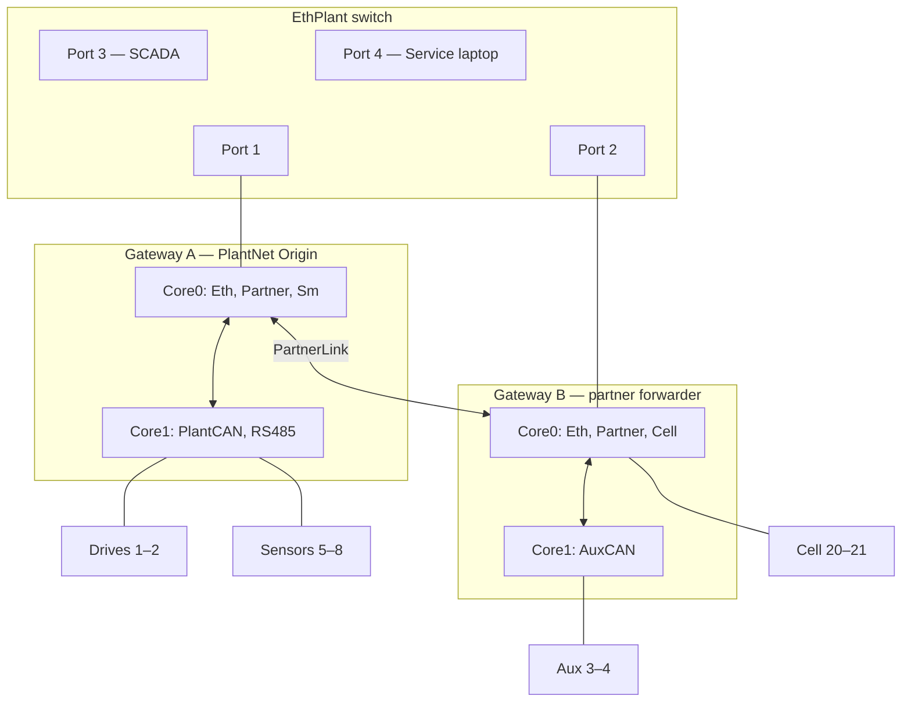
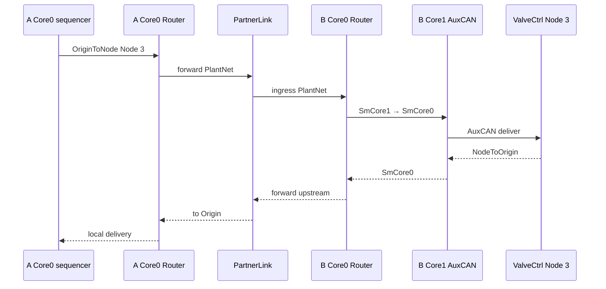

# Sketch 06 — Partitioned dual multicore gateways (2+2 bus split)

> **Catalog file:** `06_redundant_gateway.md` — stresses **redundancy composition pressure**, but the baseline topology is **paired / fault-partitioned**, not redundant fieldbus reachability. True redundancy requires Config D (deferred) or §23.11 composition above the Wire.

```text
**Mapping:** Twin sketch-05 gateways; **2+2 exclusive bus split**; **PlantNet** Origin on A only; partner **same-Wire forward** on PartnerLink for B-local Nodes; **Service** uses **branch-owned EthPlant ingress** — PartnerLink not on nominal Service path.
**Worst friction:** Identity awkwardness — Mild (Service Nodes 9–12; candidate SF-019 resolution).
**Main lesson:** Partner connectivity ≠ fault partitioning ≠ redundancy; WS makes it hard to mistake the first for the third (`CORE §23.11`).
**Configs:** Baseline; B (PartnerLink down); C (Gateway A offline); D (redundancy composition — outline only).
```

**Intent:** Rework [`05_multicore_gateway.md`](05_multicore_gateway.md) as a **paired gateway** pair with **fault-isolated bus ownership** (2+2 split), **cross-partner PlantNet forwarding**, and explicit partner taps/status. **Not** a redundant fieldbus architecture in baseline — A loss removes drives, sensors, and PlantNet Origin; B loss removes aux and cell buses. Service laptop and SCADA attach via a **small Ethernet switch** from the system builder's perspective.

**Archetype:** Two identical dual-core AMP gateway MCUs (Gateway **A** plant coordinator, Gateway **B** partner forwarder). Four fieldbuses split **2+2** for hardware fault isolation — **not** duplicated attachment. Partner Ethernet between the units. No formal safety case or WireContract.

### Node ownership (reference)

| Branch | Gateway | Nodes | Fieldbuses |
|---|---|---|---|
| **A-local** | A | 1–2, 5–8 | PlantCAN, SensorRS485 |
| **B-local** | B | 3–4, 20–21 | AuxCAN, CellLink |

Do not treat Nodes 1–8 as A-local — **3–4 are B-local** and require PartnerLink on PlantNet.

### Three concepts — do not conflate

```text
partner connectivity   A can reach B's buses while B is healthy (PartnerLink)
fault partitioning     each bus has one exclusive gateway attachment
redundancy             alternate authority and/or alternate physical reachability
```

PartnerLink provides **connectivity**, not **redundancy**. If B dies, A loses aux/cell buses physically. If A dies, drives/sensors and PlantNet Origin are gone — promoting B to Origin would not recover A's buses.

---

## Configurations

### Baseline — Nominal dual-gateway operation

**What changed** vs sketch `05`:

- **Two gateway MCUs** instead of one; each retains Core0 supervisor + Core1 fieldbus Domains (`05` pattern).
- **Bus split** — exclusive attachment:
  - **Gateway A:** PlantCAN (Nodes 1–2), SensorRS485 (Nodes 5–8).
  - **Gateway B:** AuxCAN (Nodes 3–4), CellLink (Nodes 20–21).
- **PlantNet** (#10): **single Origin** on Gateway A Core0 — unchanged semantic authority; spans both units via **PartnerLink** same-Wire forward (not a second Origin on B).
- **PartnerLink** — dedicated Ethernet A↔B Core0; carries **PlantNet** in baseline (not nominal Service).
- **EthPlant** — small managed switch: SCADA (Node 22), service laptop (Service Origin), Gateway A, Gateway B.
- **Service branch routing** — laptop reaches **A-local** Nodes via A's EthPlant port, **B-local** Nodes via B's EthPlant port; **PartnerLink excluded** from nominal Service forwarding (avoids EthPlant↔PartnerLink↔EthPlant cycle / duplicate delivery — `SF-023`).
- **Partner status** and **partner ingress observation taps** modeled explicitly (`CORE §12.6`, `§23.11`).

**Maturity level:** **Level 3**. Paired static Wiring, partner forwarding tables, failover policy hooks (composition), and switch port plan exported together.

---

### Config B — PartnerLink offline

**What changed** vs baseline:

- PartnerLink failed or cable removed.
- Each gateway serves **only its local two fieldbuses**.
- Gateway A Origin still cannot reach Nodes 3–4, 20–21; Gateway B forwards locally but receives no plant commands for partner buses.
- **No automatic Origin move** to B — Wiring persists; degraded visibility only (`SF-012`).

**Maturity level:** **Level 3** configuration; **degraded runtime**.

---

### Config C — Gateway A offline (active Origin absent)

**What changed** vs baseline:

- Gateway A powered off or removed.
- Gateway B retains AuxCAN + CellLink; field Nodes may still emit valid `NodeToOrigin` PDUs.
- **PlantNet Origin participant (A Core0) unreachable** — no role reassignment in this sketch (`04-C` pattern).
- PartnerLink down with A; B cannot reach A-local Nodes 1–2, 5–8.

**Maturity level:** **Level 3** configuration; **degraded runtime**.

---

### Config D — Redundancy composition (outline only; not modeled)

**Purpose:** Stress what **`CORE §23.11`** actually costs — deferred from baseline because the 2+2 exclusive split provides **no physical bus failover**.

**Candidate directions** (pick one in a follow-on sketch):

```text
Option 1 — Dual attachment:
  Each critical bus reachable from both gateways (true physical redundancy).
  + ActiveAuthority composition selecting which Origin/Wiring is live.

Option 2 — Dual plant Wires:
  PlantNetA (Origin A), PlantNetB (Origin B, standby)
  + explicit failover composition (dup suppression, stale-copy rejection, health).

Option 3 — PartnerLink as alternate Service path only:
  Nominal Service on EthPlant branch routing;
  PartnerLink Service forward enabled only when B EthPlant failed but B alive.
```

Baseline Configs A–C intentionally omit these — they prove **partner forward ≠ redundancy**.

**Not in scope for baseline:** Automatic active/standby Origin failover.

---

## Native communication model

```text
Machine cell with paired (partitioned) gateways:

  Gateway A (plant coordinator):
    - Core0: PlantNet Origin; EthPlant + PartnerLink + SmCore1.
    - Core1: PlantCAN + SensorRS485 only.
    - Plant sequencer runs here.

  Gateway B (partner forwarder):
    - Core0: Partner receiver/forwarder; EthPlant + PartnerLink + CellLink + SmCore1.
    - Core1: AuxCAN only.
    - Forwards PlantNet for B-local buses only — not Origin.

  Bus ownership (exclusive — not redundant):
    A only: drives (1–2), sensors (5–8).
    B only: aux (3–4), cell (20–21).

  PlantNet partner path:
    - A commands B-local Nodes: A Core0 → PartnerLink → B → local bus.
    - B telemetry upstream: reverse path to A Origin.
    - PartnerLink gives connectivity to healthy B — nothing when B is gone.

  Service maintenance (nominal):
    - Laptop → A EthPlant for A-local field Nodes (1–2, 5–8) and gateway Nodes 9–10.
    - Laptop → B EthPlant for B-local field Nodes (3–4, 20–21) and gateway Nodes 11–12.
    - PartnerLink is NOT used for nominal Service (avoids duplicate paths).

  Ethernet switch (plant cell):
    - Port 1: Gateway A EthPlant
    - Port 2: Gateway B EthPlant
    - Port 3: Plant SCADA (read-only)
    - Port 4: Service laptop (maintenance Origin)

  Partner health:
    - Explicit partner-link status Endpoints (not inferred from silence).
    - Partner ingress PlantNet observation taps on A and B.

  Degraded cases:
    B: PartnerLink down → A cannot reach B-local Nodes; each gateway serves its branch only.
    C: A offline → A-local buses and Origin gone; B-local Nodes may still emit NodeToOrigin.
```

One plant authority (A Core0), one maintenance authority (service laptop), partner forward as **transport** — not a second coordinator.

---

## Obvious conventional implementation

> **Obvious conventional implementation:** Two gateway firmware images with **split I/O maps** and a **proprietary inter-gateway protocol**. Active unit (A) runs the sequencer; B forwards IPC for its buses. SCADA talks to A. Maintenance tools use **branch-specific** tool configuration (connect to A for drive/sensor work, B for aux/cell) — or a single UI with explicit next-hop selection. Partner health is a heartbeat outside fieldbus stacks.

> **What additional conceptual objects does WS introduce?** **One PlantNet Wire** with partner forward on PartnerLink only; **Service branch map** (NodeId → EthPlant ingress) avoiding multipath; explicit partner taps/status. Conventional systems also need partner routing — WS makes partition vs redundancy visible. **No second Origin** on B.

---

## WireSpaces mapping

### Side-by-side with sketch 05

| Topic | Sketch 05 (single gateway) | Sketch 06 (paired / partitioned) |
|---|---|---|
| Gateway count | 1 MCU, 4 buses local | 2 MCUs, **2+2 exclusive split** |
| PlantNet Origin | Local Core0 | **Gateway A Core0 only** |
| Fieldbus redundancy | — | **None** in baseline — exclusive attachment |
| Cross-segment path | SmCore hop | SmCore + **PartnerLink** for B-local Nodes |
| Service path | One EthPlant | **Branch-owned EthPlant**; no Service on PartnerLink |
| Service Wire Nodes | 9, 10 | **9–12** (candidate SF-019: one NodeId per Domain) |

### Design choice: one PlantNet, one Origin, partner forward

`CORE §23.11`: the base Wire has exactly one Origin; redundancy is **composed** — not implied by partner link or dual EthPlant. PartnerLink provides **PlantNet reachability** to B-local Nodes while B is healthy.

```text
Wire PlantNet (#10)
  Origin:  Gateway A — Core0 supervisor Domain ONLY
  Nodes:   1–2   drives           (A-local PlantCAN)
           3–4   aux devices      (B-local AuxCAN)
           5–8   sensors          (A-local SensorRS485)
          20–21  cell             (B-local CellLink)
          22     Plant SCADA      (EthPlant observe)

Wire Service (#101)
  Origin:  Service laptop
  Nodes:   1–2, 5–8     A-local field devices
           3–4, 20–21   B-local field devices
           9–10         Gateway A Domains
          11–12         Gateway B Domains
```

Gateway B is a **partner forwarder** on PlantNet — not Origin.

### Design choice: Service branch-owned EthPlant ingress (no Service on PartnerLink)

Both gateways attach to the same EthPlant switch, and PartnerLink connects A↔B. That creates a physical **cycle** on the Service Wire realization:

```text
EthPlant A ↔ PartnerLink ↔ EthPlant B
```

If **both** gateways install Service forwarding through PartnerLink, a request to B-local Node 3 has two paths:

```text
Laptop → EthPlant → B → AuxCAN          (intended)
Laptop → EthPlant → A → PartnerLink → B → AuxCAN   (duplicate)
```

**Nominal Service routing** therefore uses **branch ownership** — PartnerLink is **not** in Service forwarding tables in baseline:

| Target Nodes | Nominal ingress | Path |
|---|---|---|
| 1–2, 5–8, 9–10 | **A EthPlant** | A Router → Sm / local buses |
| 3–4, 20–21, 11–12 | **B EthPlant** | B Router → Sm / local buses |

The service laptop (or Organizer static Wiring) selects ingress by **NodeId branch map** — not implicit Router choice. Alternate Service path via PartnerLink is **Config D** failover composition only (`SF-023`).

**Candidate resolution to SF-019:** Endpoint Domains participating independently on a Wire receive **independent NodeIds** (9–12 here), even when hosted by one physical gateway PCB — provisional; not settled normative architecture.

### Design choice: 2+2 split (fault isolation, not redundancy)

```text
Gateway A (exclusive)              Gateway B (exclusive)
  PlantCAN (1–2)                     AuxCAN (3–4)
  SensorRS485 (5–8)                  CellLink (20–21)
        \                              /
         ===== PartnerLink ===========   ← connectivity only
                    |
              Gateway A Origin
```

Duplicate EthPlant ports do **not** imply redundant Service delivery — branch routing is **configured** (`CORE §23.11`).

### Topology — system builder view (switch + partners)



### Devices

| Device | Endpoint Domains | Link interfaces | Role summary |
|---|---|---|---|
| Gateway A | Core0; Core1 | Core0: EthPlant, PartnerLink, SmCore1; Core1: SmCore0, PlantCAN, SensorRS485 | **PlantNet Origin**; partner egress to B for Nodes 3–4, 20–21 |
| Gateway B | Core0; Core1 | Core0: EthPlant, PartnerLink, CellLink, SmCore1; Core1: SmCore0, AuxCAN | PlantNet **forwarder**; local Aux + Cell |
| Field devices | 1 each | per bus | A-local 1–2, 5–8; B-local 3–4, 20–21 |
| Plant SCADA | 1 | EthPlant | PlantNet Node 22 — observer |
| Service laptop | 1 | EthPlant | Service Origin (static Wiring) |

### Wires

| Wire | Origin | Nodes | Physical realization | Notes |
|---|---|---|---|---|
| PlantNet #10 | Gateway A Core0 | 1–2, 5–8, 3–4, 20–21, 22 | A: Sm, PlantCAN, RS485, Partner; B: Partner, AuxCAN, CellLink; EthPlant observe | One Origin; PartnerLink for B-local only |
| Service #101 | Service laptop | 1–2, 5–8, 9–10, 3–4, 20–21, 11–12 | **EthPlant branch ingress only** — no Service on PartnerLink | Branch-owned routing |

### Interactions (primary — baseline)

| Interaction | Producer | Consumer(s) | Wire | Direction | Notes |
|---|---|---|---|---|---|
| Drive torque | A Core0 sequencer | DriveLeft/Right | PlantNet | OriginToNode | A: Sm → PlantCAN — local |
| Aux valve command | A Core0 sequencer | ValveCtrl | PlantNet | OriginToNode | A Core0 → PartnerLink → B Core0 → Sm → AuxCAN |
| Sensor reading | Nodes 5–8 | A Core0 | PlantNet | NodeToOrigin | B not involved; A Core1 poll projection |
| Cell handshake | A Core0 | CellFeeder | PlantNet | OriginToNode | A → PartnerLink → B → CellLink |
| Cell telemetry | Cell Nodes | A Core0 | PlantNet | NodeToOrigin | Reverse partner path |
| SCADA observe | Field Nodes | SCADA (22) | PlantNet | NodeToOrigin (observe) | A Core0 forwards observe set to EthPlant |
| Service → drive param | Service laptop | DriveLeft | Service | OriginToNode | Laptop → **A EthPlant** → Sm → PlantCAN |
| Service → aux param | Service laptop | ValveCtrl | Service | OriginToNode | Laptop → **B EthPlant** → Sm → AuxCAN (not via A) |
| Service → cell FW | Service laptop | CellFeeder | Service | OriginToNode | Laptop → **B EthPlant** → CellLink |
| Partner ingress tap | PartnerLink | A/B diag Queue | PlantNet | observe tap | **Explicit** per gateway (`SF-016`) |
| Partner link status | Each gateway Core0 | Service laptop | Service | NodeToOrigin | **Explicit** partner-status Endpoint — not inferred |
| Link Telemetry | Each Domain | Service laptop | Service | NodeToOrigin | Nodes 9–12 (`SF-018`) |

### Gateway forwarding — per Domain (baseline)

Each gateway retains **separate Routers per Domain** (`05`). PartnerLink is a real hop on both units. **Gateway B is never PlantNet Origin.**

#### Gateway A — Core0 Router

**PlantNet**

| Ingress | Egress / delivery | Notes |
|---|---|---|
| Core0 plant Services | `SmCore1` for Nodes **1–2, 5–8** | A-local fieldbuses only |
| Core0 plant Services | `PartnerLink` for Nodes **3–4, 20–21** | Toward Gateway B |
| `SmCore1` | local delivery | Telemetry from A Core1 |
| `PartnerLink` | local delivery | Telemetry from B segment |
| `SmCore1` / `PartnerLink` | `EthPlant` | SCADA observe Node 22 |

**Service** — nominal (no PartnerLink)

| Ingress | Egress / delivery | Notes |
|---|---|---|
| `EthPlant` | local (Node 9) | A Core0 maintenance |
| `EthPlant` | `SmCore1` for Nodes **1–2, 5–8** | A-local field Nodes only |
| `SmCore1` | `EthPlant` | Responses toward laptop |

**Rejected:** `EthPlant` → `PartnerLink` on Service — would create duplicate path to B-local Nodes.

#### Gateway A — Core1 Router

**PlantNet / Service:** `SmCore0` ↔ PlantCAN / SensorRS485 only — **no PartnerLink, no CellLink** (same as `05`).

#### Gateway B — Core0 Router

**PlantNet**

| Ingress | Egress / delivery | Notes |
|---|---|---|
| `PartnerLink` | `SmCore1` for Nodes 3–4 | Toward AuxCAN |
| `PartnerLink` | `CellLink` for Nodes 20–21 | Local on B Core0 |
| `SmCore0` / `CellLink` | `PartnerLink` | NodeToOrigin upstream to A Origin |
| `PartnerLink` | partner ingress **observe tap** | Explicit diagnostics (`SF-016`) |

**Service** — nominal (no PartnerLink)

| Ingress | Egress / delivery | Notes |
|---|---|---|
| `EthPlant` | local (Node 11) | B Core0 maintenance |
| `EthPlant` | `SmCore1` for Nodes **3–4** | B-local AuxCAN |
| `EthPlant` | `CellLink` for Nodes **20–21** | B-local cell |
| `SmCore0` / `CellLink` | `EthPlant` | Responses toward laptop |

**Rejected:** `EthPlant` → `PartnerLink` on Service.

#### Gateway B — Core1 Router

**PlantNet / Service:** `SmCore0` ↔ AuxCAN only.

> **Cross-partner routing composes through PartnerLink** — same rule as inter-core Sm in `05`: no device-global forwarding plane.



### Partner connectivity — explicit only (`CORE §23.11`)

| Mechanism | Modeled? | Notes |
|---|---|---|
| PlantNet same-Wire partner forward | Yes | A ↔ B forwarding tables |
| Partner ingress observation tap | Yes | Explicit per gateway |
| Partner link status Endpoint | Yes | Service Wire from each Core0 |
| Service branch-owned EthPlant | Yes | No Service on PartnerLink in baseline |
| Physical bus redundancy | **No** | Exclusive 2+2 attachment |
| Automatic Origin failover | **No** | Config D / §23.11 composition |
| Duplicate suppression | **No** | Router has no dup state (`CORE §12.4`) |

### Config B — PartnerLink offline

| Path | Baseline | PartnerLink down |
|---|---|---|
| A → A-local (1–2, 5–8) | Works | Works |
| A → B-local (3–4, 20–21) | Via PartnerLink | **Unreachable** |
| B → B-local buses | Under A coordination | Local only — no upstream Origin commands |
| Service → A-local Nodes | Via A EthPlant | Works |
| Service → B-local Nodes | Via B EthPlant | Works (local branch only) |
| Partner status | Reports link OK | **Explicit fault** |

Wiring unchanged; partner status Endpoint reports `PartnerLink` degraded (`DEPLOY §3.3`, `CORE §23.10`).

### Config C — Gateway A offline

| Path | Baseline | A offline |
|---|---|---|
| PlantNet Origin | A Core0 | **Unreachable** — Wiring persists (`SF-012`) |
| B-local (3–4, 20–21) | Under A coordination | May still TX `NodeToOrigin`; no Origin consumer |
| A-local (1–2, 5–8) | On A buses | **Unreachable** — A hardware gone |
| Service → B-local | Via B EthPlant | Works for Nodes 3–4, 20–21, 11–12 |
| Service → A-local | Via A EthPlant | **Fails** — A offline |

No automatic promotion of B to PlantNet Origin in this sketch.

### Per-gateway Service Wire NodeIds

| Gateway | Domain | Service NodeId | Role |
|---|---|---|---|
| A | Core0 | 9 | Maintenance + Link Telemetry (Eth, Partner, Sm) |
| A | Core1 | 10 | Link Telemetry (PlantCAN, RS485, Sm) |
| B | Core0 | 11 | Maintenance + Link Telemetry + **partner status** |
| B | Core1 | 12 | Link Telemetry (AuxCAN, Sm) |

Four Domain-local telemetry instances — extends `SF-018` / `SF-019` to paired gateways.

### Alternatives considered

| Alternative | Outcome |
|---|---|
| PlantNet Origin on both A and B (active/standby) | **Rejected for baseline** — two Origins on one Wire violates `CORE §3`; failover is §23.11 composition, not dual Origin |
| Second Wire for partner segment (`PartnerPlantNet`) | **Rejected** — physical-link split; duplicates authority; cross-Wire compose for every aux/cell command |
| B as co-Origin only for its Nodes | **Rejected** — fragments PlantNet; `03`/`05` lesson: one semantic Origin |
| Infer partner health from PlantNet silence | **Rejected** — explicit partner-status Endpoint required (`README` fixed choices) |
| Service laptop direct to PartnerLink | **Rejected** — builder uses EthPlant switch |
| Service on PartnerLink in baseline | **Rejected** — duplicate delivery / cycle (`SF-023`) |

---

## Friction signals

| Signal | Rating | Justification |
|---|---|---|
| **Artificial Origin** | None | A is natural plant coordinator; B forwarder matches hardware split |
| **Artificial Wire** | None | PlantNet + Service match authorities |
| **Wire proliferation** | None | Still two Wires; partner path is Link hop, not new Wire |
| **Forwarding tax** | None / Mild | Partner PlantNet hop is regular gateway work; Service branch routing is simple |
| **Identity awkwardness** | Mild | Nodes 9–12; candidate SF-019 resolution (one NodeId per Domain) |
| **Interaction awkwardness** | None | PlantNet cross-partner commands are ordinary OriginToNode |
| **Configuration burden** | Mild | Regular branch rules — Organizer template; Significant only if Config D failover state added |
| **Role instability** | None | Origin fixed on A; Config C is unreachable Origin, not role swap |
| **Failure mismatch** | None | WS represents partition failures faithfully; missing failover is out of scope, not misrepresentation |

---

## Model pressure

- **Partner connectivity ≠ fault partitioning ≠ redundancy** — the sketch's main negative result; WS resists calling this "redundant" without §23.11 composition.
- **PlantNet partner forward** — strong fit; B-local command stays `PlantNet | OriginToNode(3)` end-to-end.
- **Service multipath trap** — dual EthPlant + PartnerLink cycle must be resolved by **branch routing**, not Router defaults (`SF-023`).
- **SF-019 candidate:** independent NodeId per Endpoint Domain on Service Wire (9–12).
- **Config D** — true redundancy needs dual attachment or dual plant Wires + composition; costs TBD.

---

## Open questions

- Organizer **branch map**: NodeId → nominal EthPlant ingress gateway — export with paired-gateway template?
- **SF-019:** adopt per-Domain NodeId as normative, or require service-instance sub-address?
- Config D: which redundancy option (dual attachment vs dual plant Wires) to sketch first?

---

## Spec findings

| ID | Topic |
|---|---|
| [SF-012](synthesis.md#spec-findings-log) | Wiring persists; A offline → Origin unreachable (Config C) |
| [SF-016](synthesis.md#spec-findings-log) | Partner ingress observation tap (explicit) |
| [SF-018](synthesis.md#spec-findings-log) | Per-domain Link Telemetry — Nodes 9–12 |
| [SF-013](synthesis.md#spec-findings-log) | Service Wire — branch-owned EthPlant ingress |
| [SF-019](synthesis.md#spec-findings-log) | Multi-Domain Service addressing — candidate NodeId-per-Domain |
| [SF-020](synthesis.md#spec-findings-log) | Partner same-Wire forward — not second Origin |
| [SF-021](synthesis.md#spec-findings-log) | Partner connectivity ≠ redundancy (`§23.11`) |
| [SF-022](synthesis.md#spec-findings-log) | Exclusive bus ownership bounds physical failover |
| [SF-023](synthesis.md#spec-findings-log) | Service Wire multipath — no nominal PartnerLink route |

---

## Synthesis

| Topic | Finding |
|---|---|
| Expected stress (`README` catalog) | **Partition + redundancy pressure** — baseline is paired, not redundant |
| vs sketch `05` | PartnerLink for PlantNet; Service branch routing; exclusive bus split |
| PlantNet partner forward | **Strong fit** — one Origin, honest PartnerLink loss semantics |
| Service Wire | **Multipath trap discovered** — branch routing required (`SF-023`) |
| Physical redundancy | **None** in baseline — useful negative (`SF-022`) |
| Configuration | **Mild** — regular rules; Significant deferred to Config D |
| Main product | WS makes it **hard to accidentally call connectivity "redundancy"** |

Paired gateways extend `05` without breaking the authority model. The sketch's strongest results are **positive** (PlantNet partner forward, Config C honesty) and **negative** (exclusive split ≠ redundancy; Service cycle must be authored away).

---

## References

| Doc | Sections used |
|---|---|
| `CORE` | §3.3, §12 forwarding, §12.6 observation, §13 multicore, §23.10–§23.11 redundancy composition |
| `DEPLOY` | §3.1 promiscuous vs observe, §3.3 Link Telemetry |
| `05_multicore_gateway.md` | Baseline multicore mapping, per-Domain Routers |
| `04_pi_robot.md` | Origin offline / Wiring persists (Config C) |
| `sketches/README` | Sketch 06 fixed choices |
