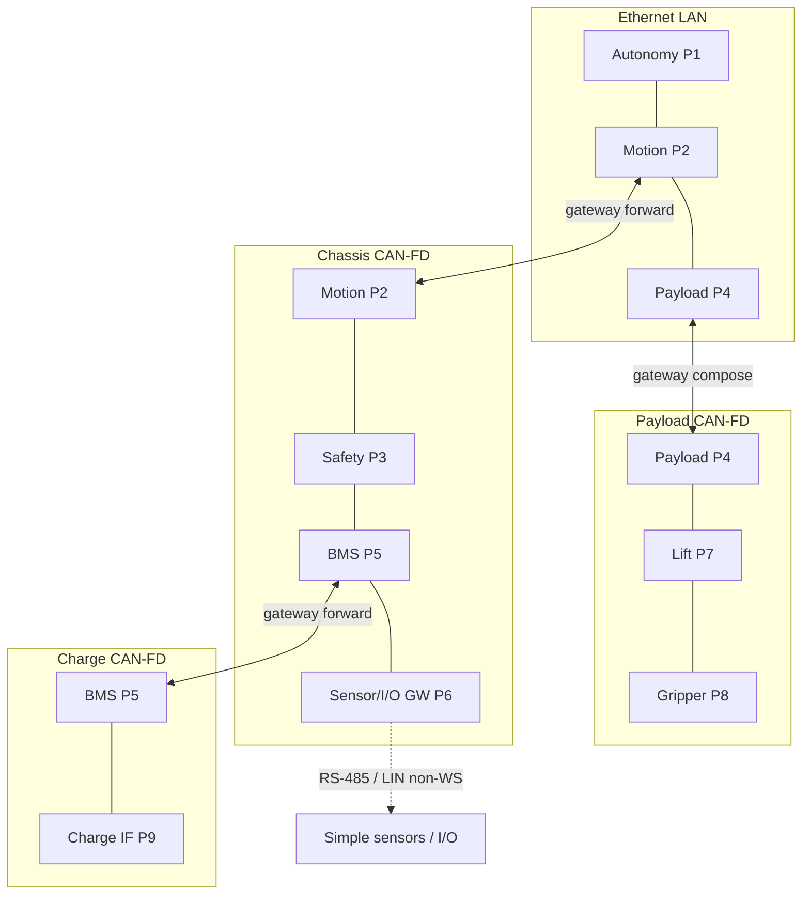

# Sketch 07 — Autonomous Mobile Robot with Modular Payload (AMR)

```text
**Mapping:** Seven authority-shaped Wires derived from interaction scope — not one Wire per physical link. Coordination on Ethernet; SafetyEnvelope, PowerThermal, and NavigationSensing span Chassis CAN and Ethernet through Motion forwarding; ChassisProximitySensing stays Chassis-local; PayloadActuation and Charge on their fieldbuses. Multi-Origin on Coordination and PayloadActuation; Motion and Payload ECUs are forwarding/composition gateways only where the brief freezes native behavior.
**Worst friction:** Configuration burden — Mild (multi-Origin allow-sets plus cross-link Wire membership are auditable but not trivial; Organizer projection is expected to be larger than author intent).
**Main lesson:** Distributed production authority without a system master maps cleanly when Wires follow semantic scope rather than cables; cross-link forwarding cost is native to Motion, not WS-imposed — but overlapping Chassis CAN Wires are deliberate, not an accident of one-bus-one-Wire thinking.
**Configs:** A (nominal), B (Motion-first constraint), C (Payload-first constraint), D (payload module replacement).
```

**Intent:** Exercise **distributed multi-Origin authority** on a production AMR with no system-wide application master, three multi-interface gateway ECUs (Motion, Payload, BMS), and a Sensor/I/O Gateway that terminates non-WS leaves. Tests whether multi-Origin eliminates artificial structure or merely relocates it into authorization policy. Frozen payload: **lift + gripper** (Lift Axis Controller, Gripper Controller on Payload CAN).

**Archetype:** Battery-powered warehouse AMR — Linux Autonomy Computer, real-time Motion ECU, independent Safety ECU, modular Payload ECU, BMS, Sensor/I/O Gateway, Charge-interface controller. Six physical link segments; nine WS Endpoint Domains.

**Accepted premises:** Deployment-global `ParticipantId`; Origin as per-interaction role; Direction structural (`WIRE-5`); no external maintenance host; no Internal Debug Wires/splices; carrier-local address projection out of scope.

---

## Configurations

### Config A — Nominal payload mission

**What changed:** Baseline — all major controllers and all six physical links available; lift+gripper payload installed and active.

**Maturity level:** **Level 2–3.** Static Wiring with Organizer-generated forwarding tables and participant projection; representative platform-service paths mapped. Commissioning narrative omitted (sketch TODO).

### Config B — Motion discovers constraint first

**What changed:** During a demanding maneuver, Motion determines Payload must hold/stow before chassis motion can proceed. Motion initiates toward Payload **without Autonomy**.

**Maturity level:** Same as A. Exercises Coordination Wire with Autonomy absent from the interaction path.

### Config C — Payload discovers constraint first

**What changed:** Payload mechanics discover geometry/instability requiring chassis restriction or alignment correction. Payload initiates toward Motion **without Autonomy**.

**Maturity level:** Same as A. Exercises bidirectional Coordination authority.

### Config D — Payload module replacement (identity variant)

**What changed:** Physical Payload ECU replaced (new hardware identity / version inventory); deployment **ParticipantId 4** slot unchanged; functional service contract and Wire topology unchanged.

**Maturity level:** Same as A. Commissioning mechanism out of scope — only deployment identity continuity is shown.

---

## Native communication model

```text
On-robot production system (no external maintenance host):

  Autonomy Computer (Linux):
    - Mission planning, localization, route selection, high-level task sequencing.
    - Submits motion goals to Motion and payload jobs to Payload when present.
    - May initiate dock/alignment mission objectives toward Motion.
    - Normal firmware-update orchestrator in explicit maintenance/update state only.
    - Optional observer of BMS power/thermal limits and navigation ranging (not an enforcer).

  Motion ECU (real-time chassis):
    - Trajectory execution, velocity control, odometry, chassis state.
    - Combines Autonomy trajectory intent with independent Safety limits (Safety wins).
    - Bidirectional coordination with Payload (hold/stow, motion restriction) — must work
      with Autonomy offline.
    - Machine time-synchronization source for attached links.
    - Gateway: forwards selected canonical interactions unchanged between Chassis CAN-FD
      and Ethernet when the target is on the other side. Interactions to Motion itself
      terminate locally.

  Safety ECU (independent):
    - Safety envelope, protective stop, speed ceiling, motion inhibit authority.
    - Commands Motion on Chassis CAN; may command Payload inhibit crossing Chassis→Ethernet
      through Motion while Motion communication is available.
    - Required consumer of bumper/discrete safety-relevant I/O from Sensor/I/O Gateway.

  Payload ECU (modular):
    - Payload sequencing, payload state, actuator coordination for lift + gripper.
    - Combines payload-job intent with Safety inhibit and Motion hold/stow constraints
      (Safety dominates job execution).
    - Composes high-level requests into actuator-level commands — does NOT transparently
      forward application traffic to Lift/Gripper controllers.
    - May forward canonical platform-service traffic to WS-capable actuators.

  BMS:
    - Battery state, charge/discharge limits, thermal derate.
    - Publishes constraints to Motion (required) and Payload (required); Autonomy may observe.
    - Charge negotiation with Charge-interface controller on separate Charge CAN-FD.
    - May forward canonical platform-service traffic to Charge-interface controller.

  Sensor/I/O Gateway (small MCU):
    - Bridges Chassis CAN to RS-485 (ranging/environment sensors) and LIN (bumpers, lamps,
      buttons). RS-485 and LIN leaves are non-WS — gateway terminates/adapts and originates
      machine-level Services on Chassis CAN.
    - Bumper/discrete safety state → Safety and Motion (required).
    - Ranging/navigation sensor state → Autonomy (required), Motion optional observer.

  Lift Axis Controller / Gripper Controller (Payload CAN):
    - Intelligent leaf actuators; report fault/availability; do not command chassis.

  Charge-interface controller (Charge CAN):
    - Dock charging negotiation with BMS.

  Physical topology invariant:
    - Motion and Payload communicate directly on shared Ethernet — not through Autonomy.
    - Ethernet switch is infrastructure, not a WS Endpoint Domain.

  Source-selection / precedence (frozen):
    - Safety limits override Autonomy trajectory intent on Motion.
    - Safety inhibit overrides Payload job execution.
    - Motion↔Payload requests are coordination constraints, not actuator ownership transfer.
    - BMS limits constrain power demand; they do not directly command motion or payload behavior.
    - Stale interaction rejection is application freshness policy — not Direction-derived authority.

  No soft-master: Autonomy may disappear while Motion, Payload, Safety, BMS, and Gateway
  continue valid production interactions.
```

---

## Obvious conventional implementation

> **Obvious conventional implementation:** Each ECU runs native stacks on its buses — CAN-FD message matrices with fixed IDs per signal, Ethernet UDP/TCP or shared-memory middleware between Autonomy/Motion/Payload, gateway firmware in Motion with explicit route tables for cross-bus forwarding, Payload ECU application composing CAN commands to actuators, BMS on dual CAN with charge-protocol state machine, Sensor/I/O Gateway as Modbus/LIN master with aggregated CAN publish. Safety logic is hard-coded source addresses. Power-limit fan-out is explicit gateway copy. No unified identity across buses — each link has its own address plan linked by gateway tables.

> **What additional conceptual objects does WS introduce?** Named Wires with explicit membership, broadcast scope, and permitted-Origin sets spanning multiple physical Links through gateway forwarding; deployment-global `ParticipantId`; per-interaction `OriginId`; canonical PDU forwarding vs explicit composition boundaries; auditable authorization policy separate from electrical bus visibility. The conventional design already needs gateway routing tables and precedence logic — WS makes Wire scope, Origin authority, and forward-vs-compose boundaries explicit rather than implicit in firmware.

---

## WireSpaces mapping

### Design approach: authority-shaped Wires, not cable-shaped Wires

Physical link segments (frozen):

| # | Segment | WS-capable members |
|---|---|---|
| 1 | Ethernet LAN | Autonomy (1), Motion (2), Payload (4) |
| 2 | Chassis CAN-FD | Motion (2), Safety (3), BMS (5), Sensor/I/O Gateway (6) |
| 3 | Payload CAN-FD | Payload (4), Lift (7), Gripper (8) |
| 4 | Sensor RS-485 | Gateway (6) + non-WS sensors — not WS Participants |
| 5 | LIN | Gateway (6) + non-WS I/O — not WS Participants |
| 6 | Charge CAN-FD | BMS (5), Charge Interface (9) |

**Derivation rule used:** Each Wire was justified by a distinct combination of route scope, broadcast/delivery scope, permitted Origins, and failure meaning — not by counting cables. Multiple Wires share Chassis CAN-FD because their **semantic membership and broadcast scope differ**, even though all Chassis-local members share one electrical bus.

### Participants

| ParticipantId | Endpoint Domain | Device | Link interfaces |
|---:|---|---|---|
| 1 | Autonomy | Autonomy Computer | Ethernet |
| 2 | Motion | Motion ECU | Ethernet, Chassis CAN-FD |
| 3 | Safety | Safety ECU | Chassis CAN-FD |
| 4 | Payload | Payload ECU | Ethernet, Payload CAN-FD |
| 5 | BMS | BMS | Chassis CAN-FD, Charge CAN-FD |
| 6 | Sensor/I/O Gateway | Sensor/I/O Gateway | Chassis CAN-FD (+ RS-485/LIN as non-WS) |
| 7 | Lift Axis Controller | Lift Axis Controller | Payload CAN-FD |
| 8 | Gripper Controller | Gripper Controller | Payload CAN-FD |
| 9 | Charge Interface | Charge-interface controller | Charge CAN-FD |

RS-485 sensor nodes and LIN I/O nodes have **no** `ParticipantId` — the Gateway terminates them.

### Wires — application

| Wire (name / #) | Members (ParticipantId) | Permitted Origins | Physical realization | System role |
|---|---|---|---|---|
| **Coordination** #20 | 1, 2, 4 | 1, 2, 4 | Ethernet LAN | Mission motion intent, payload jobs, Motion↔Payload interlocks, dock/alignment mission objective from Autonomy |
| **SafetyEnvelope** #21 | 2, 3, 4 | 3 | Chassis CAN-FD + Ethernet (Motion forward for 3→4) | Protective stop, speed ceiling, motion inhibit; Safety→Payload inhibit |
| **PowerThermal** #22 | 1, 2, 4, 5 | 5 | Chassis CAN-FD + Ethernet (Motion forward for 5→4, 5→1 observe) | BMS power/thermal limit publication and negotiation |
| **ChassisProximitySensing** #23 | 2, 3, 6 | 6 | Chassis CAN-FD only | Bumper / safety-relevant discrete I/O |
| **NavigationSensing** #24 | 1, 2, 6 | 6 | Chassis CAN-FD + Ethernet (Motion forward for 6→1) | Ranging / navigation sensor state |
| **PayloadActuation** #25 | 4, 7, 8 | 4, 7, 8 | Payload CAN-FD | Payload application composition to actuators; actuator fault/limit events |
| **Charge** #26 | 5, 9 | 5, 9 | Charge CAN-FD | Charge negotiation, dock charging limits and status |

**WireNumber values are illustrative** (Level 2–3 static config). What matters is distinct semantic scope.

#### Why seven Wires instead of one per physical link

| Tempting decomposition | Why rejected |
|---|---|
| **One Ethernet Wire + one Chassis Wire + one Payload CAN Wire + one Charge CAN Wire** (four physical-link Wires) | Collapses unlike broadcast scopes onto Chassis CAN: BMS power limits, Safety commands, bumper state, and ranging would share one membership — receivers would rely on Endpoint filtering for scope that the native model treats as distinct delivery obligations. NavigationSensing requires Autonomy as required sink while ChassisProximitySensing does not — different membership. |
| **One broad Machine Wire** spanning all nine Participants | Hides authority and broadcast scope in a large Endpoint authorization matrix; violates anti-cheat constraint. Every production initiator would share one broadcast domain. |
| **Safety and Power merged on Chassis** | Safety inhibit and BMS derate have different Origins, different failure meaning, and different optional observers — merging them saves one Wire but mixes enforcement domains. |

**Accepted cost:** Three Wires (`SafetyEnvelope`, `PowerThermal`, `ChassisProximitySensing`) share Chassis CAN-FD electrical media. WS membership is per-Wire; electrical visibility does not imply delivery (`CORE §12.6`).

### Topology — device-centric

```text
                        Ethernet LAN
              +-----------+-----------+
              |           |           |
         Autonomy(1)  Motion(2)  Payload(4)
                          |           |
                    Chassis CAN-FD  Payload CAN-FD
                    /    |    \         /    \
              Safety(3) BMS(5) GW(6)  Lift(7) Grip(8)
                              |                \
                         RS-485 / LIN      (composition
                         (non-WS)           not forward)

              BMS(5) ---- Charge CAN-FD ---- Charge IF(9)
```



### Interactions (representative)

| Interaction | Origin (ParticipantId) | Required sink(s) | Optional observer(s) | Wire | Notes |
|---|---|---|---|---|---|
| Submit trajectory / motion goal | 1 Autonomy | 2 Motion | — | Coordination | Directed; Autonomy does not own low-level actuators |
| Submit payload job / cancel | 1 Autonomy | 4 Payload | — | Coordination | Directed |
| Dock / alignment mission objective | 1 Autonomy | 2 Motion | — | Coordination | High-level; Motion owns chassis execution |
| Payload hold/stow constraint | 2 Motion | 4 Payload | — | Coordination | **Config B**; must work with 1 offline |
| Motion restriction / alignment correction | 4 Payload | 2 Motion | — | Coordination | **Config C**; must work with 1 offline |
| Protective stop / speed ceiling | 3 Safety | 2 Motion | — | SafetyEnvelope | Safety authority independent of 1 |
| Payload safe-state / inhibit | 3 Safety | 4 Payload | — | SafetyEnvelope | Cross-link via Motion forward |
| Power / thermal limit publication | 5 BMS | 2 Motion, 4 Payload | 1 Autonomy (configured observer) | PowerThermal | Cross-link to 4 and observe 1 via Motion |
| Bumper / discrete safety I/O | 6 Gateway | 3 Safety, 2 Motion | — | ChassisProximitySensing | Chassis-local; gateway composes RS-485/LIN |
| Ranging / navigation sensor state | 6 Gateway | 1 Autonomy | 2 Motion (configured observer) | NavigationSensing | Cross-link via Motion forward |
| Lift / gripper actuator command | 4 Payload | 7 Lift, 8 Gripper | — | PayloadActuation | **Composition** at Payload ECU — not transparent forward |
| Actuator fault / availability event | 7 or 8 | 4 Payload | — | PayloadActuation | Leaf-initiated |
| Charge limit / state negotiation | 5 BMS or 9 Charge IF | 9 or 5 respectively | — | Charge | Bidirectional; terminates in BMS application |
| Machine time synchronization | 2 Motion | 1, 3, 4, 5, 6, 7, 8, 9 (as configured) | — | Platform path on attached Links | Single source; no election on Motion failure — see below |
| Firmware update (maintenance state only) | 1 Autonomy | via paths below | — | Multiple | **Not active during nominal mission** |
| → Chassis ECU target | 1 Autonomy | e.g. 3 Safety via 2 Motion | — | Service reachability | 1→2 forward → Chassis participant |
| → Payload actuator target | 1 Autonomy | 7 or 8 via 4 Payload | — | PayloadActuation + Coordination | 1→4 compose/forward platform only |
| → Charge Interface | 1 Autonomy | 9 via 2 Motion, 5 BMS | — | Charge + forward chain | 1→2→5→9 |

**Direction:** Every row uses structural Direction — `OriginToNode` from the listed Origin toward sink Participant(s). Replies and constraint acknowledgments use binding-authorized transmit Endpoints, not Direction reversal (`DISP-7`).

### Permitted-Origin and Endpoint authorization policy

#### Authored intent (designer-facing)

```text
Coordination #20
    permitted Origins: {1, 2, 4}
    Origin 1 may invoke: Motion trajectory/mission Endpoints, Payload job Endpoints,
                          dock/alignment mission Endpoints on Motion
    Origin 2 may invoke: Payload hold/stow / mechanical constraint Endpoints on Payload
    Origin 4 may invoke: Motion restriction / alignment correction Endpoints on Motion
    No member may invoke another member's internal actuator Endpoints

SafetyEnvelope #21
    permitted Origins: {3}
    Origin 3 may invoke: Motion protective-stop / speed-ceiling Endpoints;
                         Payload inhibit / safe-state Endpoints
    Members 2, 4 may not originate on this Wire

PowerThermal #22
    permitted Origins: {5}
    Origin 5 may invoke: power-limit publication Endpoints on Motion and Payload
    Member 1 is configured observer only — may not originate
    Members 2, 4 receive as required sinks; they do not originate limit publication

ChassisProximitySensing #23
    permitted Origins: {6}
    Origin 6 may invoke: bumper/discrete state publication Endpoints
    Members 2, 3 are required sinks; they do not originate

NavigationSensing #24
    permitted Origins: {6}
    Origin 6 may invoke: ranging/navigation state publication Endpoints
    Member 1 is required sink; member 2 is optional configured observer

PayloadActuation #25
    permitted Origins: {4, 7, 8}
    Origin 4 may invoke: lift and gripper command Endpoints (composition into actuator protocol)
    Origins 7, 8 may invoke: fault/limit event Endpoints toward Payload only
    Actuators may not invoke chassis or safety Endpoints

Charge #26
    permitted Origins: {5, 9}
    each may invoke the other's charge-negotiation Endpoints within the frozen bidirectional set
```

#### Organizer-generated projection (implementation-facing)

```text
Per Link Interface, static tables (not authored by hand):
    ParticipantId <-> ParticipantLocalId   (out of scope for bit layout in this sketch)
    WireNumber <-> carrier metadata where required
    Gateway forwarding: (WireNumber, ingress Link IF) -> egress Link IF bitmask + local delivery
    Observer flags: Autonomy on PowerThermal; Motion on NavigationSensing
    Endpoint transmit bindings installed per authored policy above
    Compatibility fingerprint across all projections (CFG-10)
```

**Auditability:** Author intent is seven Wire definitions plus the policy block above. Generated artifacts include per-gateway forwarding rows and per-Link participant projections — larger than author intent, but mechanically derivable. The evaluator should check that no permission appears only in generated tables without authored backing.

### Sink / source-selection policy

| Receiving function | Legitimate command sources | Precedence / combination |
|---|---|---|
| Motion trajectory execution | 1 Autonomy (mission intent), 4 Payload (restriction/hold) | 3 Safety stop/ceiling **overrides** 1 intent; 4 Payload constraints combined per Motion application policy |
| Payload job execution | 1 Autonomy (job), 2 Motion (hold/stow) | 3 Safety inhibit **dominates**; 2 Motion constraints combined per Payload application policy |
| Motion actuator outputs | 2 Motion internal sequencer only | No cross-domain direct actuator command |
| Lift / Gripper actuators | 4 Payload composed commands only | 7/8 fault events inform Payload; no chassis command |
| BMS limit enforcement | 5 BMS publication | Limits constrain 2 and 4 power demand; 1 observes only |

No WS Direction reversal grants reply or command authority. Precedence is **native application state**, not inferred from Wire membership.

### Gateway forwarding vs composition

#### Motion ECU (Participant 2)

| Ingress | Wire | Egress | Local delivery? | Forward or compose? | Notes |
|---|---|---|---|---|---|
| Chassis CAN-FD | SafetyEnvelope | Ethernet | No | **Forward** unchanged | Safety→Payload inhibit |
| Chassis CAN-FD | PowerThermal | Ethernet | Yes (required sink) | **Forward** to Ethernet for 4; observe 1 | Motion also sinks locally |
| Chassis CAN-FD | NavigationSensing | Ethernet | Optional observe | **Forward** unchanged | Gateway→Autonomy ranging |
| Chassis CAN-FD | ChassisProximitySensing | — | Yes | Terminate / sink | Bumper path |
| Chassis CAN-FD | SafetyEnvelope | — | Yes | Terminate / sink | Safety→Motion |
| Ethernet | Coordination | — | Yes | Terminate / sink | Motion-bound interactions |
| Ethernet | Coordination | — | No | No forward | Motion↔Payload on same Wire, same Link — direct |
| Ethernet | SafetyEnvelope | Chassis CAN-FD | No | **Forward** | Only if Safety-originated from Ethernet side — N/A in this topology (Safety is Chassis-only) |
| Ethernet | PowerThermal | Chassis CAN-FD | No | **Forward** | BMS originates Chassis-side only |
| Ethernet | *platform* | Chassis CAN-FD | Per target | **Forward** | FW update / telemetry reachability to 3, 5, 6 |
| Chassis CAN-FD | *platform* | Ethernet | Per target | **Forward** | Chassis-origin platform traffic toward 1 or 4 if configured |

Motion **never composes** application interactions listed in the brief — it forwards canonical PDUs or terminates locally.

#### Payload ECU (Participant 4)

| Ingress | Wire | Egress | Local delivery? | Forward or compose? | Notes |
|---|---|---|---|---|---|
| Ethernet | Coordination | — | Yes | Terminate / sink | Job/control requests |
| Ethernet | Coordination | Payload CAN-FD | No | **No** transparent forward | Application commands **composed** by Payload Services |
| Payload CAN-FD | PayloadActuation | — | Yes | Terminate / sink | Actuator feedback |
| Ethernet | *platform* | Payload CAN-FD | Per target | **Forward** (platform only) | FW update to 7, 8 |
| Ethernet | SafetyEnvelope | — | Yes | Terminate / sink | Safety inhibit |

Payload **composition boundary:** Autonomy/Motion/Safety high-level Payload requests are consumed on Ethernet-side Endpoints and reproduced as actuator-level PayloadActuation traffic — new Origin (4) on a different Wire.

#### BMS (Participant 5)

| Ingress | Wire | Egress | Local delivery? | Forward or compose? | Notes |
|---|---|---|---|---|---|
| Chassis CAN-FD | PowerThermal | — | Yes | Sink / originate | BMS publishes here |
| Chassis CAN-FD | *platform* | Charge CAN-FD | Per target | **Forward** | Platform to 9 |
| Charge CAN-FD | Charge | — | Yes | Terminate / compose | Charge negotiation in BMS app |
| Charge CAN-FD | *platform* | Chassis CAN-FD | Per target | **Forward** | Reverse platform path |

#### Sensor/I/O Gateway (Participant 6)

| Ingress | Egress | Notes |
|---|---|---|
| RS-485 / LIN (non-WS) | Chassis CAN-FD WS | **Composition** — gateway originates ChassisProximitySensing and NavigationSensing |
| — | — | No WS forwarding to RS-485/LIN leaves |

### Broadcast and observation accounting

| Wire | Representative broadcast or publication | Required receivers | Optional configured observers |
|---|---|---|---|
| Coordination #20 | None required for happy path — directed interactions dominate | Per interaction table | — |
| SafetyEnvelope #21 | Directed only in frozen brief | Per interaction | — |
| PowerThermal #22 | BMS limit publication (snapshot/stream) | 2 Motion, 4 Payload | 1 Autonomy |
| ChassisProximitySensing #23 | Gateway discrete state publication | 3 Safety, 2 Motion | — |
| NavigationSensing #24 | Gateway ranging publication | 1 Autonomy | 2 Motion |
| PayloadActuation #25 | Directed commands; actuator events directed to 4 | Per interaction | — |
| Charge #26 | Negotiation is directed between 5 and 9 | Peer sink | — |

**Electrical hearing:** All Chassis CAN-FD ECUs electrically see all frames. WS delivery requires Wire membership **and** configured Endpoint bindings. Safety is not a required sink for ranging; Autonomy is not a required sink for bumpers.

### Platform services (representative paths only)

| Service family | Representative path | Wire / gateway notes |
|---|---|---|
| Identity / version inventory | Each Participant exposes locally; Autonomy may observe cross-domain | Coordination or platform read — not exhaustively mapped |
| Health / heartbeat | 2 Motion → visible on Ethernet segment | Coordination membership; directed or periodic publish |
| Link telemetry | Per-domain Link Telemetry (`DEPLOY §3.3`) — one per Participant | Published on configured telemetry Wire; **no IDebug splice** in this sketch |
| Logs / events / fault history | 6 Gateway → 3 Safety on fault; 7/8 → 4 Payload on actuator fault | ChassisProximitySensing / PayloadActuation |
| Firmware update | Maintenance state only — see interaction table | Forward chains through 2 and 4 |
| Time sync | 2 Motion originates; distribution on Ethernet + Chassis CAN attachments | See below |
| Reset / watchdog history | Local per Participant | Platform note only |

#### Time synchronization (representative)

| Field | Value |
|---|---|
| Origin | 2 Motion |
| Distribution | Ethernet: to 1, 4; Chassis CAN-FD: to 3, 5, 6; via Payload ECU to 7, 8 on Payload CAN as configured; via BMS to 9 on Charge CAN as configured |
| On Motion failure | **No reassignment.** Surviving Participants use local monotonic clocks; timestamp-quality Endpoints report degraded sync |
| Wire | Not a separate Wire — platform interaction carried on existing Link attachments |

---

## Configuration-specific notes

### Config A — Nominal

All interactions in the primary table are available. Autonomy participates in Coordination and as optional observer on PowerThermal; required sink on NavigationSensing.

**Maintenance-only (not nominal mission):** Autonomy may initiate firmware update toward Chassis participants (via Motion), Payload actuators (via Payload), and Charge Interface (via Motion→BMS).

### Config B — Motion discovers constraint first

```text
Trigger: demanding maneuver; Motion determines Payload must hold/stow.

Active interaction:
    Origin 2 (Motion) -> Payload hold/stow Endpoint on Participant 4
    Wire: Coordination #20
    Path: Ethernet direct (1 not involved)

Autonomy: may be online or offline — interaction does not require 1.
Safety/BMS: unchanged — SafetyEnvelope and PowerThermal independent.
```

**Degraded-state clarity:** "Autonomy unavailable" is separable from "Motion↔Payload coordination active."

### Config C — Payload discovers constraint first

```text
Trigger: payload mechanics discover geometry/instability.

Active interaction:
    Origin 4 (Payload) -> Motion restriction/alignment correction Endpoint on Participant 2
    Wire: Coordination #20
    Path: Ethernet direct (1 not involved)
```

### Config D — Payload module replacement

```text
Before:
    ParticipantId 4 -> permanent device identity serial ABC
    PayloadActuation #25 members {4, 7, 8} unchanged

After:
    ParticipantId 4 -> permanent device identity serial XYZ
    Same deployment role, same Wire membership, same service contract
    Version inventory Endpoints reflect new software/hardware

Commissioning assignment mechanism: out of scope.
```

---

## Failure / degraded-state mapping

| Failure / absence | Traffic / behavior that continues | Authority / delivery lost | WS mapping notes |
|---|---|---|---|
| **Autonomy (1) unavailable** | Motion↔Payload on Coordination; Safety→Motion/Payload via SafetyEnvelope + Motion forward; BMS→Motion/Payload on PowerThermal; chassis sensing; payload/chassis protective behavior | Mission planning, high-level task initiation, Autonomy as NavigationSensing sink, Autonomy FW orchestration | No role reassignment. Coordination Wire remains valid with Origins {2,4}. |
| **Payload (4) unavailable** | Chassis-side Motion/Safety/BMS/Gateway; Autonomy↔Motion on Ethernet | Payload jobs, Payload-side constraints, Payload composition, Ethernet↔Payload-CAN platform reach, Safety→Payload inhibit delivery | Safety→Payload path **lost** — no alternate route. |
| **Motion (2) unavailable** | Safety, BMS, Gateway on Chassis CAN locally; Autonomy↔Payload on Ethernet; Payload CAN local actuator safe behavior | Chassis motion, Motion↔Payload Coordination, **all Motion gateway forwarding** including Safety→Payload, BMS→Payload/Autonomy, Gateway→Autonomy ranging | **Crisp degraded flags per path:** "cross-chassis-Ethernet forwarding unavailable" distinct from "Autonomy offline." |
| **Sensor/I/O Gateway (6) unavailable** | Core control subject to missing sensor policy | ChassisProximitySensing and NavigationSensing publications | No WS representation of RS-485/LIN leaves. |
| **Ethernet LAN down** | Chassis CAN safety/power/sensing among {2,3,5,6}; Payload CAN local protection | All Ethernet interactions; Motion↔Payload Coordination; cross-link forwards | Coordination Wire physically split — members 1, 4 on Ethernet cannot reach each other; 2 unreachable if Motion only on Ethernet side fails entirely — see Motion row. |
| **BMS (5) unavailable** | Motion/Safety/Gateway chassis traffic; Payload/Autonomy Ethernet | PowerThermal publication; Charge Wire; charge negotiation | Machine power-limit participation lost. |
| **Safety (3) unavailable** | Non-safety chassis and Ethernet traffic | SafetyEnvelope commands and Safety as sink for bumpers | Motion may continue without safety envelope — native policy outside WS. |
| **One RS-485/LIN leaf** | Other leaves + Gateway | That leaf's data | Non-WS; Gateway composition partial. |

**Safety → Payload with Motion unavailable:** Delivery **lost** — confirmed no alternate path. Safety→Motion may still be configured on SafetyEnvelope, but Motion sink is unavailable in the Motion-failure row.

**Multi-Origin degraded-state vs single-Origin:** There is no single "the Origin is offline" flag. Tooling should report **per-Wire / per-path** unavailability (e.g. `TF-004` successor needed for multi-Origin — see open questions).

---

## Friction signals

### Config A (nominal happy path)

| Signal | Rating | Justification |
|---|---|---|
| **Artificial Origin** | **None** | Every permitted Origin is a native production initiator — Autonomy, Motion, Payload, Safety, BMS, Gateway, actuators, Charge IF. |
| **Artificial Wire** | **None** | Each Wire maps to a distinct communication/authority relationship in §2.4 of the brief — not created solely for WS mechanics. |
| **Wire proliferation** | **Mild** | Seven Wires, three sharing Chassis CAN — justified by broadcast/membership differences, but more than the tempting four-link decomposition. |
| **Forwarding tax** | **None** | Motion and BMS forwarding mirror frozen native gateway behavior; WS adds no relay, hop, or semantic translation beyond what cross-link delivery already requires. |
| **Identity awkwardness** | **None** | Deployment-global `ParticipantId` matches natural ECU boundaries; lift/gripper are distinct Participants. |
| **Interaction awkwardness** | **Mild** | Cross-link Wires (SafetyEnvelope, PowerThermal, NavigationSensing) are natural but require explicit gateway forward rows — not special-case Direction hacks. |
| **Configuration burden** | **Mild** | Seven Wire definitions plus explicit authorization policy; Organizer projection is larger than author intent but structured. |
| **Role instability** | **None** | No runtime Origin election or reassignment; Autonomy offline does not promote Motion or Payload to "system master." |
| **Failure mismatch** | **Mild** | Per-path degraded states are expressible, but multi-Origin removes single "Origin offline" crispness (`SF-012` / open Q8). |

### Configs B and C

| Signal | Rating | Justification |
|---|---|---|
| **Artificial Origin** | **None** | Motion and Payload initiating constraints is the point of the brief — earned multi-Origin. |
| **Interaction awkwardness** | **None** | Directed Coordination with Origin 2 or 4 is the natural mapping — no observation tricks or nominated coordinator. |
| **Failure mismatch** | **None** | Scenarios explicitly require Autonomy-independent paths; mapping preserves them on Coordination over Ethernet. |

---

## Model pressure

**If you could change one WireSpaces concept to make this system simpler:**

A **standard idiom for cross-link Wires** (membership spanning Links with a named gateway forward profile) would reduce repeated Motion forwarding table rows without collapsing semantic scope. Today each cross-link Wire is correct but verbose.

**Did WS expose a useful distinction the conventional model tends to obscure?**

**Forward vs compose** at Payload ECU is the clearest win — the brief's frozen boundary (application requests terminate; actuator commands are composed) maps to Wire boundary (`Coordination`/`SafetyEnvelope` vs `PayloadActuation`) plus explicit composition at Participant 4, not ambiguous gateway firmware. **Required sink vs optional observer** on PowerThermal and NavigationSensing is second — WS membership makes Autonomy's non-enforcing consume explicit.

**Model pressure (not repaired in sketch):**

- No native private-debug topology and no external host — **Internal Debug Wire / splice omitted** per assignment. If Autonomy-in-maintenance-state needs isolated diagnostic scope, that may warrant device-private Wires in a fuller deployment; recorded here, not added.
- **Time sync** as platform traffic on existing Links rather than a dedicated Wire — workable but Organizer must ensure Motion's single-source role is visible in config.

---

## Open questions

1. **Multi-Origin degraded-state tooling:** What replaces the single "Origin offline" flag (`TF-004` / `SF-012`) when no Wire has a unique Origin? Per-Wire health? Per-path forward reachability matrix?

2. **Cross-link Wire canonical membership:** Should Organizer validate that every member of a spanning Wire has a forward path to every other member, or only that configured interactions are reachable? Motion failure breaks reachability for {3,4} on SafetyEnvelope even though both are "members."

3. **Authorization static check:** Candidate 2 open Q6 — can Organizer prove Origin 4 cannot invoke Safety Endpoints on SafetyEnvelope, or is that purely Endpoint registration policy? This sketch assumes per-Wire allow-set + per-Endpoint binding intersection.

4. **Platform telemetry Wire:** Link Telemetry network face configuration is unspecified — which Wire carries telemetry from Chassis-only Participants to Autonomy? Forwarded via Motion on a platform binding, or periodic publish on PowerThermal/NavigationSensing? Left to deployment config.

5. **Charge Wire during undocked operation:** Charge #26 inactive when not docked — does Wire membership persist with quiet Endpoints, or is Charge a deployment-mode Wire? Brief does not freeze; sketch assumes persistent membership, idle when undocked.

6. **Config D and actuator Participants:** If replacement payload module includes different Lift/Gripper serials but same functional contract, do ParticipantId 7/8 slots remain stable (parallel to Payload 4)? Brief freezes Payload ECU replacement only — actuator replacement policy unspecified.

---

## Spec findings (for evaluator harvest)

| ID | Sketch | Finding | Suggested doc target |
|---|---|---|---|
| SF-07x | 07 | Multi-Origin AMR needs **per-path forward reachability** in degraded-state reporting — single "Origin offline" is insufficient when Safety→Payload depends on Motion gateway | `DEPLOY` tooling / `REG` |
| SF-07x | 07 | **Seven authority Wires on one Chassis CAN** is deliberate; physical-link-shaped decomposition would mis-model required vs optional sinks | `README` / sketch guidance |
| SF-07x | 07 | **Forward vs compose** at Payload ECU aligns cleanly with Wire boundaries when application and actuation Wires differ | `CORE §12` examples |
| SF-07x | 07 | **Required sink vs optional observer** on PowerThermal and NavigationSensing must be authored explicitly — not inferable from one Chassis bus | `DEPLOY §2.3` validation checklist |

*(Evaluator: assign formal SF numbers when harvesting into `synthesis.md`.)*

---

## References

| Input | Role |
|---|---|
| `WireSpaces_Sketch_07_AMR_Agent_Brief.md` | Frozen machine description and assignment rules |
| [Global identity proposal, revision 2 (Git history)](https://github.com/ofdouglas/WireSpaces/blob/02894d3a84e48ffe0ddeb6d27db87abf4af9c99f/docs/proposed/WireSpaces%20Change%20Proposal%20%E2%80%94%20Global%20Participants%2C%20Multi-Origin%20Wires%2C%20and%20Revised%20Addressing.md) | Accepted Candidates 1–2 premises |
| `sketches/README.md` | Sketch structure, friction signals, Wire≠Link guidance |
