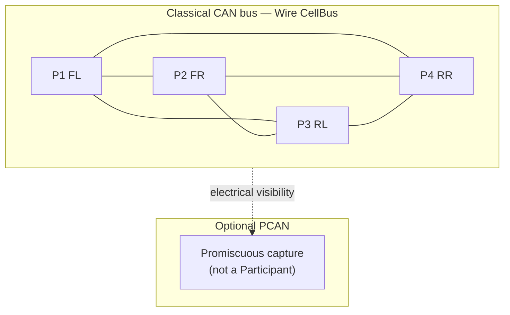

# Remap — Sketch 02 Peer CAN ECUs (no coordinator)

```text
**Remap of:** sketches/02_peer_can.md
**Evaluator-normalized net effect:** Emphatically Simpler — multi-Origin is the primary win; Candidate 1 minor naming/tooling only (single Wire).
**Wires:** 1 before → 1 after; 1 of 1 needs more than one Origin (4 permitted); multi-Origin roles: primary.
**Authority:** structural single nominated Origin before → 1 compact authored rule ("symmetric peer cell: all members may originate") + estop Endpoint restriction on P1.
**Attribution:** Global identity: stable P1–P4 (minor — single Wire); Multi-Origin: symmetric broadcast, native peer unicast, failure semantics, observation removal; Both: none.
**Headline friction delta:** Interaction awkwardness Significant → None; Failure mismatch Mild → None.
**Main lesson:** Peer-equal CAN is where multi-Origin pays — one Wire with four permitted Origins matches native symmetry; contrasts with 05 (0/2 Wires need multi-Origin).
```

**Experiment premises applied:** deployment-global `ParticipantId` (§2.1); Origin as per-interaction role with permitted-Origin policy (§2.3); broadcast as forward-direction `OriginToParticipant` anchored to actual Origin (§2.5); configured observation unchanged in capability but **not required** for primary telemetry/commands in this remap (§2.6).

**Configs remapped:** Config A only (single configuration in original).

---

## Unchanged from original (verbatim reuse)

### Native communication model

```text
Four ECUs (FL, FR, RL, RR) share one Classical CAN bus — e.g. four corners of a small mobile platform.

Each ECU:
  - publishes its own wheel speed, driver state, and fault flags periodically;
  - listens to the other three ECUs' periodic state (every frame is visible on the bus);
  - may command any other ECU directly (torque enable, speed setpoint, clear fault) without asking a master;
  - reacts to observed faults on other corners (e.g. cut torque if any neighbor reports slip).

There is no firmware-designated coordinator. Arbitration is CAN's; addressing is per-frame CAN IDs chosen by each ECU's stack.

A developer may attach a PC with a PCAN adapter to log traffic during bring-up. The PC is not part of normal runtime control.
```

### Obvious conventional implementation

> **Obvious conventional implementation:** Fixed CAN identifier plan — each ECU owns TX IDs for its status frames; peer commands use addressed CAN IDs (or a small matrix of command IDs per source/destination pair). Every ECU implements the full RX filter table. No bus master; symmetry is in the ID map and handler tables.

> **What additional conceptual objects does WS introduce compared with this?** At minimum: one Wire, one **nominated** Origin (not a peer in the native sense), per-ECU NodeIds, Direction on every PDU, and explicit **observer configuration** if peers consume each other's `NodeToOrigin` traffic. Peer-to-peer command may move from CAN-ID addressing to application-layer addressing over observed bus traffic, or to multiple overlapping Wires — see mapping below.

*(Original "what WS introduces" assumed single-Origin model — see **Changed / unchanged summary** below.)*

### Devices

| Device | Endpoint Domains | Link interfaces | Role summary |
|---|---|---|---|
| ECU FL | 1 | CAN | Participant **P1**; permitted Origin on CellBus |
| ECU FR | 1 | CAN | Participant **P2**; permitted Origin on CellBus |
| ECU RL | 1 | CAN | Participant **P3**; permitted Origin on CellBus |
| ECU RR | 1 | CAN | Participant **P4**; permitted Origin on CellBus |
| PC (optional) | 1 | CAN (PCAN) | Promiscuous capture only — not a Participant |

---

## Remapped WireSpaces mapping

### Participants

| ParticipantId | ECU | Notes |
|---|---|---|
| **P1** | FL (front-left) | Corner ECU |
| **P2** | FR (front-right) | Corner ECU |
| **P3** | RL (rear-left) | Corner ECU |
| **P4** | RR (rear-right) | Corner ECU |

Each ECU is one Endpoint Domain with one global `ParticipantId`. Carrier-local CAN addresses projected by Organizer (§2.2) — not designed here.

**Global identity effect:** Stable `ParticipantId` P1–P4 is a minor naming/tooling improvement here — this system has only one Wire, so per-Wire NodeIds were already sufficient for peer addressing once multi-Origin permits FR as Origin. Global identity matters more for cross-Wire deployment tooling.

### Wires

| Wire | Origins needed | System role | Members | Physical realization | Notes |
|---|---:|---|---|---|---|
| **CellBus** | **4** | **primary** | P1–P4 | Classical CAN | All peers permitted to originate |

```text
Wires after remap: 1
Wires requiring >1 Origin: 1
Multi-Origin Wires by role: primary (1 Wire, 4 permitted Origins)
```

**Why one Wire remains:** One CAN bus ↔ one logical cell bus is natural (`Artificial Wire: None` in original). Multi-Origin removes the **nominated single Origin** pressure; it does not justify splitting the bus into four commander Wires unless each Wire names a **distinct real authority** (original four-Wire alternative becomes **less necessary** — retained as stress bound only).

### Design choice: symmetric multi-Origin on one Wire (replaces nominated FL + observation primary path)

Under single-Origin, peers could not natively express FR→RL commands; FL was nominated as artificial Origin; telemetry used asymmetric paths (`OriginToNode` broadcast from FL vs `NodeToOrigin` from others) plus **observation** for peer visibility.

Under multi-Origin with all four peers permitted:

```text
Status (symmetric):
  Origin = P2 (FR)
  Participant = broadcast
  Direction = OriginToParticipant

Peer command (native):
  Origin = P2 (FR)
  Participant = P3 (RL)
  Direction = OriginToParticipant

Reply (if required):
  Origin = P2 (anchoring interaction)
  Participant = P3
  Direction = ParticipantToOrigin
  (authorized by Service binding — DISP-7)
```

No `ParticipantToOrigin` broadcast (§2.5) — unchanged from original `SF-010`.



### Interactions (revised — Origin per interaction)

| Interaction | Origin | Producer | Participant | Wire | Direction | Notes |
|---|---|---|---|---|---|---|
| Wheel status (P1) | **P1** | P1 | broadcast | CellBus | OriginToParticipant | Symmetric with other corners |
| Wheel status (P2–P4) | **P2–P4** | respective ECU | broadcast | CellBus | OriginToParticipant | **No observation required** for peer receipt — broadcast scope |
| Peer command (P2→P3) | **P2** | P2 | P3 | CellBus | OriginToParticipant | **Native** — replaces app-addressed observation (`Strategy A`) |
| Peer command reply | **P2** | P3 | P2 | CellBus | ParticipantToOrigin | Binding authorizes reply (`CORE §10.1`, `DISP-7`) |
| Global estop | **P1** | P1 | broadcast | CellBus | OriginToParticipant | P1 estop Endpoint restriction — see authority policy |
| Fault reaction | — | local observer | local actuator | — | local | Application logic on received status — unchanged |

**Forward vs compose:** No gateway; no cross-Wire paths. N/A.

### Gateway forwarding

Original had **no gateway forwarding table**. **Unchanged — N/A.**

Per-Domain Routers not applicable (single Domain per ECU, single Link).

### Optional PCAN observation

**Unchanged:** Bench PC uses promiscuous/bring-up mode (`DEPLOY §3.1`); not a Participant on CellBus. If PC must actively command ECUs, add second authority-shaped Wire with PC as permitted Origin (deferred — same as original).

### Alternative decomposition: four commander Wires (stress bound — reduced pressure)

Original four-Wire alternative (`FL-Cmd`, `FR-Cmd`, …) remains a valid **stress bound** for CAN alias / membership limits, but multi-Origin on one Wire achieves the same **directional cleanliness** for commands without four authority domains:

| Aspect | Original primary (1 Wire + nominated Origin + observation) | Remap (1 Wire + multi-Origin) | Original 4-Wire alt |
|---|---|---|---|
| Wire count | 1 | 1 | 4 |
| Nominated artificial Origin | Yes (FL) | **No** | Each ECU Origin somewhere |
| Peer telemetry | Observe `NodeToOrigin` | **OriginToParticipant broadcast** per peer | Observe or duplicate TX |
| Peer command | App-layer on observation | **OriginToParticipant unicast** | Native `OriginToNode` |
| Config | Observer groups | Symmetric permitted-Origin policy | 4× Wire membership |

**Verdict:** Multi-Origin makes the four-Wire alternative **less compelling** as a happy-path recovery — keep as documented bound only.

---

## Wire accounting (§4.4)

**Wires removed:** 0

| Removed Wire | Route scope | Broadcast scope | Command authority | Failure distinction |
|---|---|---|---|---|
| — | — | — | — | — |

No Wire removed. The original's **structural single-Origin** is replaced by **permitted-Origin policy** on the same Wire — not a Wire removal.

---

## Authority policy (§4.5)

| Wire | Members | Permitted Origins | Endpoint-level restrictions | Authored or generated? |
|---|---|---|---|---|
| CellBus | P1–P4 | **P1, P2, P3, P4** | **Global estop** Endpoint: only P1 may originate broadcast estop (same semantic as original "FL sends global estop") | **1 authored rule** ("symmetric peer cell: all members may originate") + estop declaration; Organizer may generate from profile |

> **Is this policy smaller, simpler, or easier to audit than the Wire structure it replaced?**

**Yes, for the primary path.** One compact symmetric policy replaces: (a) nominated FL as sole structural Origin, (b) asymmetric telemetry paths, (c) observation permits for peer visibility, (d) app-layer destination field for commands. The four-Wire alternative is no longer needed for directional cleanliness.

> **Could this policy be generated from bindings and topology already required?**

**Partially.** Estop restriction is one **declared role** ("P1 holds estop authority") — equivalent to original sketch's explicit FL estop choice. The symmetric peer originate rule is **one compact authored declaration**, not an O(N²) permission matrix — conservative count: **1 new authored policy rule**.

---

## Change attribution (§4.6)

| Change | Attribution |
|---|---|
| Stable P1–P4 across system | **Global identity** (minor — single Wire) |
| No per-Wire NodeId allocation | **Global identity** (minor) |
| All four peers permitted Origins | **Multi-Origin** |
| Symmetric status via `OriginToParticipant` broadcast | **Multi-Origin** |
| Native P2→P3 peer command (no app-address dest) | **Multi-Origin** — even with per-Wire NodeIds, FR could address RL once permitted as Origin; global identity is not required for this interaction |
| Nominated FL structural Origin removed | **Multi-Origin** |
| Observation not required for primary telemetry/commands | **Multi-Origin** |
| FL offline: peer traffic continues; only P1-originated unavailable | **Multi-Origin** |
| Four-Wire commander alternative less necessary | **Multi-Origin** (supporting — not actual Wire removal) |
| `ParticipantToOrigin` broadcast still invalid | **Neither** — unchanged (`SF-010`) |
| PCAN promiscuous unchanged | **Neither** |
| Per-source Snapshot storage (`SF-006`) | **Neither** — still applies if multiple producers observed |

---

## Observation accounting (§5.4)

| Original path | Remap | Transmission count | Recipient scope | Authorization | Failure meaning |
|---|---|---|---|---|---|
| Peer telemetry via observation of others' `NodeToOrigin` | **Removed** — replaced by each peer's `OriginToParticipant` broadcast | **1× per publisher** (unchanged) | Broadcast scope to all Wire members | Permitted-Origin + broadcast membership | Unchanged — CAN fan-out |
| Peer command via observe + app-layer dest | **Removed** — replaced by `OriginToParticipant` unicast | **1×** | Named Participant sink | Permitted-Origin policy | Wire layer expresses FR→RL |
| PCAN promiscuous capture | **Retained** | N/A | Electrical visibility only | Promiscuous mode | Not a configured recipient |

**Genuine simplification?** **Yes** for primary paths — observation was a bridge for single-Origin limitations, not an inherent bus requirement. Recipient scope and transmission count remain correct; authorization moves to permitted-Origin policy + broadcast membership instead of observer tables.

**Broadcast semantics caveat:** All four peers listen to each other's periodic state in this native system, so all-member broadcast is legitimate. Wire membership must not be read as "every Endpoint broadcast is semantically required by every member" — Endpoint/binding-level interest should still refine reach in other deployments (`SF-027`).

**Caveat:** If a deployment forbids all peers from broadcasting status (Endpoint policy), observation could return — that is a **product constraint**, not a remap regression.

---

## Friction re-rating (§4.8)

| Signal | Before | After | Notes |
|---|---|---|---|
| **Artificial Origin** | Significant | **None** | No nominated FL; multi-Origin **earned** this — not tautological-only (removes structural asymmetry, not just relabeling) |
| **Artificial Wire** | None | None | 1 Wire still natural |
| **Wire proliferation** | None | **None** | Chosen happy path already had 1 Wire; 4-Wire alt was rejected escape hatch, not actual proliferation removed |
| **Forwarding tax** | None | None | No gateway |
| **Identity awkwardness** | Mild | **None** | Global P1–P4; minor Candidate 1 win on single-Wire system |
| **Interaction awkwardness** | Significant | **None** | **Headline delta** — native peer unicast; no app-address compromise |
| **Configuration burden** | Mild (with tooling) | **Mild** (possibly lower within Mild) | Symmetric policy; observer O(n²) tables gone from primary path |
| **Role instability** | None | **None** | No election or changing assignment; Origin varies per interaction initiator — not instability |
| **Failure mismatch** | Mild | **None** | FL offline no longer blocks peer traffic; CAN down = whole cell unavailable — matches native behavior |

**Trade rule:** Multiple informative improvements (interaction, artificial Origin, failure mismatch); no informative regression → net **Simpler**, emphatic multi-Origin win.

### Coordinator absence (§5.1)

Original had no runtime coordinator; nominated FL was structural only.

Remap degraded-state statements:

```text
CellBus exists
Permitted Origins: P1–P4 (fixed at commissioning)
P1 offline → P1 cannot originate; P2–P4 continue as permitted Origins
CAN segment fault → all Participants unreachable (link-level)
```

**Clearer than original?** **Yes** — no false dependency on P1 as sole structural Origin for peer telemetry/commands. P1 offline → P1 interactions unavailable; P2–P4 continue as permitted Origins. CAN segment fault → all Participants unreachable (link-level).

---

## Changed / unchanged summary

**Changed:**
- Nominated single Origin (FL) → four permitted Origins
- Asymmetric telemetry (`OriginToNode` from FL vs `NodeToOrigin` from others) → symmetric `OriginToParticipant` broadcast per peer
- Peer commands: observation + app-address → `OriginToParticipant` unicast with named Participant
- Wire-local NodeIds → global `ParticipantId` P1–P4
- Direction labels → `OriginToParticipant` / `ParticipantToOrigin`
- Primary path no longer depends on observer-group configuration

**Unchanged:**
- One Wire (`CellBus`) on one CAN Link
- No gateway / forwarding
- No `ParticipantToOrigin` broadcast (`SF-010`)
- PCAN promiscuous bench capture
- Per-source Snapshot pressure (`SF-006`) where applicable
- Peer-equal CAN still **outside strongest WS regime** for systems that refuse multi-Origin — but remap shows multi-Origin is the natural fix
- Four-Wire alternative documented as stress bound only

---

## Open questions

- Should **symmetric peer cell** be a first-class Organizer profile (generates all-members permitted-Origin + optional estop authority Participant)?
- Does estop restriction belong in permitted-Origin policy, Endpoint binding, or a named **role** declaration?
- How does Endpoint/binding interest refine all-member Wire broadcast reach without recreating configured observation (`SF-027`)?
- Encoding of permitted-Origin policy — out of scope (§3 fence).

---

## Spec findings [remap]

| ID | Topic |
|---|---|
| [SF-026](synthesis.md#spec-findings-log) | [remap] Multi-Origin enables symmetric peer CAN on one Wire — primary sketch-02 improvement |
| [SF-027](synthesis.md#spec-findings-log) | [remap] Observation bridge removable when all peers permitted to broadcast as Origin |
| SF-001 | Observation still valid mechanism — **not required** on sketch-02 primary remap path |
| SF-014 | Peer-addressed control boundary — **softened** for infrequent commands under multi-Origin; mesh scale limits unchanged |

---

## End-of-remap summary (§9)

```text
Sketch: 02_peer_can
Wires before: 1
Wires after: 1
Wires requiring >1 Origin: 1 (CellBus — 4 permitted)
Multi-Origin Wires by role: primary (1)

Evaluator-normalized friction deltas:
  Interaction awkwardness (Significant → None) — headline, Multi-Origin
  Artificial Origin (Significant → None) — Multi-Origin
  Failure mismatch (Mild → None) — Multi-Origin
  Identity awkwardness (Mild → None) — Global identity, minor
  Wire proliferation (None → None) — not scored as improvement
  Role instability (None → None) — not scored as regression
  Configuration burden (Mild → Mild, possibly lower within Mild)

Benefits attributable to Global identity:
  Stable P1–P4; minor naming/tooling (single Wire — weak Candidate 1 test)
Benefits attributable to Multi-Origin:
  Symmetric broadcast telemetry; native peer unicast; no nominated FL;
  observation primary path removed; failure semantics clarified;
  four-Wire alt deprioritized (supporting evidence only)
Benefits attributable to Both / inseparable: none

New authored authorization state introduced: 1 compact rule ("symmetric peer cell")
Existing structural authority removed: nominated single Origin on CellBus
Observation paths removed / retained / changed:
  Peer telemetry observation — removed (replaced by broadcast)
  Peer command observation — removed (replaced by unicast)
  PCAN promiscuous — retained

Meta vs 05: 02 = 1/1 Wire needs multi-Origin (large benefit); 05 = 0/2 (neutral)
```

---

## References

| Doc | Sections used |
|---|---|
| `remap_brief_multi_origin_revised.md` | Full remap method; §8.2 peer CAN checks |
| `sketches/02_peer_can.md` | Source sketch (unchanged) |
| `CORE` (current) | §3.1, §10.1, §12.6 — observation still valid where needed |
