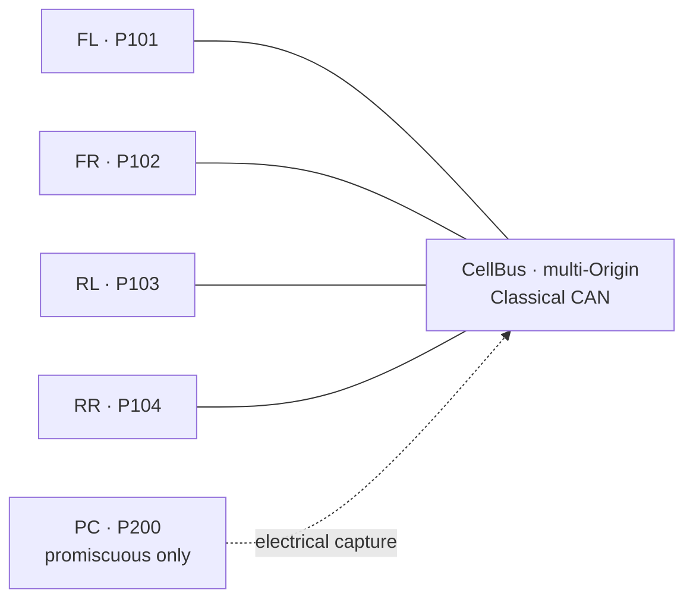

# Remap — Sketch 02: Peer CAN ECUs under global identity and multi-Origin

**Remap of:** `sketches/02_peer_can.md`  
**Net effect:** **Simpler** — the one natural CellBus remains, while direct peer addressing and symmetric publication replace app-addressed observation without an informative friction regression.  
**Wires:** 1 before -> 1 after; 1 of 1 needs more than one Origin; multi-Origin roles: primary.  
**Authority:** structural before -> **1 authored policy rule after**; generated projection: Organizer expands the all-peer Origin set and Service restrictions into carrier/dispatcher tables.  
**Attribution:** Global identity: minor stable naming/tooling improvement; Multi-Origin: symmetric publication, direct peer commands, and clearer degraded operation; Both: no material inseparable benefit in this one-Wire system.  
**Worst friction:** Configuration burden — **Mild**, unchanged in rating but with less observer/filter machinery and one explicit authority rule.  
**Main lesson:** Multi-Origin earns no Wire-count reduction here, but it removes the peer-control fracture on the system's primary Wire without moving equivalent complexity into a large authored policy.

## Intent and configuration

The physical system, Config A, and Level 1–2 maturity are unchanged: four STM32-class peer ECUs share one committed 11-bit Classical CAN segment, and an optional PCAN-attached developer PC only observes during bring-up. There is no natural coordinator.

### Native communication model

```text
Four ECUs (FL, FR, RL, RR) share one Classical CAN bus — e.g. four corners of a small mobile platform.

Each ECU:
  - publishes its own wheel speed, driver state, and fault flags periodically;
  - listens to the other three ECUs' periodic state (every frame is visible on the bus);
  - may command any other ECU directly (torque enable, speed setpoint, clear fault) without asking a master;
  - reacts to observed faults on other corners (e.g. cut torque if any neighbor reports slip).

There is no firmware-designated coordinator. Arbitration is CAN's; addressing is per-frame CAN IDs chosen by each ECU's stack.

A developer may attach a PC with a PCAN adapter to log traffic during bring-up. The PC is not part of normal runtime control.
```

Peers are **equal** in authority. The bus is physically broadcast; application logic treats received frames as "whoever sent this, I can act on it if it's for me."

### Obvious conventional implementation

> **Obvious conventional implementation:** Fixed CAN identifier plan — each ECU owns TX IDs for its status frames; peer commands use addressed CAN IDs (or a small matrix of command IDs per source/destination pair). Every ECU implements the full RX filter table. No bus master; symmetry is in the ID map and handler tables.

> **What additional conceptual objects does WS introduce compared with this?** At minimum: one Wire, one **nominated** Origin (not a peer in the native sense), per-ECU NodeIds, Direction on every PDU, and explicit **observer configuration** if peers consume each other's `NodeToOrigin` traffic. Peer-to-peer command may move from CAN-ID addressing to application-layer addressing over observed bus traffic, or to multiple overlapping Wires — see mapping below.

The quoted comparison is the original baseline. In the remap, the nominated Origin, per-Wire NodeIds, and observer configuration disappear; one Wire, global Participant identities, Direction, Service bindings, and an explicit permitted-Origin policy remain.

### Source device list (verbatim)

The original role labels below describe the pre-remap mapping and are superseded by the Participants table.

| Device | Endpoint Domains | Link interfaces | Role summary |
|---|---|---|---|
| ECU FL | 1 | CAN | **Origin** on CellBus; observes FR, RL, RR |
| ECU FR | 1 | CAN | Node 2; observes FL, RL, RR |
| ECU RL | 1 | CAN | Node 3; observes FL, FR, RR |
| ECU RR | 1 | CAN | Node 4; observes FL, FR, RL |
| PC (optional) | 1 | CAN (PCAN) | Promiscuous capture only |

## Remapped WireSpaces mapping

### Participants

Participant IDs are deployment-global Endpoint-Domain identities. The particular values are illustrative configuration, not CAN-local addresses.

| Endpoint Domain | ParticipantId | CellBus membership | Role |
|---|---:|---|---|
| ECU FL application Domain | 101 | Member | Peer; may originate |
| ECU FR application Domain | 102 | Member | Peer; may originate |
| ECU RL application Domain | 103 | Member | Peer; may originate |
| ECU RR application Domain | 104 | Member | Peer; may originate |
| Optional PC tool Domain | 200 | **Not a member** | Promiscuous capture only; no plant authority |

The Link profile still needs Organizer-owned projection from these identities to compact CAN-local addresses. Per the brief, that projection is not designed here and is not topology friction.

### Wires

| Wire | Origins needed | System role | Members | Physical realization | Notes |
|---|---:|---|---|---|---|
| CellBus | 4 | **Primary** | FL (101), FR (102), RL (103), RR (104) | One Classical CAN bus | Every ECU legitimately initiates in supported normal operation; no permanent Origin |



### Interactions

`Origin` below is the actual initiating Participant for that interaction, not a permanent Wire role.

| Interaction | Producer | Consumer(s) | Wire | Actual Origin | Direction | Notes |
|---|---|---|---|---:|---|---|
| FL wheel status | FL | FR, RL, RR | CellBus | 101 | OriginToParticipant broadcast | One CAN transmission; Wire broadcast reaches the other members, while Endpoint bindings determine semantic interest |
| FR wheel status | FR | FL, RL, RR | CellBus | 102 | OriginToParticipant broadcast | Same shape as every other peer; membership alone does not require every Endpoint |
| RL wheel status | RL | FL, FR, RR | CellBus | 103 | OriginToParticipant broadcast | Same shape as every other peer |
| RR wheel status | RR | FL, FR, RL | CellBus | 104 | OriginToParticipant broadcast | Same shape as every other peer |
| Peer command, example FR -> RL | FR | RL | CellBus | 102 | OriginToParticipant (P103) | Directly addressed; no payload destination or observer delivery |
| Peer command, any X -> Y | Any of FL/FR/RL/RR | One different ECU | CellBus | 101/102/103/104, matching X | OriginToParticipant (Y) | Covers all supported source/destination pairs |
| Global estop | FL | FR, RL, RR | CellBus | 101 | OriginToParticipant broadcast | Endpoint binding restricts this operation to FL |
| Fault reaction | Any receiving ECU | Its local actuator | — | — | local | Application logic on received peer state |

Replies, if a reliable peer command requires one, remain anchored to the command's actual Origin: the target responds `ParticipantToOrigin` under a request-scoped reply binding. Reply authority is not inferred by reversing Direction.

### Services / bindings

| Service | Wire | Permitted interaction | Binding / authorization note |
|---|---|---|---|
| WheelStatus | CellBus | Each ECU broadcasts its own Snapshot | All four producer bindings are declared symmetrically |
| PeerCommand | CellBus | Any ECU directly addresses any other ECU | Source identity is canonical; no destination field or source filter in application payload |
| Health | CellBus | Each ECU may broadcast its own health | Same symmetric producer declaration as status |
| GlobalEstop | CellBus | FL broadcasts to all other members | Binding permits only Participant 101 as Origin |

There is no gateway forwarding table: the original had none, and the remap remains one Link and one Wire. **No forwarding entry changed.** There is also no application composition step to reclassify; forward-versus-compose semantics are unchanged.

## Wire accounting

The primary original mapping had one Wire and the remap retains it. Therefore there are **no removed Wires** and no route, broadcast, authority, or degraded-state responsibility to re-home.

| Removed Wire | Route scope now provided by | Broadcast scope now provided by | Command authority now provided by | Failure/degraded-state distinction now provided by |
|---|---|---|---|---|
| None | Not applicable | Not applicable | Not applicable | Not applicable |

The original four-commander decomposition was an alternative stress bound, not part of the chosen configuration, so it is not counted as four removed Wires. Multi-Origin makes that alternative unnecessary for directionally clean commands, but does not reduce the chosen Wire count.

CellBus retains exactly the original route reach, membership, physical failure boundary, and Wire-scoped broadcast reach. Loss of one ECU can now be reported as loss of that Participant's status/command capability while valid traffic among the other three continues; total CAN loss remains “CellBus unavailable.” No role is reassigned. This is at least as crisp as the original: there is no misleading “configured Origin FL offline” condition for a peer bus that otherwise continues operating.

## Complete authority policy

Configured observers are deliberately excluded from `Members`. There are **no configured observers after the remap**. The optional PC is promiscuous tooling, separately accounted for below, and is neither a member nor an authority subject.

| Wire | Members | Permitted Origins | Endpoint-level restrictions beyond that | Authored or generated? |
|---|---|---|---|---|
| CellBus | FL (101), FR (102), RL (103), RR (104) | FL (101), FR (102), RL (103), RR (104) | Each member may publish only its own WheelStatus/Health; any member may send PeerCommand to another member; only FL (101) may originate GlobalEstop; request-scoped reply bindings authorize command responses | **Authored:** one high-level all-peer Origin rule plus Service intent; **generated:** flattened per-source/per-Endpoint dispatcher and CAN projection |

Per the experiment's counting rule, this table has **1 authority-policy row = 1 policy rule**.

**Is this policy smaller, simpler, or easier to audit than the Wire structure it replaced?** It is explicit rather than structural, but it is compact and more faithful: one row states peer authority, while narrow Service bindings retain the only exceptional restriction. Compared with the chosen one-Wire mapping, it replaces the nominated-Origin asymmetry plus symmetric observer declarations and command source/destination filters. Compared with the rejected four-Wire alternative, it is substantially smaller than four overlapping memberships.

**Could it be generated from bindings and topology?** The designer must state and understand the author intent that all four CellBus members may originate and that only FL may issue GlobalEstop. That is **one newly authored permitted-Origin rule**, not zero new state. Organizer can generate the flattened policy from that declaration, CellBus membership, and the Service bindings already required; the generated rows are not counted as additional authored rules.

Authority previously carried by “FL is the one structural Origin” is removed. The replacement is the CellBus permitted-Origin rule plus typed Service bindings. Authority is not smuggled into ad-hoc Endpoint source checks.

## Observation accounting

| Original observation path | Remap disposition | Transmission count | Recipient / broadcast scope | Authorization and sink status | Failure / degraded-state meaning |
|---|---|---|---|---|---|
| FR/RL/RR status observed by non-FL peers | **Removed; replaced by each publisher's direct Origin-anchored broadcast** | Unchanged: one CAN TX per update | Same three peers are within Wire broadcast reach; Endpoint bindings express which status consumers are semantically interested | Delivery no longer relies on observer authorization; publisher binding authorizes its own status, while consumer bindings determine required vs optional interest | Loss of a publisher or CellBus remains directly reportable; no nominal FL sink is implied |
| FL status delivered as Origin broadcast while peers observed other sources | **Changed to the same symmetric broadcast pattern used by all peers** | Unchanged: one CAN TX | Same other three peers | Same authorization shape for every status producer | Removes role-dependent interpretation; no availability loss |
| Peer command such as FR -> RL consumed by RL as observed FR ingress | **Removed; replaced by direct addressing** | Unchanged: one CAN TX | Narrows semantic scope from nominal FL sink plus configured RL observer to RL as required addressed sink | Wire policy authorizes FR; PeerCommand binding authorizes RL delivery; payload destination and ad-hoc source acceptance disappear | Command success/failure is tied to FR-RL interaction rather than observer delivery; clearer and auditable |

This is a genuine simplification, not only a representation change: transmission count stays one, intended recipients are preserved or narrowed correctly, authorization moves into one explicit Wire rule and typed bindings, and required-sink semantics now match the native relationships.

The optional PCAN path is **retained unchanged as promiscuous capture**, not configured observation. It has electrical visibility only, adds no CellBus membership or authority, and provides no redundancy claim.

## Change attribution

| Meaningful change | Attribution |
|---|---|
| Per-Wire NodeIds are replaced by one stable identity per Endpoint Domain | **Global identity** — minor in this one-Wire system |
| Organizer still projects global identities to compact CAN-local addresses | **Global identity** |
| Every peer publishes status with the same forward broadcast shape | **Multi-Origin** |
| Peer commands become direct Origin-to-addressed-Participant interactions | **Multi-Origin** — the old per-Wire target address was already sufficient once FR could act as Origin |
| Nominated FL Origin and its special telemetry path disappear | **Multi-Origin** |
| Direct interactions use stable global names for their initiating and addressed peers | **Global identity** for naming/tooling only; direct-addressing capability is **Multi-Origin** |
| CellBus route, membership, physical realization, and Wire-wide failure boundary stay unchanged | **Neither / unchanged** |
| PCAN remains promiscuous capture rather than a configured participant | **Neither / unchanged** |

Global identity alone would not allow all peers to originate. Multi-Origin is sufficient to fix role symmetry and direct addressing because the old CellBus-local address already identified the target. Global identity makes those names stable outside CellBus, but that is a minor benefit in this one-Wire sketch. No interaction benefit is inseparably attributable to both candidates.

## Friction deltas

| Signal | Before -> after | Remap justification |
|---|---|---|
| Artificial Origin | **Significant -> None** | No ECU is permanently nominated; this is a premise-driven, tautological improvement and is not evidence by itself. |
| Artificial Wire | **None -> None** | CellBus remains one meaningful logical peer bus. |
| Wire proliferation | **None -> None** | The chosen happy path already had one Wire. Multi-Origin makes the rejected four-commander escape hatch unnecessary but removes no deployed Wire proliferation. |
| Forwarding tax | **None -> None** | There is no gateway or forwarding. |
| Identity awkwardness | **Mild -> None** | Stable ParticipantIds identify equal peers without per-Wire NodeIds; carrier-local projection remains generated machinery. |
| Interaction awkwardness | **Significant -> None** | Direct addressed peer commands and symmetric status broadcasts now match the native interactions. |
| Configuration burden | **Mild -> Mild** | One authored Origin-policy rule and Service bindings replace symmetric observer declarations and application destination/source filtering; generated projections remain auditable tooling output. |
| Role instability | **None -> None** | Origin varies per interaction by design, but there is no runtime election or reassignment. |
| Failure mismatch | **Mild -> None** | Link-wide failure remains CellBus failure, while individual Participant capability loss is reportable without treating FL as a failed coordinator. |

Informative improvements are interaction awkwardness (**Significant -> None**) and failure mismatch (**Mild -> None**). No informative signal regresses; Wire proliferation remains None and configuration burden remains Mild. The “Simpler” result therefore satisfies the brief's trade rule without relying on Wire-count reduction or the tautological Artificial-Origin delta.

## Changed / unchanged summary

Changed: identities are global ParticipantIds rather than per-Wire NodeIds; all four peers may act as actual Origin; status publication is symmetric broadcast; commands are directly addressed; configured observation and application payload addressing are removed; authority is one explicit authored Wire policy with generated endpoint projections. Broadcast reach does not by itself imply that every Endpoint is semantically required by every member; Endpoint bindings still express interest.

Unchanged: the four-ECU physical system, optional PCAN capture, Config A, Level 1–2 maturity, one CellBus Wire, CAN route and broadcast reach, one-transmission telemetry behavior, local fault reactions, lack of gateways, and link-wide failure boundary.

No global-identity splice-coordination case exists in the source sketch, so the splice-specific check does not apply. The recommended bring-up pattern remains Organizer commissioning/export plus optional promiscuous PCAN capture.

## Open questions

- Can tooling present the one all-peer policy and its generated Service restrictions without making the flattened dispatcher matrix look like authored complexity?
- How should Endpoint/binding-level interest distinguish required consumers from uninterested members within Wire-level broadcast reach?
- How should operators distinguish “Participant 102 cannot originate PeerCommand” from “Participant 102 is unavailable” while retaining the compact capability-specific diagnostics enabled by this remap?

## End-of-remap summary

```text
Sketch: 02_peer_can
Wires before: 1
Wires after: 1
Wires requiring >1 Origin: 1
Multi-Origin Wires by role: primary: CellBus / supporting: none / peripheral: none

Informative friction improved: Interaction awkwardness Significant -> None; Failure mismatch Mild -> None
Informative friction regressed: none
Informative friction unchanged: Artificial Wire None; Wire proliferation None; Forwarding tax None; Configuration burden Mild; Role instability None

Benefits attributable to Global identity: minor stable Endpoint-Domain naming/tooling improvement; no per-Wire NodeIds
Benefits attributable to Multi-Origin: symmetric status publication; direct peer commands; no nominated permanent Origin
Benefits attributable to Both / inseparable: none material in this one-Wire system

New authored authorization state introduced: 1 authority-policy rule
Existing structural authority removed: FL as sole structural Origin on CellBus
Observation paths removed / retained / changed: configured peer-status and peer-command observation removed; optional promiscuous PCAN capture retained unchanged; status delivery changed to direct broadcast
```
