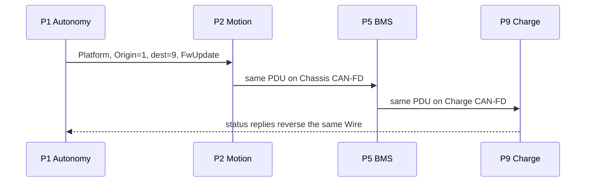

# Sketch 07 — Autonomous Mobile Robot with Modular Payload

**Status:** Phase-1 independent sketch against the frozen AMR brief and accepted multi-Origin / global-Participant premises  
**Maturity:** Level 2 (named Wires, static Wiring, embedded gateways; no WireContracts)

```text
**Mapping:** Eight named Wires — Ethernet Plant among Autonomy/Motion/Payload (all three originate); four overlapping consumer-scoped Wires spanning Chassis CAN-FD and Ethernet via Motion forwarding (Safety, Power, Bumper, NavSense); PayloadAct on payload CAN-FD; Charge on charge CAN-FD; supporting on-robot Platform for identity/health/logs/update/time.
**Worst friction:** Wire proliferation — Mild (happy path).
**Main lesson:** Multi-Origin removes any need for an Autonomy master, but Motion’s native forward-vs-compose split and the bumper-vs-ranging required-sink split still want distinct Wires rather than one robot-wide bus plus a permission matrix.
**Configs:** A nominal mission; B Motion-first hold/stow; C Payload-first motion constraint; D payload-slot identity replacement.
```

---

# 1. Title and intent

Warehouse AMR with no system-wide application master: Linux Autonomy, real-time Motion, independent Safety, swappable Payload, BMS, Sensor/I/O Gateway, two WS payload actuators, and a charge-interface controller. The claim under test is whether global `ParticipantId` plus Origin-as-per-interaction-role can represent distributed production authority, Motion’s canonical cross-link forwarding, Payload/BMS composition, and the frozen degraded states without inventing a coordinator or a tester PC.

---

# 2. Configurations

| Config | What changed | Maturity |
|---|---|---|
| **A — Nominal payload mission** | Baseline. All six physical links up; payload installed; full distributed authority. | Level 2: repeatable static Wiring and gateway tables are the product, not a bench accident. |
| **B — Motion discovers constraint first** | Same topology and Wiring as A. During a maneuver, Motion initiates hold/stow toward Payload with Autonomy offline-capable. | Level 2. Interaction scenario, not a topology change. |
| **C — Payload discovers constraint first** | Same topology and Wiring as A. Payload initiates chassis restriction / alignment correction toward Motion with Autonomy offline-capable. | Level 2. Interaction scenario, not a topology change. |
| **D — Payload module replacement** | Same topology, Wires, and service contract as A. Payload **slot** keeps `ParticipantId` 4; permanent device/serial/version identity changes. | Level 2. Identity variant; commissioning bit-level details out of scope. |

No maintenance laptop, cloud Origin, extra backbone, or convenience link is added in any config.

---

# 3. Native communication model

Describe the machine without WireSpaces vocabulary.

The robot has an on-board Ethernet LAN among three complex controllers: Autonomy Computer, Motion ECU, and Payload ECU. An Ethernet switch is only a switch. Motion and Payload talk to each other on that LAN without going through Autonomy. Autonomy submits trajectory/mission intent to Motion and job intent to Payload, including a high-level dock/alignment objective. It does not own low-level actuators.

Motion executes chassis motion, publishes chassis/odometry state, and during maneuvers may demand that the payload hold or stow. Payload sequences lift/gripper work and may demand that the chassis restrict speed, stop, or correct alignment when its mechanics discover a constraint. Those two coordination paths must keep working if Autonomy is absent, including docking/alignment mechanics already in progress.

Safety is an independent chassis controller. It applies protective stop / speed ceiling to Motion, and a narrower inhibit / safe-state request to Payload. The Payload-directed safety request is carried unchanged through Motion onto Ethernet; Motion does not execute that Payload command itself. A separate Safety→Motion request does terminate at Motion. Safety authority does not depend on Autonomy.

BMS publishes or negotiates charge/discharge power limits and thermal derate. Motion and Payload must enforce those limits. Autonomy may watch them for planning. BMS also negotiates charging with a dock charge-interface controller; either side may start a negotiation step. BMS turns charger/battery facts into robot power limits; it does not send wheel or lift commands.

A small Sensor/I/O Gateway sits on chassis CAN-FD and electrically owns RS-485 ranging/environment sensors and LIN bumpers/lamps/buttons. Those leaves are dumb peripherals. The gateway is the machine-level publisher of two different data classes: bumper / safety-relevant discretes, which Motion and Safety must have, and ranging / navigation state, which Autonomy must have and Motion may watch. Safety does not consume ranging. Delivery of Autonomy-bound gateway data goes through Motion onto Ethernet.

Payload CAN-FD holds a Lift Axis Controller and a Gripper Controller. High-level jobs from Autonomy, Motion, or Safety stop at the Payload ECU, which composes axis commands. Actuators report state and may raise local faults; they never command the chassis. Selected management traffic (identity, health, firmware update) may pass through the Payload ECU onto payload CAN. Charge-side management traffic may pass through the BMS onto charge CAN.

Autonomy is the normal firmware-update orchestrator, and only in an explicit maintenance/update state. Nobody else takes that job if Autonomy is missing. Motion is the machine time source. If Motion is missing, nobody else becomes the time source; survivors keep local clocks and report bad timestamp quality.

Autonomy may disappear while Motion, Payload, Safety, BMS, and the gateway keep doing their production jobs. Motion disappearing kills chassis motion, Motion↔Payload coordination, and every Chassis-CAN↔Ethernet relay. Payload disappearing kills payload jobs and Ethernet↔payload-CAN management reach; axes keep only local safe behavior. Ethernet disappearing kills the three-controller LAN and all chassis-to-Ethernet delivery; chassis-local safety/power/bumper work can continue. The gateway disappearing removes machine-level RS-485/LIN representation only.

---

# 4. Obvious conventional implementation

> **Obvious conventional implementation (A–D):** ROS2/DDS or UDP topics on the robot LAN; independent CAN-FD matrices on chassis, payload, and charger buses; gateway firmware that adapts RS-485/LIN into CAN signals; Motion as the Ethernet↔chassis CAN router/filter; Payload and BMS as application controllers that also pass a few management frames onto their second bus.

**What additional conceptual objects does WS introduce compared with this?**

Native design already has three CAN ID/signal spaces, a LAN topic space, a serial/LIN I/O adapter, Motion as a cross-bus router, Payload/BMS as composers, required vs nice-to-have consumers, and firmware-update routing. WS adds named Wires as explicit membership/broadcast/authority scopes, deployment-global `ParticipantId`, Origin-per-PDU, authored vs generated authorization, configured observation distinct from required delivery, and static forwarding tables that must not be confused with those composers. It does not add a hop the native machine lacks. The extra objects worth counting are the **eight Wires**, the **observer/required-sink annotations**, and the **Organizer-generated forwarding/bindings**. Physical-link “one Wire per cable” is rejected in §5.8 because it would force illegal cross-Wire re-origination of Safety→Payload and BMS→Payload.

---

# 5. WireSpaces mapping

Accepted premises used throughout: one `ParticipantId` per Endpoint Domain, stable on every Wire; Origin is a per-interaction role; Direction only names which side of that Origin/Participant relation produced the PDU; ordinary forwarding preserves Wire identity; carrier-local compact addresses exist but are not designed here.

## 5.1 Participants

One Endpoint Domain per named ECU, as required. RS-485 and LIN leaves are not Participants.

| ParticipantId | Endpoint Domain | Device | Character |
|---:|---|---|---|
| 1 | Autonomy Computer | Autonomy Computer | Linux-class mission/localization/task sequencing |
| 2 | Motion ECU | Motion ECU | Real-time chassis; Ethernet↔Chassis CAN forwarder |
| 3 | Safety ECU | Safety ECU | Independent safety envelope / stop / inhibit |
| 4 | Payload ECU | Payload ECU (deployment **slot**) | Modular payload sequencer; Ethernet↔Payload CAN composer + platform forwarder |
| 5 | BMS | BMS | Power/thermal limits; Chassis↔Charge composer + platform forwarder |
| 6 | Sensor/I/O Gateway | Sensor/I/O Gateway | Chassis CAN participant; terminates non-WS RS-485/LIN |
| 7 | Lift Axis Controller | Lift Axis Controller | WS leaf on Payload CAN-FD |
| 8 | Gripper Controller | Gripper Controller | WS leaf on Payload CAN-FD |
| 9 | Charge Interface | Charge-interface controller | WS participant on Charge CAN-FD |

Config D: `ParticipantId` 4 remains the payload slot. Permanent hardware/serial identity and version inventory change from Payload ECU ABC to Payload ECU XYZ. Service contract and topology do not.

## 5.2 Devices, domains, and Link Interfaces

| Device | Endpoint Domains | WS Link interfaces | Native non-WS attachments | Role summary |
|---|---|---|---|---|
| Autonomy Computer | 1 (P1) | Ethernet LAN | — | Mission/job Origin; firmware-update orchestrator; optional Power/Bumper observer; required NavSense sink |
| Motion ECU | 1 (P2) | Ethernet LAN; Chassis CAN-FD | — | Chassis controller; pure forwarder for selected spanning Wires; Plant peer |
| Safety ECU | 1 (P3) | Chassis CAN-FD | — | Safety Origin on Safety Wire; required Bumper sink |
| Payload ECU | 1 (P4) | Ethernet LAN; Payload CAN-FD | — | Payload sequencer; composes axis commands; forwards Platform only onto Payload CAN |
| BMS | 1 (P5) | Chassis CAN-FD; Charge CAN-FD | — | Power Origin; Charge peer; forwards Platform only onto Charge CAN |
| Sensor/I/O Gateway | 1 (P6) | Chassis CAN-FD | RS-485 sensors; LIN I/O | Originates Bumper and NavSense machine-level Services; no WS forwarding to leaves |
| Lift Axis Controller | 1 (P7) | Payload CAN-FD | — | Axis leaf |
| Gripper Controller | 1 (P8) | Payload CAN-FD | — | Axis leaf |
| Charge Interface | 1 (P9) | Charge CAN-FD | — | Charge-negotiation peer |
| Ethernet switch | none | — | LAN fabric | Infrastructure, not a Domain |
| RS-485 / LIN leaves | none | — | those buses | Non-WS peripherals |

The Ethernet switch is not a Participant and not a gateway.

## 5.3 Topology (device-centric)

Application plane. There is no host maintenance plane in this assignment.

```text
                    On-robot Ethernet LAN  (Plant, and Ethernet legs of
                    Safety / Power / Bumper / NavSense / Platform)
                    +-------------+-------------+
                    |             |             |
                 P1 Autonomy   P2 Motion     P4 Payload
                                  |             |
                          Chassis CAN-FD     Payload CAN-FD
                          (Safety, Power,     (PayloadAct,
                           Bumper, NavSense,   Platform)
                           Platform)
                          /     |      \
                       P3     P5      P6 Sensor/I/O Gateway
                    Safety   BMS       |            |
                                      RS-485       LIN
                                   (non-WS)     (non-WS)
                                 ranging etc.  bumpers etc.

                          P5 BMS ---- Charge CAN-FD ---- P9 Charge Interface
                                          (Charge, Platform)

                          P4 Payload -- Payload CAN-FD -- P7 Lift
                                                      \-- P8 Gripper
```

Motion is the only Chassis-CAN↔Ethernet WS gateway. Payload ECU is the only Ethernet↔Payload-CAN WS gateway, and only for Platform. BMS is the only Chassis-CAN↔Charge-CAN WS gateway, and only for Platform. The Sensor/I/O Gateway is an application adapter, not a WS forwarder, toward RS-485/LIN.

## 5.4 Wires

Authority-shaped Wires, not one Wire per cable. Overlapping membership on Chassis CAN-FD and Ethernet is intentional: bumper and ranging share a physical path and do not share required sinks.

| Wire (name / #) | Members | Origins needed | Physical realization | Role | Notes |
|---|---|---|---|---|---|
| **Plant** / 10 | P1, P2, P4 | P1, P2, P4 | Ethernet LAN only | primary | Mission/job/interlock/dock coordination. No chassis members. Motion does **not** forward this Wire onto CAN. |
| **Safety** / 20 | P2, P3, P4 | P3 commands; P2/P4 request-scoped replies | Chassis CAN-FD + Ethernet via Motion | primary | Safety→Motion terminates at Motion. Safety→Payload forwarded unchanged. Autonomy is not a member. |
| **Power** / 30 | P2, P4, P5 required; P1 observer | P5 | Chassis CAN-FD + Ethernet via Motion | primary | Required sinks enforce limits. Autonomy watches; absence of Autonomy does not drop enforcement. |
| **Bumper** / 40 | P2, P3, P6 required; P1 observer | P6 | Chassis CAN-FD + Ethernet via Motion | primary | Safety-relevant discretes. Safety is a required sink. |
| **NavSense** / 50 | P1, P6 required; P2 observer | P6 | Chassis CAN-FD + Ethernet via Motion | primary | Ranging/nav. Safety is **not** a member and not a consumer. |
| **PayloadAct** / 60 | P4, P7, P8 | P4 commands; P7, P8 state/fault | Payload CAN-FD only | primary | Application commands are composed here, never transparently forwarded from Plant/Safety. |
| **Charge** / 70 | P5, P9 | P5 and P9 | Charge CAN-FD only | primary | Bidirectional negotiation. Neither side has unrestricted authority over the other. |
| **Platform** / 80 | P1–P9 | P1 update orchestration; P2 time; each member its own identity/health/logs/telemetry; request-scoped replies | Ethernet + Chassis CAN-FD + Payload CAN-FD + Charge CAN-FD | supporting | Firmware-update reach and representative platform paths. Payload ECU and BMS forward **this Wire only** onto their second bus. |

`kLocalDomain` may exist inside each Domain for purely local Service plumbing; it is not a network Wire and is not tabulated.

### Why these Wires (and not one robot bus)

Plant is Ethernet-only because Motion↔Payload and Autonomy↔{Motion,Payload} already share a LAN, and because Autonomy absence must not be a Chassis-CAN event.

Safety, Power, Bumper, and NavSense all span Chassis CAN-FD and Ethernet **because the frozen machine forwards those canonical interactions through Motion**. They are separate Wires because **required-sink sets and command authority differ**:

- Safety commands: only P3; sinks P2 and/or P4; Autonomy must not be a semantic recipient.
- Power: only P5 originates; P2 and P4 must get it; P1 may.
- Bumper: P6 originates; P2 and P3 must get it; P1 may; P4 must not become a required sink by accident.
- NavSense: P6 originates; P1 must get it; P2 may; P3 must not.

Merging those four into one Chassis+Ethernet Wire would make broadcast and membership the wrong shape and push the distinction into a large Endpoint policy table. That alternative is counted in §5.8.

PayloadAct and Charge are separate because those buses have different members, and because application traffic there is composed, not forwarded, from the LAN/chassis Wires.

Platform exists because firmware-update and representative health/log reach need Autonomy to address Safety, BMS, gateway, axes, and charger — participants that are not Plant members — without stuffing them into Safety or Plant.

## 5.5 Interactions

Direction is structural. `O→P` means OriginToParticipant; `P→O` means ParticipantToOrigin for replies inside the same interaction. Broadcast, where used, is OriginToParticipant with participant = Wire broadcast, reaching that Wire’s members only.

Transport: unreliable datagram + freshness unless noted. Firmware update uses reliable segment.

| Interaction | Origin | Required sink(s) | Optional observers | Wire | Dir | Broadcast? | Forward / compose | Notes |
|---|---|---|---|---|---|---|---|---|
| Trajectory / motion goals; cancel/replace | P1 | P2 | — | Plant | O→P | no | local Ethernet | Autonomy does not command wheels. |
| Trajectory progress / chassis state | P2 | P1 (progress); P1 and P4 (chassis state) | — | Plant | O→P | chassis state may broadcast on Plant | local Ethernet | Snapshot. |
| Payload job / cancel | P1 | P4 | — | Plant | O→P | no | terminate at Payload; **compose** onto PayloadAct | Config A mission. |
| Payload progress / payload state | P4 | P1 (progress); P1 and P2 (state) | — | Plant | O→P | payload state may broadcast on Plant | local Ethernet | |
| Motion hold/stow request | P2 | P4 | — | Plant | O→P | no | terminate at Payload; **compose** onto PayloadAct if needed | Config B. Works with P1 absent. |
| Payload motion restriction / alignment | P4 | P2 | — | Plant | O→P | no | local Ethernet | Config C. Works with P1 absent. |
| High-level dock/alignment mission | P1 | P2 | — | Plant | O→P | no | local Ethernet | Absent if Autonomy unavailable; does not authorize Motion↔Payload mechanics. |
| Motion↔Payload dock mechanics | P2 or P4 | the other of P2/P4 | — | Plant | O→P | no | local Ethernet | Continues without Autonomy if already active / locally initiated. |
| Protective stop / speed ceiling | P3 | P2 | — | Safety | O→P | no | **terminate at Motion**; do not deliver to P4 | Overrides Autonomy intent at Motion (sink policy). |
| Payload inhibit / safe-state | P3 | P4 | — | Safety | O→P | no | Motion **forwards** CAN→Eth; Motion does **not** consume | Distinct PDU from the Motion stop. |
| Safety envelope / monitoring publication | P3 | P2 | P4 if configured | Safety | O→P | optional on Safety | Motion forwards if P4 is a configured consumer | Not a substitute for inhibit commands. |
| Power/thermal limit | P5 | P2, P4 | P1 | Power | O→P | yes, on Power | Motion forwards CAN→Eth for P4 and observer P1 | P2 also local on CAN. Enforcement does not need P1. |
| Charge limits / requests | P5 | P9 | — | Charge | O→P | no | terminate at Charge Interface | Not robot motion commands. |
| Charger capability / state / status change | P9 | P5 | — | Charge | O→P | no | terminate at BMS; BMS **composes** into Power publications | Either side may originate. |
| Bumper / safety discrete | P6 | P2, P3 | P1 | Bumper | O→P | yes, on Bumper | Motion forwards to Ethernet for observer P1 | Safety is a required sink. |
| Ranging / nav state | P6 | P1 | P2 | NavSense | O→P | no (directed to P1); P2 observes | Motion forwards CAN→Eth | Safety is not a consumer. |
| Axis command (lift/gripper) | P4 | P7 or P8 | — | PayloadAct | O→P | no | composed from Plant/Safety/Power sinks at P4 | Never a forwarded Autonomy/Safety PDU. |
| Axis state | P7 or P8 | P4 | — | PayloadAct | O→P | no | local Payload CAN | |
| Axis fault / availability | P7 or P8 | P4 | — | PayloadAct | O→P | no | local; P4 may compose a Plant-facing constraint | Actuators do not command chassis. |
| Identity / version inventory | each | representative: P1 | — | Platform | O→P | no | Motion / Payload ECU / BMS forward as needed | Config D: P4 slot stable; UUID/serial change. |
| Health / heartbeat | each | representative: P1 | peers as configured | Platform | O→P | no | same forwarding | Compact representative path, not a catalog. |
| Events / text logs | each | representative: P1 | — | Platform | O→P | no | same forwarding | Queue. |
| Link telemetry | each Domain | representative: P1 | — | Platform | O→P | no | same forwarding | One Service per Domain (`DEPLOY §3.3`). |
| Firmware update control/image | P1 | addressed WS target | — | Platform | O→P | no | Motion → chassis targets; Payload ECU → P7/P8; BMS → P9 | Reliable segment. Only in update state. No orchestrator failover. |
| Time / timestamp quality | P2 | all other Platform members that consume time | — | Platform | O→P | yes, on Platform | Motion forwards onto Chassis CAN; others as members | If P2 is down, no new time Origin. |
| Replies (progress ack, update status, charge reply, etc.) | same Origin as the request | the request Origin | — | same Wire | P→O | no | request-scoped binding | Never inferred from reversing Direction. |

Gateway-local faults ride the Bumper path when they are safety-relevant I/O faults, and Platform health otherwise. They are not a third spanning production Wire.

## 5.6 Services / Endpoints (topology-relevant only)

No Namespace/EID allocation. Storage and binding only where they affect the mapping.

| Service | Storage | Binding | Why it matters |
|---|---|---|---|
| TrajectoryGoal, PayloadJob, HoldStow, MotionConstraint, ProtectiveStop, PayloadInhibit, AxisCommand, FwUpdate | Queue | Static TX; request-scoped replies | Events/commands must not coalesce (`OWN-5`). |
| ChassisState, PayloadState, PowerLimit, SafetyDiscrete, RangingNav, AxisState, Health, TimeQuality | Snapshot | Transmit-only publication + static RX | Latest-value + freshness. Power/Bumper/NavSense required vs observer is a RX binding property, not addressing magic. |
| AxisFault, Events/Logs | Queue | Static TX | Faults are events. |
| ChargeLimitRequest / ChargeCapability | Queue or Snapshot per message type | Static; both P5 and P9 may originate the types they host | Bidirectional without unrestricted peer command. |

Learned-from-ingress is not used on the shared CAN-FD or Ethernet production Links.

## 5.7 Authorization policy

### Authored intent (what a designer should have to write)

Compact Wire declarations. This is the audit surface.

```text
Plant
    members:            P1, P2, P4
    permitted Origins:  P1, P2, P4
    P1 may originate:   TrajectoryGoal, PayloadJob, DockMission
    P2 may originate:   ChassisState, TrajectoryProgress, HoldStow, dock-mechanics toward P4
    P4 may originate:   PayloadState, PayloadProgress, MotionConstraint, dock-mechanics toward P2
    replies:            request-scoped on the receiving Endpoint
    not members:        P3, P5, P6, P7, P8, P9
    Motion forwarding:  none (Ethernet only)

Safety
    members:            P2, P3, P4
    permitted Origins:  P3 for ProtectiveStop, SpeedCeiling, PayloadInhibit, SafetyEnvelope
                        P2, P4 for request-scoped replies only
    ProtectiveStop / SpeedCeiling: required sink P2 only; P4 must not accept these EIDs
    PayloadInhibit:                required sink P4 only; P2 must not accept (forward-only)
    Autonomy:           not a member; electrical Ethernet visibility ≠ delivery
    Motion forwarding:  Chassis CAN-FD ↔ Ethernet for this Wire

Power
    members:            P2, P4, P5
    observer:           P1
    permitted Origins:  P5 for PowerLimit
    required sinks:     P2, P4
    P1:                 configured observer; not required for enforcement
    P2/P4:              may not originate PowerLimit
    Motion forwarding:  Chassis CAN-FD ↔ Ethernet for this Wire

Bumper
    members:            P2, P3, P6
    observer:           P1
    permitted Origins:  P6 for SafetyDiscrete / gateway-local safety I/O faults
    required sinks:     P2, P3
    P1:                 configured observer
    P4, P5:             not members
    Motion forwarding:  Chassis CAN-FD ↔ Ethernet (for P1 observer)

NavSense
    members:            P1, P6
    observer:           P2
    permitted Origins:  P6 for RangingNav
    required sinks:     P1
    P3:                 not a member, not a consumer
    Motion forwarding:  Chassis CAN-FD ↔ Ethernet (required path to P1)

PayloadAct
    members:            P4, P7, P8
    permitted Origins:  P4 for AxisCommand
                        P7, P8 for AxisState, AxisFault
    P7/P8:              must not originate chassis/Plant/Safety commands
    Payload ECU:        does not forward Plant/Safety/Power PDUs onto this Wire

Charge
    members:            P5, P9
    permitted Origins:  P5 for battery-allowed charge limits/requests
                        P9 for charger capability/state/independent status changes
    neither:            may originate the other’s command set
    BMS:                composes Charge facts into PowerLimit; does not forward Charge onto Chassis as Charge Wire traffic

Platform
    members:            P1–P9
    P1 may originate:   firmware-update control/image, and representative platform queries, only in explicit update/maintenance state
    P2 may originate:   TimeQuality
    each member:        own Identity, Health, Events/Logs, LinkTelemetry
    replies:            request-scoped
    no orchestrator failover if P1 absent
    no time-source reassignment if P2 absent
    forwarding:         Motion: Ethernet ↔ Chassis CAN-FD
                        Payload ECU: Ethernet ↔ Payload CAN-FD  (this Wire only)
                        BMS: Chassis CAN-FD ↔ Charge CAN-FD    (this Wire only)
```

Safety dominate and BMS-as-constraint rules are **sink application policy**, not extra Origins and not Direction bits. See §5.10.

### Organizer-generated projection (not authored by hand, still auditable)

Generated from the intent above; a large table here is not automatically a large authored burden:

- per-Link membership and (out of scope) `ParticipantLocalId` projection
- Motion / Payload ECU / BMS forwarding bitmasks per Wire
- per-Endpoint TX bindings and RX required-sink vs observer flags
- reject lists: P4 must not have RX binding for ProtectiveStop; P2 must not have RX binding for PayloadInhibit; P3 must not have RX binding for RangingNav; P1 has observer RX for PowerLimit and SafetyDiscrete, required RX for RangingNav
- compatibility fingerprint covering Wires, bindings, and forwarding (`DEPLOY §2.4`)

If a human has to maintain the flattened permission matrix instead of the compact intent, that is a tooling failure and should be counted as configuration burden. This sketch assumes Organizer expansion.

## 5.8 Forwarding versus composition

### Motion ECU — Chassis CAN-FD ↔ Ethernet

Pure canonical forwarding for Wires **Safety, Power, Bumper, NavSense, Platform**. Local delivery only when this Domain is a required sink or configured observer of that PDU.

| Ingress | Wire | Egress | Local delivery at Motion? |
|---|---|---|---|
| Chassis CAN-FD | Safety | Ethernet | **Yes** only if dest/required-sink is P2 (ProtectiveStop / SpeedCeiling / envelope). **No** for PayloadInhibit. |
| Ethernet | Safety | Chassis CAN-FD | Yes only if dest is P2 (replies toward Safety stay sourced as P2/P4 on Safety). |
| Chassis CAN-FD | Power | Ethernet | Yes (required sink of PowerLimit). |
| Ethernet | Power | Chassis CAN-FD | Yes if dest is P2 (replies). |
| Chassis CAN-FD | Bumper | Ethernet | Yes (required sink). Ethernet flood exists so P1 may observe. |
| Chassis CAN-FD | NavSense | Ethernet | **Observer only** (not required). Required sink is P1 on Ethernet. |
| Ethernet | NavSense | Chassis CAN-FD | No application dest on CAN except P6 replies. |
| Ethernet | Platform | Chassis CAN-FD | Yes if dest is P2; otherwise forward toward chassis members. |
| Chassis CAN-FD | Platform | Ethernet | Yes if dest is P2; otherwise forward toward Ethernet members. |
| Ethernet | Plant | — | Local Plant only. **Do not** egress Chassis CAN. |
| *any* | PayloadAct, Charge | — | Not a member. |

Flood-and-filter on a spanning Wire may put a PDU on Ethernet even when the addressed sink is on CAN (`CORE §12.1`). That is not membership for non-members and not local delivery at Motion.

### Payload ECU — Ethernet ↔ Payload CAN-FD

| Path | Kind | Behavior |
|---|---|---|
| Plant / Safety / Power ingress on Ethernet | **composition** | Terminate in Payload Services. Emit **new** PayloadAct PDUs (new producer identity P4) toward P7/P8. |
| Platform Ethernet ↔ Payload CAN-FD | **forwarding** | Preserve Platform Wire identity toward P7/P8 or back to Ethernet. |
| PayloadAct | local | Never bridged onto Ethernet as PayloadAct. |

### BMS — Chassis CAN-FD ↔ Charge CAN-FD

| Path | Kind | Behavior |
|---|---|---|
| Charge Wire | **composition** into Power | Terminate negotiation in BMS Services. Emit **new** PowerLimit on Power (producer P5). |
| Platform Chassis ↔ Charge | **forwarding** | Preserve Platform toward P9 / back to chassis/Ethernet via Motion. |
| Power | Chassis + Motion forward | BMS does not itself reach Ethernet. |

### Sensor/I/O Gateway — Chassis CAN-FD ↔ RS-485/LIN

**Composition / adaptation only.** No canonical WS forwarding. Gateway originates Bumper and NavSense as P6.

### Electrical visibility is not delivery

Autonomy, Motion, and Payload can electrically hear every Ethernet frame. Safety, BMS, Motion, and the gateway can electrically hear every Chassis CAN-FD frame. Non-members must not consume (`CORE §12.6`). Especially: P1 must not accept Safety PayloadInhibit just because it appears on the LAN; P3 must not accept NavSense just because it appears on chassis CAN; P4 must not accept ProtectiveStop.

## 5.9 Broadcast and observation accounting

| Publication | Wire broadcast members | Required delivery | Optional configured observation | Not a consumer |
|---|---|---|---|---|
| Plant chassis/payload state | P1, P2, P4 | as in §5.5 | none required beyond members | chassis-only Participants |
| PowerLimit | P2, P4, P5 (+P1 if treated as member-observer) | P2, P4 | P1 | P3, P6, P7, P8, P9 |
| SafetyDiscrete | P2, P3, P6 (+P1 observer) | P2, P3 | P1 | P4, P5, P7, P8, P9 |
| RangingNav | not broadcast; directed to P1 | P1 | P2 | P3 and everyone else |
| TimeQuality | Platform members | consumers that need timestamps | — | none of the WS set is forbidden; quality degrades if missing |
| Safety→Payload inhibit | unicast P4, not broadcast | P4 | none | P2 must not consume; P1 must not consume |

Observation stress: optional P1 on Power/Bumper is useful (one publication, no BMS/gateway re-origin to Autonomy). It is slightly awkward to author because membership and required-sink are two layers. It is not used as fake redundancy. Raw CAN visibility is **not** treated as WS delivery.

## 5.10 Sink / source-selection policy

WS does not pick a winner among Origins. Receiving Services do.

| Receiving function | Legitimate Origins | Precedence |
|---|---|---|
| Motion trajectory execution | P1 goals; P3 stop/ceiling; P4 motion constraint; P5 power limit | P3 constrains/overrides P1. P4 is a coordination constraint, not ownership of Motion’s actuators. P5 limits power demand; it does not specify the trajectory. Stale P1 goals rejected by freshness/sequence. |
| Payload job execution | P1 job; P3 inhibit; P2 hold/stow; P5 power limit | P3 inhibit dominates job execution. P2 hold/stow is a constraint, not ownership of lift/gripper. P5 limits power. Axis commands to P7/P8 are P4’s composed output only. |
| Charge negotiation | P5 and P9 | Bidirectional protocol state in those two Services; not “whichever PDU arrived last owns the charger.” |
| Firmware update | P1 only | No standby orchestrator. Targets reject update traffic from anyone else. |
| Time | P2 only | No reassignment. Survivors use local monotonic time and report degraded quality. |

Reply, failover, and actuator precedence are never inferred from Direction.

## 5.11 Failure / degraded-state mapping

No runtime Origin election. Wiring persists; paths go silent.

| Failure | What continues | Authority lost | WS reading |
|---|---|---|---|
| **Autonomy (P1) unavailable** | Plant P2↔P4; Safety to P2 and (via Motion) P4; Power to P2/P4; Bumper to P2/P3; PayloadAct local; Charge local; gateway I/O | Mission/job/dock **objective** initiation; firmware orchestration; NavSense required sink; Platform collector at P1 | Plant still has Origins P2 and P4. Not role reassignment. P1 observer loss on Power/Bumper is not an enforcement failure. |
| **Payload ECU (P4) unavailable** | Plant P1↔P2; Safety→P2; Power to P2; Bumper; chassis CAN among P2/P3/P5/P6; Charge if BMS up | Payload jobs, P4-originated constraints, PayloadAct composition, Ethernet↔Payload-CAN Platform forward; Safety→P4 and Power→P4 | PayloadAct leaves: local safe behavior only. Slot P4 is absent, not remapped to P2. |
| **Motion (P2) unavailable** | Ethernet Plant **P1↔P4 only**; Chassis CAN among P3, P5, P6 (and P9 via BMS Platform/Charge); PayloadAct local | Chassis motion; Plant involving P2; **all** Chassis↔Ethernet forwarding; Safety→P4; Power→P4 and P1; Bumper observer P1; NavSense to P1; Platform across that cut; time source | Spanning Wires **partition**. That is forwarding-path loss, not Origin failover. P3 cannot reach P4. P1 and P4 still talk on Plant. |
| **Sensor/I/O Gateway (P6) unavailable** | Plant, Safety commands, Power, Charge, PayloadAct, Platform except P6 | Bumper and NavSense; machine-level RS-485/LIN | Other leaves are irrelevant once P6 is gone. No substitute publisher. |
| **Ethernet LAN unavailable** | Chassis Safety→P2, Power→P2, Bumper→P2/P3; Charge; PayloadAct; Platform on CAN islands | Plant; Motion↔Payload; Safety→P4; Power→P4/P1; NavSense; Ethernet Platform | Same partition as losing the LAN fabric. No new Origin. |
| **One RS-485/LIN leaf fails** | Gateway and other leaves | That leaf only | Not a WS Participant failure. |
| **BMS (P5) unavailable** (not in brief table; implied by native power/charge) | Motion/Safety/gateway chassis traffic without new power limits; Plant; PayloadAct | PowerLimit; Charge negotiation; Chassis↔Charge Platform | Motion/Payload use last-limit freshness policy until stale, then their defined derate/fail-safe. Not sketched as a fifth config. |
| **Config D swap** | Same as A after slot bind | none if XYZ implements the contract | P4 unchanged. Device UUID/serial on Identity Service change. |

Crisp operator phrases that should remain sayable:

- “Autonomy is down; Motion and Payload are still coordinating; Safety still owns stop/inhibit.”
- “Motion is down; Autonomy and Payload can still talk; Safety cannot reach Payload; chassis time is degraded.”
- “Gateway is down; bumper and ranging are gone; motion/safety/power command paths are not.”

## 5.12 Sequence (cross-link paths)

Safety→Payload inhibit (forward, not local Motion consume):

```mermaid
sequenceDiagram
    participant S as P3 Safety
    participant M as P2 Motion
    participant P as P4 Payload
    S->>M: Safety Wire, Origin=3, dest=4, PayloadInhibit
    Note over M: forward only; no local accept of this EID
    M->>P: same PDU on Ethernet
    P-->>S: request-scoped reply, Origin=3, dest=4, P→O
```

Firmware update to Charge Interface (Platform forwarding through two gateways):



## 5.13 Rejected alternative: one Wire per physical link

| Physical-link mapping | Why it is rejected |
|---|---|
| EthernetWire vs ChassisWire vs PayloadWire vs ChargeWire | Safety→Payload and BMS→Payload are **frozen as unchanged forwarding**. Different WireNumbers would make Motion a composer/re-originator, which the brief forbids. |
| Single RobotBody Wire = {P1–P6} on Eth+CAN | Removes artificial cable Wires, but bumper vs ranging vs safety vs power become one membership with a large required-sink/observer/command matrix. Autonomy would be a member of Safety traffic unless extra Endpoint policy forbids it. Counted as moved complexity, not as simplification. |
| Force Autonomy as Plant Origin for Motion↔Payload | Violates the no-soft-master rule and Configs B/C. |

The chosen mapping is the middle: spanning Wires where forwarding is real; split Wires where required sinks/authority differ; composition Wires where the native ECU actually composes.

---

# 6. Friction signals

Rated on Config A happy path. None / Mild / Significant. One sentence each.

| Signal | Rating | Justification |
|---|---|---|
| **Artificial Origin** | None | Every Origin is a native production initiator; Autonomy is not used as a dummy coordinator for Motion↔Payload, Safety, or Charge. |
| **Artificial Wire** | None | Each Wire matches a native relationship (LAN peers, safety command scope, power consumers, two gateway data classes, payload axes, charger, on-robot management). |
| **Wire proliferation** | Mild | Four overlapping spanning Wires on the same Chassis CAN-FD plus Platform is more named topology than “one chassis bus,” chosen to keep required-sink sets structural rather than a permission matrix. |
| **Forwarding tax** | None | Motion/Payload-ECU/BMS forwarding and the gateway’s non-forwarding adapter are native; WS does not add a hop. |
| **Identity awkwardness** | None | Global `ParticipantId` matches one Domain per ECU, Config D slot stability is natural, and the gateway as publisher for non-WS leaves matches the machine. |
| **Interaction awkwardness** | Mild | Same Motion ECU must forward PayloadInhibit without accepting it and must accept ProtectiveStop, which is correct but easy to get wrong if forwarding is mistaken for local delivery. |
| **Configuration burden** | Mild | Authored intent is eight compact Wire declarations plus sink precedence; the generated forwarding/observer/binding projection is large but should stay generated. |
| **Role instability** | None | Different Origins on different interactions is normal multi-Origin behavior; the brief forbids Autonomy/time/update failover, and none is introduced. |
| **Failure mismatch** | Mild | Spanning Wires **partition** when Motion or Ethernet dies, which matches the native cut, but operators must talk about forwarding-path loss rather than “the Safety Wire is down,” because Chassis Safety→Motion can still be live. |

Configs B and C do not change these ratings; they are why Artificial Origin stays None. Config D keeps Identity awkwardness at None.

---

# 7. Model pressure

**If you could change one WireSpaces concept** to make this system simpler: a first-class authored distinction between **Wire membership**, **required sink**, and **configured observer** (so a publication can have one structural consumer set without either opening a second Wire or treating every member as a required recipient). Bumper vs NavSense is exactly that pressure on one physical chassis path.

**Did WS expose a useful distinction the conventional model tends to obscure?** Yes: **forward versus compose** at the three multi-interface ECUs, and the fact that Autonomy’s absence is not a Safety or Motion↔Payload event. Conventional “Motion bridges CAN to Ethernet” often hides that Safety→Payload must remain Safety’s PDU while Autonomy→lift must become Payload’s PDU.

Other notes:

- Multi-Origin **eliminates** an artificial Autonomy master for Plant and an artificial Charge “bus master” Origin. It **moves** bumper/ranging/power optional-Autonomy into observer policy rather than deleting that structure.
- A Wire-count reduction to one body bus would not be a simplification here; the flattened authorization table would be the real design.
- Device-private Internal Debug Wires spliced to a host-facing maintenance Wire were **not** added: the assignment forbids an external Origin, and Autonomy already collects representative Platform traffic.

---

# 8. Open questions

Do not resolve architecture policy the machine does not settle.

1. Should Bumper and NavSense remain two Wires, or one ChassisSensors Wire with per-Endpoint required-sink sets if that distinction becomes a first-class authored field?
2. Should PowerLimit be Wire broadcast (membership-shaped) or two unicasts plus an Autonomy observer of the Motion copy? Both preserve required sinks; bandwidth and audit differ.
3. Is Platform’s all-member Wire the right firmware-update reach, or should update ride each functional Wire (forcing Autonomy onto Safety/Charge membership)?
4. How should tooling present a **partitioned spanning Wire** (Motion down) so “Safety cannot reach Payload” is obvious without implying Safety→Motion is dead?
5. Config D slot-stable `ParticipantId` vs changing device UUID: what Organizer check prevents flashing Payload XYZ with stale P4 bindings that disagree with the rest of the robot (`DEPLOY §2.4`) — mechanism out of scope, need is in-scope.
6. When Ethernet flood-and-filter copies a Chassis-destined Safety PDU onto the LAN, is “P4 Dispatcher rejects ProtectiveStop” sufficient, or should Motion prune by dest before egress (`CORE §12.1`)?
7. TimeQuality as Platform broadcast vs time only on Plant plus a chassis subset: the brief makes Motion the sole source, not the distribution topology.

---

# 9. Spec findings

Not added to `synthesis.md` from this independent sketch. Local stresses worth a later log if they generalize:

- Forwarding must not imply local delivery at the gateway Domain (ProtectiveStop vs PayloadInhibit through Motion).
- Required sink vs configured observer vs electrical visibility need to stay three different things under multi-Origin spanning Wires.
- Wire partition on gateway loss is the degraded-state language that replaces “the Origin is offline” for these spanning Wires.

---

## Submission checklist (local)

- Frozen six-link topology; no tester PC / cloud / extra backbone
- One Domain per named ECU; two payload actuators (lift, gripper); no conveyor
- Global `ParticipantId`; carrier projection not scored
- Every Wire: membership, realization, Origins needed, primary/supporting
- Representative interactions name actual Origin and required sinks
- Authored intent vs generated projection separated
- Broadcast vs observation explicit; electrical hearing ≠ membership
- Forwarding vs composition at Motion, Payload ECU, BMS, gateway
- Source-selection / precedence explicit
- Frozen degraded configs mapped without role reassignment
- Representative platform paths: identity/version, health, logs/events, link telemetry, firmware reach, time
- Nine friction ratings with one-sentence justifications
- No simplification claimed from Wire-count reduction alone
